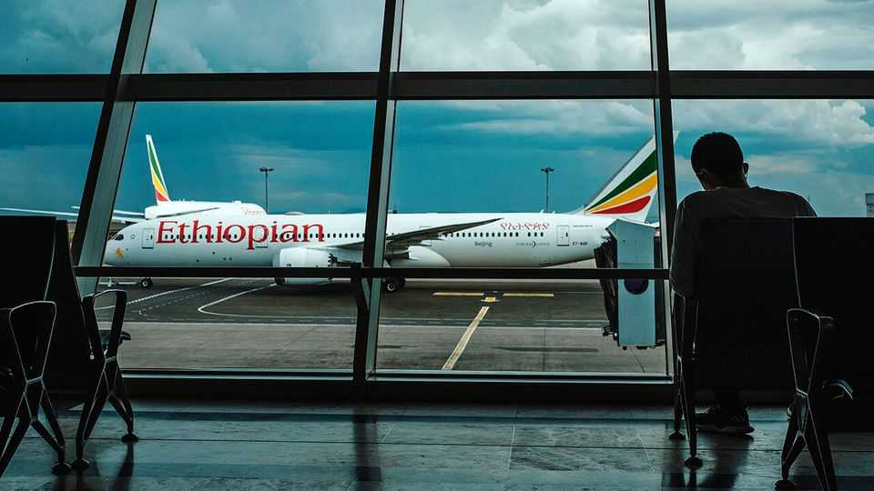

Middle East & Africa | The next mega-project
Ethiopia wants to build Africa’s biggest airport
But conflict, competition and government meddling are complications
December 18th 2025

Ethiopian airlines (ET) has come a long way since it started flying five small planes at the behest of Emperor Haile Selassie back in 1946. Four major wars, two revolutions and three constitutional overhauls later, it is the largest and most profitable airline in Africa (if not necessarily, judging by recent customer reports, the most comfortable). Now the airline hopes to cement its dominance in African air travel by building Africa’s largest airport, near Addis Ababa, Ethiopia’s capital. The project is supposed to strengthen Ethiopia’s status as the continent’s air- travel hub and help return the country of around 130m people to a path of stability and development after years of internal strife. Yet competition from

other regional players, the fractious state of Ethiopia’s politics and government meddling raise doubts about the project’s viability.

If it is built, the new airport will occupy vast swathes of what are currently fields around Bishoftu, an hour’s drive south of Addis Ababa. According to ET’s plans, it will ultimately be able to handle some 110m passengers a year. That is more than travelled in 2024 through Atlanta, which has been the world’s busiest airport almost every year since 1999. ET, which is owned by the Ethiopian government, says it will stump up a fifth of the expected cost of around $10bn. The African Development Bank (AfDB) has pledged $500m and is soliciting more cash from foreign investors.

The business case for a new airport is compelling. Most state-owned African airlines are badly managed and chronically lossmaking. ET, by contrast, has long been run by able professionals. In 2024 its passenger-carrying capacity was roughly equivalent to that of the second-, third- and fourth-largest African airlines combined. When flying from one African capital to another or onwards to Europe, it is often the cheapest option and sometimes the only one.

Since many of those passengers must transit through Ethiopia, its main airport is already under strain. It boasts a capacity of 22m passengers a year; by 2035 ET aims to be carrying triple that number annually. The airport’s location in central Addis Ababa limits any potential expansion. Moreover, taking off at the capital’s altitude of 2,300 metres requires planes to be lighter. From Bishoftu, which lies around 400 metres lower, ET’s aircraft could carry either more cargo or more fuel, which would make it possible to offer direct flights to North America, for instance.

Some reckon the airline can easily afford the steep price tag. ET has turned a profit every year for nearly two decades, even during the covid-19 pandemic. In the year to July its revenues grew by 8% to $7.6bn; over the previous year they grew by 15%. “Ethiopian Airlines is about as blue-chip as you can get if you’re looking at infrastructure in Africa,” says Sean Mendis, an aviation consultant. In addition to the AfDB, both America and China have expressed interest in financing the airport.

Others remain sceptical. Even with ET’s strong balance-sheet, $8bn is a lot of debt. Civil strife, which continues in much of the country, could cripple the project, as could a new war with neighbouring Eritrea.

More prosaically, ET is also likely to face more competition in the coming years. Airlines from the Gulf have plans to expand in Africa. Emirates recommenced its daily direct flight to Lagos, Nigeria’s commercial capital, in 2024. It also increased the frequency of flights to key hubs like Addis Ababa and Nairobi, in Kenya. Like Qatar Airways, it is adding new destinations by signing codeshare agreements with African carriers. Istanbul airport, an important hub connecting Africa with many European destinations, plans to finish its expansion by the end of 2028, increasing its annual capacity to 200m passengers. Turkish Airlines will significantly expand its network in western and southern Africa next year.

Some investors therefore believe a more prudent approach would be to opt for a smaller airport to start with, which could be expanded in stages. Several sources suspect that the monumental size of the current plan reflects pressure from the government of the prime minister, Abiy Ahmed. Like previous Ethiopian regimes, it has a penchant for mega-projects.

Plans for the airport could conceivably be revised or scaled back should investors refuse to cough up the cash. More troubling is the government’s inclination to interfere with ET’s affairs more generally. ET’s success derives in large part from what one researcher calls its “Chinese wall between political and commercial decision-making”.

For now, interference in the day-to-day running of the company appears to be limited. But there are worrying signs that the Chinese wall is crumbling. In 2022 the airline’s widely respected chief executive resigned after facing what credible sources say was intimidation from the government over his perceived links to opposition politicians. In 2023 General Yilma Merdasa, head of the Ethiopian Air Force, replaced a veteran aviation executive as chairman of ET’s board. (ET and the Ethiopian government did not respond to multiple requests for comment.)

At the site of the new airport, construction is expected to displace some 15,000 people. Some say they have been promised new houses. Others

expect to receive nothing at all. Local activists say people who complained to the government have been harassed and arrested by security forces. Whatever the eventual fate of the airport, some Ethiopians are already beginning to notice its impact. ■

Sign up to the Analysing Africa, a weekly newsletter that keeps you in the loop about the world’s youngest—and least understood—continent.

This article was downloaded by zlibrary from https://www.economist.com//middle-east-and-africa/2025/12/16/ethiopia-wants-to- build-africas-biggest-airport

Europe

Ukraine scrabbles for handholds against Russia’s massive assault Italy is using the Winter Olympics to appeal to the ultra-wealthy Why German cities feel like war zones on New Year’s Eve European nationalism is dead. Long live European gastronationalism