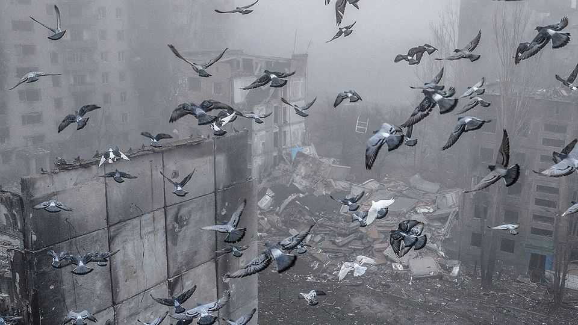
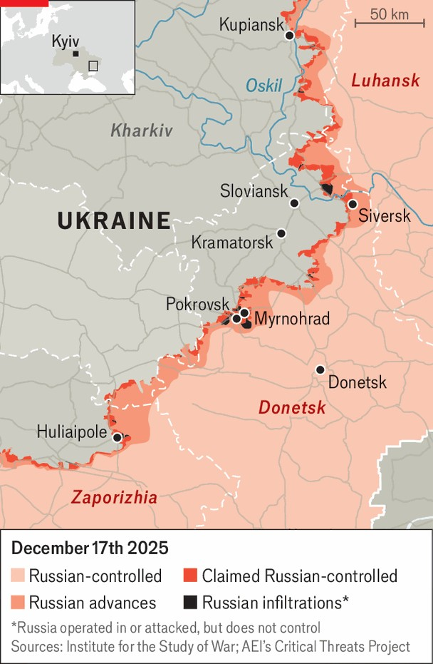
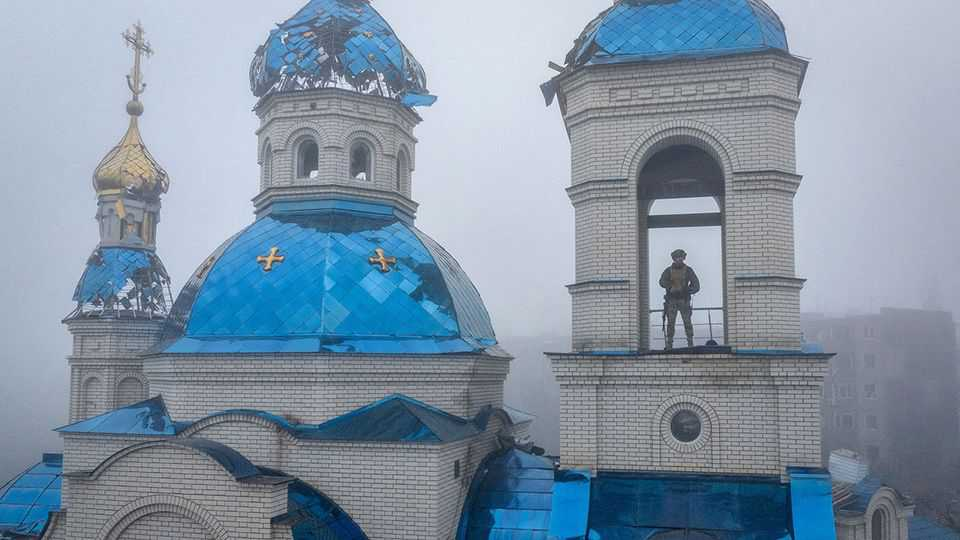
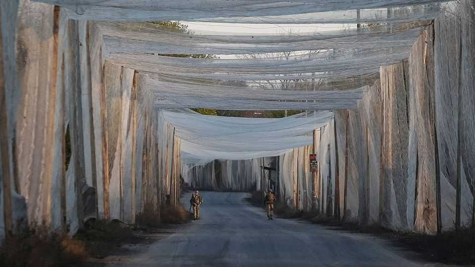

Europe | Bitter struggle
Ukraine scrabbles for handholds against Russia’s massive assault
A counter-attack in Kupiansk is promising, but the overall outlook is not
December 18th 2025

ON DECEMBER 12TH situation maps around the key railway town of Kupiansk in Ukraine’s north-east flipped from red to blue. DeepState, a war monitor, explained the change: a successful Ukrainian counter-attack had liberated most of the town, leaving pockets of Russians encircled. After midday came more drama, with Volodymyr Zelensky posting a selfie video from the town’s edge. Barely 1km from enemy positions, and just weeks after Vladimir Putin had declared the town to be his, the Ukrainian president challenged Kremlin claims to be winning the war. “They talked a lot about Kupiansk. Now we see the truth for ourselves.”

Much about the Kupiansk operation remains secret. Part of the reason is that it is ongoing. Perhaps 200 Russian defenders remain isolated in basements in the town. But part is because Ukraine is keeping secret the methods it hopes will help it regain a winning edge elsewhere. Participants refuse to say how they circumvented the all-seeing eyes and kill-zones of the modern battlefield. “There are war games and different courses of action, but these are things the enemy must not know,” says Ihor Obolensky, commander of the Khartiia corps, who developed the original operational plan. “Above all it’s about creative thinking, a feel for the enemy, a sense of his rhythm.”

The Kupiansk counter-attack was conceived in response to increasing Russian pressure in the late summer. The first stages of an operation to relieve the town began as early as August 24th, Ukraine’s independence day. Yet by mid-September the situation grew critical, with Russian troops breaching the Oskil river that runs through the town, occupying the town centre, and threatening a much larger grouping of Ukrainian forces to the south. On September 21st a task group led by Khartiia, the 92nd brigade and the Code 9.2 regiment, an elite assault unit, began the full counter-charge.

Over October and November, the group slowly pushed the Russians back over the river. They took control of two villages to the north, effectively cutting off supply routes. Russia attempted to reinforce its encircled troops via a disused pipeline, unaware that Ukrainian guns had established control over the exit point. The pipe became a death trap, with Ukraine destroying whatever came out of it. “Every day [they sent] a platoon,” says Ihor Raikov, head of Khartiia’s drone forces. ”A platoon a day is a thousand men a month.”

The Kupiansk counter-attack is one of few bright points for Ukraine. Elsewhere, Russia continues to push its advantage in men and materiel. Progress is slow and bloody, and the Russians have not achieved a break- out. Yet Ukrainian defences are retreating faster than at any point since the start of war. A Ukrainian intelligence source said Russia’s fifth army is now “several weeks” ahead of its operational plan, advancing westward near the city of Huliaipole in Zaporizhia province.

The 22-month-long defence of Pokrovsk and its satellite town of Myrnohrad is also reaching a bitter end. Russia has assembled 160,000 troops there and is pressing ahead. The situation in Myrnohrad (prewar population: 50,000) has become particularly acute. As of the most recent rotation of Ukrainian troops in mid-November, Russian forces were already close to surrounding the town. A marine from the 38th Brigade said his unit went in only after two others refused. “Someone had to do the job.” By early December the town was in effect encircled, with no safe routes out and no order to withdraw. Ukrainian military sources say several hundred soldiers remained trapped in mid-December, many sheltering underground under the threat of Russian glide bombs. Some are missing. “There are wounded, and they cannot be evacuated,” said a relative of one of the unaccounted-for. “People are hoping for a miracle.”

A similarly bleak picture is developing in Siversk, a small mining town in Donetsk province. Owing to its location on high ground, Siversk had served as a Ukrainian outpost, blocking a Russian advance towards Sloviansk and Kramatorsk, the  largest cities in the province still held by Ukraine. In the second week of December Russian forces surged forward to gain a significant foothold. A senior Ukrainian officer, speaking anonymously and nervously, said that key positions could have been held had reserves been released. They were not. ”If the line now breaks, it won’t be a local setback,” he said. “Siversk is only the first domino. It will create a chain of panic.” By mid-December Russia appeared to control most of the town, with some troops already pushing beyond it.

Ukraine is struggling in Donbas and Zaporizhia for three reasons. The first is its well-documented difficulties with conscription and materiel. Russia, by contrast, is drawing on a far larger pool and has little difficulty finding recruits to feed its costly offensive. A source in Ukraine’s general staff said that during the first half of 2025 Russia’s army grew by an average of 8,000–9,000 soldiers a month, despite heavy losses, while Ukraine struggled to replace its own casualties. The Russian grouping in Ukraine now stands at roughly 710,000 troops, with an operational reserve of about 50,000. “They are still exceeding their recruitment targets by 20-30%,” said a Ukrainian

intelligence officer. “They create conditions in the regions such that people choose between starving or signing a big contract with the armed forces.”

A second factor is Russia’s growing competence in drone warfare. New, well-funded drone units, including the grouping known as Rubikon, are striking Ukrainian logistics deep behind the front. In some areas of the front line it has many more drones that can operate at longer distances, meaning it can search for and kill Ukrainian drone operators first. Casualties among drone operators and others in rear areas are now higher than among front- line infantry, a remarkable reversal from earlier in the war.

But local conditions are a third factor. Not all commanders are as joined-up as Mr Obolensky. At the Pokrovsk axis, for instance, command has long suffered from co-ordination problems. Where Russian forces encounter a coherent, systematic defence, they grind to a halt, said a commander of an elite Ukrainian drone unit that took part in the Kupiansk attack. “Numbers alone do not decide things in modern warfare.”

The Russian surge is clearly designed to project confidence at a sensitive moment in negotiations. It may be working, but it is not cheap. Ukraine estimates that Russia is suffering more than 1,000 casualties a day, killed and wounded. Even so, a Ukrainian intelligence source says the push can

continue for several more months. The Ukrainians think Russia will eventually lose its current level of dominance, but not until February. Until then it plans to squeeze as hard as possible, seize as much territory as it can, and weaken Ukraine while talks continue.

Ukraine’s western allies hope it will be able to hold out until then, denying Russia major gains while demonstrating its ability to fight. Before the maps in Kupiansk flipped from red to blue, many feared that was asking too much. But that tactical success showed that Ukrainian strength is sometimes deeper than it appears. “For the public, everything turned on the map update,” says Khartiia’s Raikov. “We don’t lie. We are under pressure. But we have shown that when we are organised, we can beat them.” ■

To stay on top of the biggest European stories, sign up to Café Europa, our weekly subscriber-only newsletter.

This article was downloaded by zlibrary from https://www.economist.com//europe/2025/12/17/ukraine-scrabbles-for-handholds- against-russias-massive-assault