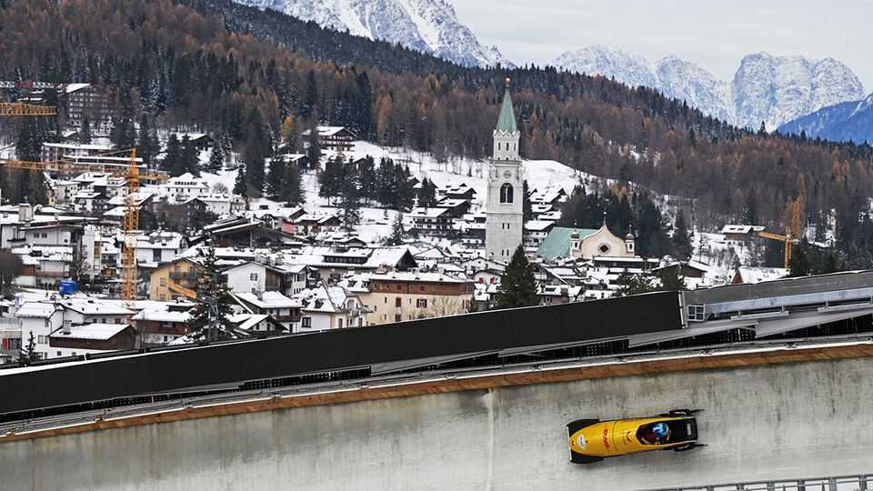

Europe | Swish as they come
Italy is using the Winter Olympics to appeal to the ultra-wealthy
In Milan, everyone is going for gold
December 18th 2025

On the outskirts of Milan lorries come and go from a site beside the railway tracks where the final touches are being put to six elegant beige and cream apartment blocks. At the end of January thousands of athletes will arrive and the site will become an Olympic Village. The 2026 Winter Games are due to start here on February 6th. Milan is scarcely an obvious venue. It sits north of the River Po in the longest, broadest valley in Italy. The highest point in the city is just 122 metres above sea level. So it will host the skating events, including ice hockey at two venues, one of which is running nail-bitingly late. Most of the

Olympic and Paralympic competitions will be held at various towns in the Alps.

Yet only one of these resorts, Cortina d’Ampezzo—a five-hour drive away —features in the Games’ official title. The winter playground of Italy’s bankers, industrialists and entertainers, it has been entrusted with the curling, sliding events (bobsleigh, skeleton and luge) and some of the skiing. The women’s downhill and super-G will be on the intimidating Olympia delle Tofane run, where skiers plunge between rocks down a slope with a 64% gradient known as the Schuss.

Why the focus on Cortina? Because, like Milan, it is a byword for ritzy wealth. The winter games here in 1956 were attended by Sophia Loren; George Clooney is a repeat visitor. In the resort’s Cianderies district, with its mesmerising views of the Dolomites, a three-bedroom flat sold two years ago for €6.5m ($7.6m). At five-star accommodation such as the Hotel Ancora a room can go for €1,500-2,000 a night.

This makes Cortina a perfect partner for the Milan that has taken shape since 2017, when a tax break devised by the government of Matteo Renzi, a centre-left prime minister, began luring the very rich to Italy. Anyone content to pay an annual €100,000 on their non-Italian income was welcome. The figure was later upped to €200,000 and the 2026 budget proposes raising it to €300,000. Official records of the number of takers are outdated and incomplete. Filippo Molinari of Withers, a law firm, puts it between 5,000 and 10,000.

Geraldine Semeghini, who runs a property agency, reckons that about 80% of them came to Milan and doubts the proposed tax-rate increase will stem the flow. The arrival of so many ultra-high-net-worth individuals (UHNWIs in the jargon) is having a profound effect. Milan has acquired new clubs, admittance to which depends not on membership of the local aristocratic and financial elites but the ability to pay eye-wateringly costly subscriptions. Several new private schools have opened or are planned.

“I should be excited,” says Nicolas Bellavance-Lecompte, whose business relies on just the sort of high rollers who are making Milan their new home. He founded and manages Nomad, a travelling fair that showcases collectible

design and contemporary art. “But I used to be able to go to my favourite restaurant without a reservation and now I need to call days, if not weeks, in advance.”

He is not the only one with reservations. Property prices have soared, pulled up by demand at the top end—and, recently, the effects of a real-estate scandal. In October prosecutors asked for 36 people to be tried in connection with alleged irregularities in granting permission to build a huge residential complex. Investigations into other developments have led to the arrest, and subsequent release, of the head of the firm that built the Olympic Village. He denies wrongdoing. The investigations have caused work to be halted on several projects intended to increase the city’s housing stock and mitigate the rise in prices. Developers complain that other projects are paralysed because city officials, wary of future prosecutions, fear signing additional building permits.

Not that any of this is terribly likely to deter the UHNWIs. “We are getting calls every week for properties in the €5m to €30m range,” says Ms Semeghini. “And most recently we have had inquiries from private offices outside Europe.” In Milan, everyone is going for gold. ■

To stay on top of the biggest European stories, sign up to Café Europa, our weekly subscriber-only newsletter.

This article was downloaded by zlibrary from https://www.economist.com//europe/2025/12/18/italy-is-using-the-winter-olympics-to- appeal-to-the-ultra-wealthy