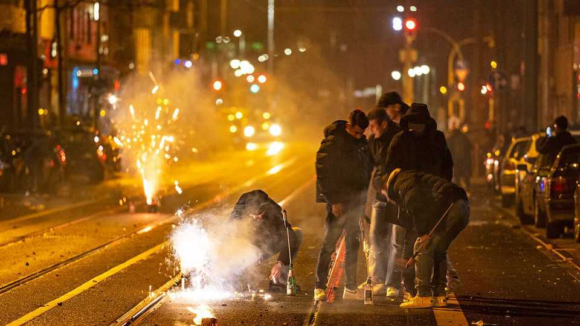

Europe | Same procedure as every year
Why German cities feel like war zones on New Year’s Eve
A dream for pyromaniacs, a nightmare for everyone else
December 18th 2025

NEW YEAR traditions in Germany are not for the faint-hearted. eu regulations have killed off the old custom of divining one’s future by dripping molten lead into cold water. But the devotion to seeing in the new year with a viewing of “Dinner for One”, a British comedy from 1963 stuffed with the double entendres Germans adore, is undimmed. So is the commitment to waging street battles with fireworks so intense that in the hours around midnight on December 31st, parts of Berlin and other cities can resemble war zones. In 2024 five Germans were killed in firework-related accidents on New Year’s Eve. In Berlin over 360 people were hurt, hundreds of fires broke out

and a block of 36 flats was evacuated after its windows were shattered. A visiting Palestinian influencer was arrested after posting a video of himself firing a rocket into a child’s bedroom. Then there is the less visible damage. Emergency services are overwhelmed, people hesitate to leave home and pets cower in fear (airport hotels with soundproofed rooms make a killing). Germans stepping out to greet the new year find the air thick with particulates and streets littered with debris.

Every year the chaos inspires the same lament: surely Germany should extend the ban on buying fireworks that applies for 362 days of the year to the remaining three? True, much of the damage is done by the dreaded Kugelbomben, which are already illegal for amateurs. These intensely explosive spherical “bombs” are smuggled in from Poland and the Czech Republic, with the names of trusted dealers spread on private networks. Big Firework says existing laws on Kugelbomben simply need to be enforced. But campaigners say it is tricky for overstretched police to distinguish between legal and illegal fireworks while rockets whizz past their heads. Better just to ban the lot, says Vasili Franco, a Green member of Berlin’s parliament.

Polls suggest most Germans agree. But many politicians regard Silvester (new year) fireworks as an inviolable national tradition, and the relevant law is federal, meaning city-states like Berlin cannot impose unilateral prohibitions. Still, Hanna Rhein of Environmental Action Germany, an ngo pushing for a ban, reckons politicians are beginning to feel the pressure. Campaigners take solace from the neighbouring Netherlands, where years of carnage forced mps to outlaw private fireworks earlier this year. Yet even there it will not take effect until 2026/27—so pyrophobes must, one last time, see the year out with a bang. ■

To stay on top of the biggest European stories, sign up to Café Europa, our weekly subscriber-only newsletter.

This article was downloaded by zlibrary from https://www.economist.com//europe/2025/12/18/why-german-cities-feel-like-war-zones- on-new-years-eve