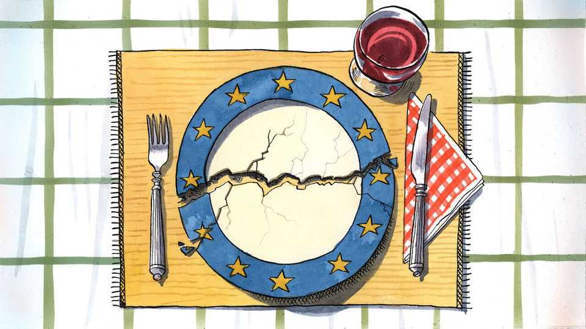

Europe | Charlemagne
European nationalism is dead. Long live European gastronationalism
A continent united by treaties remains divided by recipes
December 18th 2025

Attacked by Russia, economically submerged by China and forsaken by America, Europe can still be trusted to focus on the things that matter. Like, say, the proper way to cook spaghetti carbonara. Upon discovering last month that a shop in the European Parliament in Brussels was selling jars of ready-made carbonara saus that apparently used the wrong ingredients, Francesco Lollobrigida, Italy’s agriculture minister, reacted with the solemn intensity one might expect for matters of war and peace. How could a carbonara containing cream—crema! Madonna mia!—and the incorrect cut of pork ever be worthy of the name? What next, pineapple on pizza? This was plainly unacceptable, fumed the populist minister, who happens to be a brother-in-law of Giorgia Meloni, the prime minister. An investigation was

sternly demanded. Faced with existential threats, the continent has once again shown its talent for prioritising the non-negotiable.

Mr Lollobrigida’s Vesuvian outrage was symptomatic: food can arouse stronger emotions in Europe than almost any other topic. Culinary habits continue to divide its countries even as they have come together in myriad other ways. For decades the European Union has laboriously tamed their residual jingoism. In one interminable summit after another, 27 sets of national laws have been harmonised, border checks eradicated, currencies fused into one. But a continent stitched together by treaties remains torn apart by recipes. From Dublin to Lublin and Malmo to Palermo, European palates have remained unmoved by 70 years of European integration. Americans chow much the same food wherever they are from. Yet serve up Dutch cheese to a Greek or an Irish stew to a Spaniard and the best you can hope for is polite silence. It is considered impolite these days for a European to denigrate a neighbour, surely an ally in some vital EU negotiation. But taking pot-shots at their cuisine remains a sign of patriotic virility. European nationalism is dead. Long live European gastronationalism.

Dietary peculiarities have long been used to poke fun at those just over the border. Germans are unlovingly known as Krauts, the French are Frogs (or “cheese-eating surrender monkeys”), Brits are rosbifs in an allusion to their unrefined ways of cooking beef, and so on. Politicians across Europe know that belittling the cooking abilities of their neighbours will play well at home. French president Jacques Chirac once proclaimed that Britain’s only contribution to European agriculture was mad-cow disease, and that “you cannot trust people who cook that badly”—which, from the EU’s vantage point, turned out to be true. Italy’s late Silvio Berlusconi dismissed food from Finland as consisting largely of marinated reindeer. A Finnish restaurateur’s revenge, a Pizza Berlusconi featuring smoked reindeer meat, went on to beat a host of Italian entries at a pizza-making festival in New York.

In matters of cuisine, as with economics and climate, a horizontal line divides the continent. Those above it, the rich, rained-upon northerners, mostly cook with butter and are the continent’s gastronomical poor relations. Their “cuisine”, their southern neighbours allege, is an efficient means of delivering calories befitting their innate humourlessness; who has ever

voluntarily sought out a German, Dutch or Polish restaurant? The southerners, in contrast, are an olive-oil lot. The Italians, Greeks and French (who cleverly straddle the oil-butter line) think of a meal as a sacred occasion, nourishing the soul as well as the body.

Free-trading northerners, with their ho-hum grub, have gained much from globalisation: witness how fast Brits ditched their rosbif in favour of chicken tikka masala, and how Germans flocked to döner kebabs. Southerners like what they have, and want to defend it. In part they resent poor imitations of their nonnas’ recipes. Scandinavians happily serve their pasta with ketchup, while Poles serve up a dish of macaroni and strawberries (best not tell Mr Lollobrigida). The southerners have fought back against this culinary appropriation with gusto. Since 1992 the EU has enforced rules that stipulate some foods can only come from certain areas, ensuring for example that only Greeks can make feta and that Parmesan must hail from northern Italy. Of the over 1,500 foods now protected more than 70% come from five southern countries. On December 10th UNESCO extended its list of humanity’s intangible cultural heritage to include the cuisine of Italy, making it the first country to get such a nod. There are, one assumes, no plans to recognise Dutch fare.

Europe’s gastronationalistic squabbles are delicious because they can be comically small-bore. It is the narcissism of tiny differences. Belgians resent that “French fries” are named after their neighbours, given their evident superiority at cooking them. Greeks lay claim to “Turkish coffee”. All southern European countries distil fruit into some aniseed-flavoured firewater best enjoyed in the sunshine; who can tell the difference between Greek ouzo, Bulgarian mastika and Balkan raki? And yet each country treats its own concoction as nectar from the gods while denigrating its neighbour’s brew as a variant of paint stripper. Ukraine and Russia have long squabbled about the origin of borscht soup, each using the other’s claim as evidence of intransigence.

In a globalised age in which Instagrammable “fusion” food steamrolls over local tradition, is a little culinary chauvinism not sensible? Only up to a point. For to prescribe a “correct” way to prepare a dish, or to tie it down to one place, is to miss how cuisine evolves. Cooks borrow, adapt and improve what they find. Much food tradition is invented anyway. The carbonara so

vigorously defended by Italians is no ancestral dish: the first known recipe was printed in 1952—in Chicago. Only in the 1990s did the current “canonical” version take root. You can put that on your plate and eat it. ■

Subscribers to The Economist can sign up to our Opinion newsletter, which brings together the best of our leaders, columns, guest essays and reader correspondence.

This article was downloaded by zlibrary from https://www.economist.com//europe/2025/12/18/european-nationalism-is-dead-long- live-european-gastronationalism

Britain

How to heal the trauma from Northern Ireland’s killings Britons are becoming obsessed with pet photography A portrait of Britain’s aristocrats All sides have learned a lot from Extinction Rebellion’s co-founder