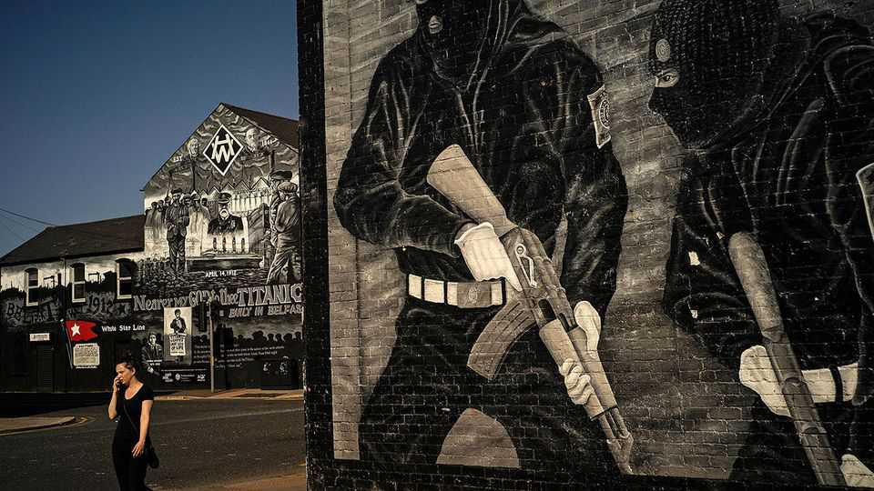

Britain | The Troubles
How to heal the trauma from Northern Ireland’s killings
The British government hopes new commissions will draw a line under the Troubles. It won’t be easy
December 18th 2025

As a young man Martin McAllister risked his life to kill British soldiers. As an old man he risks the wrath of his former comrades to help find the body of a British soldier. When he joined the Irish Republican Army (IRA) he believed that he was part of a heroic struggle to drive the British out of Northern Ireland. But the IRA’s slaughter of ten young Protestant civilians in the 1976 Kingsmill massacre shook his belief that the IRA was “romantic, chivalric, holy”. After Mr McAllister was shot by British soldiers he was attacking, he had an epiphany when a Royal Marines medic saved his life. It was that man’s actions which he now viewed as chivalric.

In 1977 a Grenadier Guardsman attached to Britain’s special forces, Robert Nairac, was abducted, tortured and murdered by the IRA. His death endures as one of the most infamous atrocities carried out during the 30 years of sectarian violence in Northern Ireland, known as the Troubles, in which more than 3,500 people were killed. Nairac’s body was “disappeared” by the IRA to instil fear. The bones of most other disappeared victims have been returned, but Nairac’s remain hidden somewhere beneath the earth near the Irish border. Mr McAllister has spent decades searching for his former foe’s body.

This lonely private quest involves the sort of reconciliation the British government has spent years trying to engineer, yet it has happened entirely outside official structures. By contrast, government attempts have failed. More than 27 years after the Good Friday Agreement ended the Troubles, the legacy of the conflict festers in Northern Ireland and beyond.

Now Sir Keir Starmer’s government is embarking on a new policy which it hopes will see commissions reinvestigate Troubles deaths, then draw a line beyond which a new future can be written. This has been agreed with the Irish government as part of a wider post-Brexit rapprochement.

Sir Keir’s policy involves ditching that of the previous, Conservative government. It legislated for a de facto amnesty—in effect trading justice for information if those involved would talk. It argued that securing convictions for crimes which may have happened half a century ago is hard, which is true. But that wasn’t the only, or even the main, reason for the legislation.

Though many terrorists had been jailed during the Troubles, few rogue soldiers were. As evidence of atrocities involving soldiers emerged, police were coming to interview veterans under caution. Some were charged and tried. On the right of British politics and media, this became a pet cause out of a belief that former IRA members weren’t being pursued to the same extent. This fury involved an inchoate logic. There is no statute of limitations for the most serious crimes. The oldest Nazi war criminal was jailed aged 101.

The most high-profile trial of a former soldier involved a British paratrooper who admitted to a public inquiry that he killed four people on Bloody

Sunday. On that infamous day in 1972 soldiers killed 13 civilians at a civil- rights march in Londonderry. “Soldier F”, granted anonymity due to fears for his life, was ultimately cleared of murder. When judged by the criminal standard, the evidence against him was weak. Even in clearing him, the judge said he was satisfied the soldiers “did not act in lawful self-defence”. By shooting in the back unarmed civilians fleeing from them, the paras had “sullied” the name of the regiment.

Unionists, who want to keep Northern Ireland British, fear that the Troubles are being retrospectively legitimised. This concern is far from irrational.

In 2022 Michelle O’Neill, a Sinn Féin politician who is now the first minister of Northern Ireland, said that there had been “no alternative” to “violent resistance to British rule” during the Troubles. A poll found that 69% of Northern Irish nationalists agreed. Yet when atrocities were happening, support for killing was far harder to find. In 1998, 70% of Catholics and 74% of Protestants said they not only did not support the violence, but had no sympathy for the reasons behind it. In its darkest decades, a shared revulsion united Northern Ireland’s politically divided community.

One of the perverse fruits of peace has been the glamourisation of killers. All three young members of Kneecap, a rap group and Belfast’s most controversial music act, largely grew up in peace. Yet their trademark is the balaclava worn by paramilitaries, they lead chants of “ooh, ahh, up the Ra” (IRA), and one of them shouted at a gig “kill your local MP”, something that the IRA did.

Some ex-paramilitaries are genuinely remorseful for their actions. But others see this as another phase in their struggle: they want to convince succeeding generations that their barbaric acts were heroic. In this lies future danger. Irish history is replete with cycles of violence in which those who launch attacks have no popular mandate or hope of success but who later come to be venerated, perpetuating the hope for others that, though shunned today, they will be lauded tomorrow.

The £200m ($267m) public inquiry into Bloody Sunday shows how getting truth is not always enough (for legal reasons, its findings couldn’t be

admitted in the criminal trial). Its outcome led the then prime minister, David Cameron, to apologise in the House of Commons for “unjustified and unjustifiable” killings. But even such clearly indefensible killings remain points of conflict. When Soldier F was cleared on October 23rd Gavin Robinson, leader of Northern Ireland’s main unionist party, the Democratic Unionist Party (DUP), posted on social media an image of the Parachute Regiment’s insignia. That crass act was all the starker because the DUP’s 41-year-old leader is a relative moderate in his party.

Under Labour’s Northern Ireland Troubles Bill, which is making its way through Parliament, the possibility of prosecutions will remain, but no one expects many killers to end up in jail. Any who do will serve only two years, thanks to a provision in the Good Friday Agreement. The focus will be on “information recovery”: telling families, and the public, what happened. But there are significant blocks on information being published. If these are seen to be sanitising what happened, rather than bringing closure, the exercise could amplify the sense that the truth is being hidden.

Mr McAllister says unionism and nationalism each “need to throw up a statesman” who can lead reconciliation. He fears that myths—such as those which accuse Nairac of atrocities without evidence—will become embedded. “What we’re dealing with here is folk memory and the older that folk memory becomes, the more potent it is because there’s no way to refute that,” he says. It took 30 years to end the killing in Northern Ireland. Resolving the trauma those deaths caused will take far longer.■

For more expert analysis of the biggest stories in Britain, sign up to Blighty, our weekly subscriber-only newsletter.

This article was downloaded by zlibrary from https://www.economist.com//britain/2025/12/15/how-to-heal-the-trauma-from-northern- irelands-killings