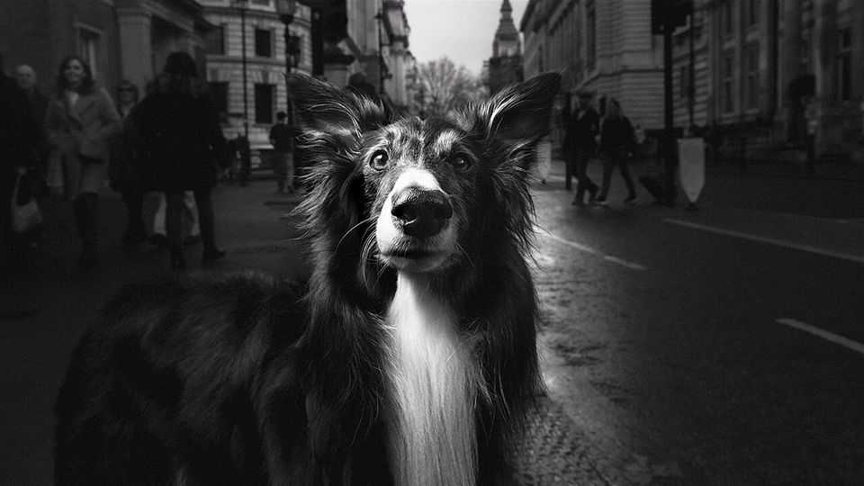
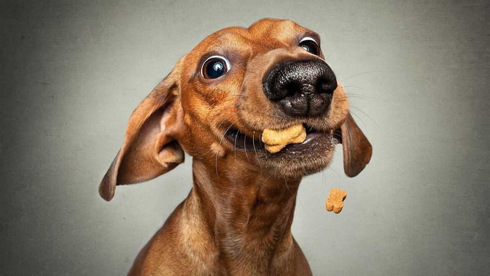
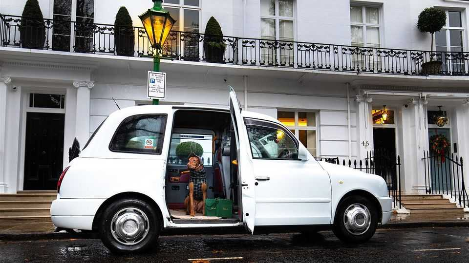

Britain | Family pawtrait
Britons are becoming obsessed with pet photography
Photos of pets are more popular than those of partners
December 18th 2025

AT A STUDIO in east London, Storm, a Maltipoo in a Christmas collar, nearly topples off a backdrop roll. Luckily the shoot is over, and her owner is thrilled with one image: Storm nose-to-nose with a large rabbit. It will sit neatly on her Instagram profile. That Britons—western Europe’s top dog-owners—like pet photos is no surprise. What is striking is how many they take. A 2024 survey of 2,000 pet-owners found that Britons post three times as many shots of their pets on Instagram as they do of their partners, or even themselves. Demand for professional pet portraits surges before Christmas.

“Is your dog ready for their closeup?” asks a flyer for a south London pop- up—illustrated with a chihuahua in a Christmas jumper. Purists sniff at the seasonality. Jon Mills, who runs Soul Dog studio in West Sussex, discourages owners from bringing outfits. “I’m all about naked dogs,” he says.

Artsier choices include portraits against London landmarks (one firm will hire a London cab for £949, or $1,270). Pawtiqe promises “an irreverent

study of the art of simply being dog”, and testimonials for Paws Célèbre show clients handling their prints with white gloves.

It is no coincidence that “pet parents”, as many insist on calling themselves, are becoming more affluent. In 2025 some 49% of new cat-owners were managers or professionals, despite that group making up only 23% of the population. Though about 16% of pet-owners have set up a social-media profile for their animal, a recent survey says the share is higher in Kensington and Chelsea, London’s poshest borough (30%), than in less well-off Blackpool (8%).

Pet photography is not for the timid. Stoyo Gerov, who runs Pawshot Studios (and offers those cab rides), recalls working with a Czechoslovakian wolfdog called Wulrick. For his signature shot for “food-motivated” animals —throwing treats and capturing the moment—Wulrick missed the kibble and caught Mr Gerov’s head. Fortunately the dog was “intelligent enough not to squeeze”.■

For more expert analysis of the biggest stories in Britain, sign up to Blighty, our weekly subscriber-only newsletter.

This article was downloaded by zlibrary from https://www.economist.com//britain/2025/12/13/britons-are-becoming-obsessed-with- pet-photography