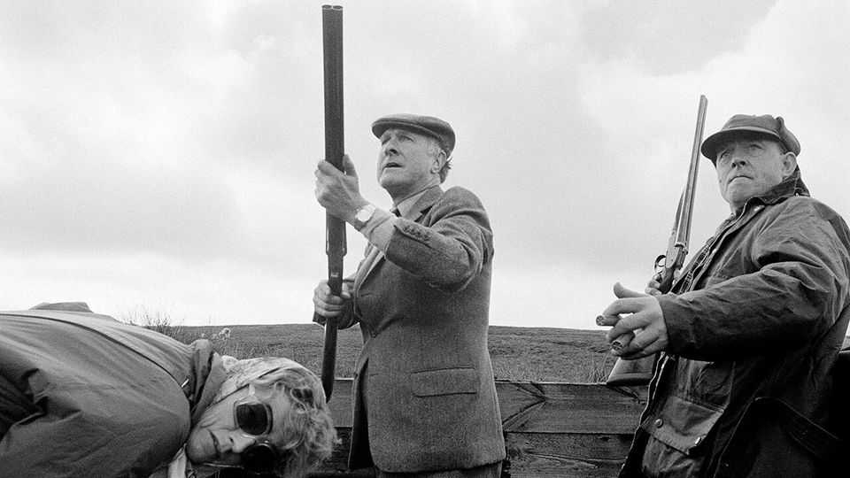

Britain | Declining, not falling
A portrait of Britain’s aristocrats
A thousand years of British history is ending. Does it matter?
December 18th 2025

It looks at first sight like a common-or-garden trade fair: there are stalls, free glazed biscuits and glazed-looking people. Peer a little closer and it becomes clear that very little about this trade fair is common—particularly not its gardens. One stall offers statuary for stately piles; another can do the stonework for stately balustrades. The punters are similarly grand. There are ladies with high colour and higher breeding; there are people with names like Araminta. They have come for the annual meeting of Historic Houses, an association that works to keep grand homes independent and in private ownership. Some call this the “AGM for aristocrats”. Britain has changed. Its aristocrats used to gather for “the season” in the summer months (Ascot in June, Lord’s and Henley in July) and for shooting

parties in the duller months (stags in autumn, pheasants in winter, foreigners whenever possible). But now they gather each autumn in a drab hall in Westminster to find ways to prevent their crumbling piles from crumbling further and to attend talks with titles like “How repairs can be made to sash windows”. Historic Houses, says a toff, is the “trade association for aristocrats”.

Britain does not have many aristocrats: just 794 hereditary peerages. As an endangered species they are less numerous than the lesser-spotted woodpecker (under 2,000). But aristocrats are not lesser-spotted. England echoes with aristocratic influence. People walk along Shaftesbury Avenue (named after the 7th Earl of Shaftesbury) and wrap cardigans (the 7th Earl of Cardigan) around them as they eat their sandwiches (the 4th earl). They watch “Downton Abbey” and revisit “Brideshead”. There has been a decline in Britain’s nobility, writes Eleanor Doughty, a journalist, in “Heirs and Graces”. There has “not yet been a fall”.

Britain’s aristocrats still dominate the nation physically (a third of the land is owned by titled toffs) and literarily (the words “country house” appear twice as often in books as “semi-detached”). The English aristocracy, as Nancy Mitford, a novelist, wrote in 1955, “is the only real aristocracy left in the world” because it still “has real political power”.

Or it did. In 2026 the House of Lords will boot out the last of its hereditary peers, all 85 of them. A thousand-odd years of aristocratic influence—which began when William the Conqueror trounced Harold in 1066—will end once The House of Lords (Hereditary Peers) Bill is passed.

Defining quite who aristocrats are is tricky. Most people might reasonably assume that to be a member of the landed gentry one must have land and be gentry. Nothing so simple will suffice. A toff might have land and a title but it is possible to be one without either a title (Winston Churchill had none, but counts as one) or land (the 9th Earl of Buckinghamshire was a street- sweeper). The hierarchy of the squirearchy can, says Hugo Strachwitz of Debrett’s, a directory of those with blue blood, be “confusing”.

Their decline has in some ways been steep. In that same 1950s essay Mitford wrote that a true aristocrat’s “mind is not occupied with money”. Today,

after decades of death duties, it is occupied with little else. Consider the current Earl of Sandwich. One of his ancestors was the 4th earl, John Montagu, First Lord of the Admiralty, who had breeches, a wig, a mistress, an imperious air and a wild life.

Now the 12th earl, Luke, wears a mildly apologetic air and a Patagonia fleece. (“I refuse to turn on the heating,” he says. “It would cost such a fortune.”) To pay for his house, Mapperton, he opens it to the public. He has a giftshop, a YouTube channel (“Mapperton Live”), paying guests and hires a butler only when “we want to look posh”. The 4th earl invented the sandwich; the current one serves sandwiches in the Coach House Café and lives “a pretty normal middle-class existence”. Albeit with the title “The Right Honourable The Earl of Sandwich” and 1,900 acres.

Which is not nearly middle-class enough for some. An aristocracy, critics argue, causes snobbery to seep through society. Parliament has a webpage explaining how to address an earl (not, naturally, as “Earl”) and a duke (grovellingly). One must, as Mitford noted, still demonstrate “U” (upper- class) speech and thus know to call a private school “a public school” and (some say) to pronounce the name “Featherstonehaugh” as “Fan-sure”. Which can leave others feeling a little un-stonehaugh. England’s nobility often feels less like a social class than a social shibboleth created to confuse the middle classes.

This makes many people cross. Behind aristocrats’ fancy pilasters, argues a book by a Labour MP, Chris Bryant, lies “theft and unrepentant greed”. Maybe so, but it is equally true that Britons like to look at those pilasters. The National Trust, a charity which offers fresh scones and old stones (and, like Historic Houses, helps preserve architectural gems that might otherwise crumble), has nearly 5.4m members. For biscuit-tin Britain, which takes pride in the national heritage, this matters.

Back in Westminster, England’s aristocracy mill about their AGM peering at stalls on woodworm prevention. Their badges give not only their own names but those of their houses. “Penshurst Place” walks past at one point; “Mapperton House” at another. As if these were not mere people but a bit of England incarnate—which, perhaps, they are. ■

For more expert analysis of the biggest stories in Britain, sign up to Blighty, our weekly subscriber-only newsletter.

This article was downloaded by zlibrary from [https://www.economist.com//britain/2025/12/18/a-portrait-of-britains-aristocrats](https://www.economist.com//britain/2025/12/18/a-portrait-of-britains-aristocrats)