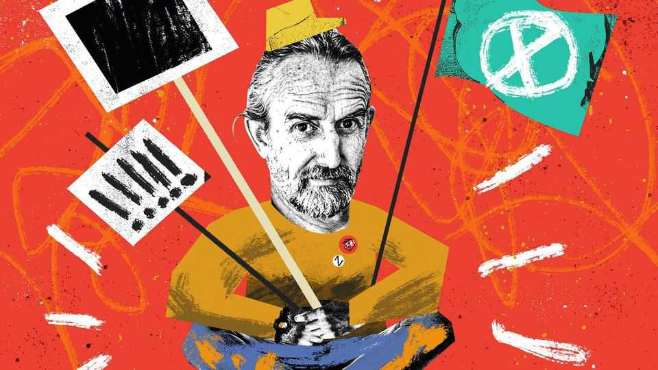

Britain | Bagehot
All sides have learned a lot from Extinction Rebellion’s co-founder
Call it the Roger Hallam extended universe
December 18th 2025

Splat! The first protester smeared a tray of apple crumble onto the case containing the Crown Jewels in the Tower of London. Next came the custard. Slop! Then the earnest slogan, from two nervous activists: “Democracy has crumbled!” Then the demands to camera: introduce a House of the People, with people appointed at random and the promise that Take Back Power, the custard-chucking protest group, will be doing this all again soon. If it felt familiar, it should. The aims were new but the methods were old. Extinction Rebellion activists caked Shell’s headquarters in graffiti and blocked junctions in central London. Just Stop Oil, another protest group,

encouraged its activists to hurl tomato soup on paintings by Vincent van Gogh. Insulate Britain, possibly the first civil-resistance movement dedicated to lobbying for lagging, blocked roads. In some cases, even the phone number supplied to curious journalists is the same.

Call it the Roger Hallam extended universe. A co-founder of the likes of Extinction Rebellion and Just Stop Oil, Mr Hallam has spent much of the past decade helping organise civil disobedience in Britain. Eventually, the law caught up with him. The activist gave a pep talk to people planning to block the M25, London’s orbital motorway, which was recorded and then handed to the police. Mr Hallam gave the court a two-hour lecture; the judge gave him five years. Now, sporting an electronic tag, Mr Hallam is free and cheering on the custard-hurlers if not doing it himself. Why listen to a 59- year-old man fresh out of hmp Wayland?

Plenty of other people have. In Mr Hallam’s telling, the more activists sent to prison the better. What was once a fringe tactic is now a core strategy across the left. Pro-Palestine activists turn up en masse outside Parliament holding signs saying “I oppose genocide. I support Palestine Action”, a pro- Palestine group that vandalised a military base and which the British government places in the same category as al-Qaeda. The protesters knew it would result in arrest. So far, 2,700 people have been arrested. Mass arrest has become the omnistrategy for the omnicause.

After all, a movement needs some martyrs. “People need to go to prison,” says Mr Hallam, who practises what he preaches. Among those jailed for blocking motorways was a Quaker so elderly no tag could fit her slender limbs. At the Palestine protests an 89-year-old was carted away by four police officers perhaps a third her age. Those arrested can become causes célèbres, touring universities and right-on talking shops to extol the virtues of lying down in the road or holding a forbidden sign.

For years the left had a near-monopoly on martyrdom. But if prison works for lefties, it will work for their enemies, too. The right is developing its own martyrs. Tommy Robinson, a football hooligan turned far-right rabble- rouser, has perfected the art of victimhood, rattling a digital collection tin in front of his followers after his release for contempt of court in May. Lucy Connolly, who was jailed for tweeting “set fire to all the fucking hotels full

of the bastards for all I care”, is now a celebrity, marching on stage at Reform UK’s annual conference like an “X Factor” contestant. She sees herself as Sir Keir Starmer’s “political prisoner”.

Now the right is on the march. Angry protesters appeared outside a hotel full of asylum-seekers in Epping after one of its residents assaulted a teenage girl. Rather than bald right-wing men, middle-aged women placed themselves at the front, dressed in pink, toting “I’m not a racist, I’m a worried mother” signs. Britain is a land where The Children march against climate change one year and The Mothers march against sex offenders the next. Sentimentality is a weapon that both sides of the political spectrum have learned to use.

Politicians in Westminster pretend that street politics does not exist and, if it becomes impossible to ignore, that it does not work. Mr Hallam and friends provide the counter. Extinction Rebellion helped create an atmosphere that pushed a Conservative government into becoming the first G7 country to pledge to reach net-zero by 2050. Just Stop Oil’s goal of banning new oil- and-gas licences in the North Sea is now government policy. Ideas can affect the body politic only if they are already in the bloodstream. A citizens’ assembly is a mad idea, but then so is an upper chamber consisting of party donors and apparatchiks. And here you are reading about it, thanks to apple crumble and custard.

British politics has taken a millenarian turn. A movement without a pet civilisational threat seems pointless. For parts of the left the looming threat is a climate apocalypse. For the right it is a Britain overrun by “fighting-age males” from abroad. How can stodgy centrists compete with the end of the world and invasion? Catastrophism sells. Mr Hallam and his ilk realised this earlier than most. “Act Now Because It’s Too Late” was an Extinction Rebellion slogan. In focus groups, voters despair that things can hardly get any worse. The radical becomes rational. And so Britain has become a nation where grannies are happy to risk jail and The Mothers will join a mob.

It might seem ridiculous to talk, as Mr Hallam does, of regime collapse. People leap to the 1920s images of “Weimar Britain”, which are absurd. More prosaic but just as sweeping examples exist, such as in early-1990s

Italy, when once-hegemonic parties disappeared and Silvio Berlusconi emerged. In Britain in the 2020s each political party is only a few points from non-existence, whether they have barely reached their seventh birthday, like Reform, or are almost 200 years old, like the Conservative Party. Doomerism is now the norm among Britain’s political class. Yet few seem to be actively preparing for it. If the system fractures, whoever is most organised will be able to pick up the pieces. ■

Subscribers to The Economist can sign up to our Opinion newsletter, which brings together the best of our leaders, columns, guest essays and reader correspondence.

This article was downloaded by zlibrary from https://www.economist.com//britain/2025/12/17/all-sides-have-learned-a-lot-from- extinction-rebellions-co-founder

Christmas Specials

A journey into the world’s most mysterious rainforest What The Economist discovered at dating bootcamp How humankind’s 10m-year love affair with booze might end The tariffs that nearly stole Christmas From honeycomb curry to blood fry: India’s “untouchable” cooking The battle to stop clever people betting Adam Smith is misinterpreted and his influence overstated What street talk reveals about Anglophone civilisation America’s fight back against China starts in Los Angeles—in flip-flops The long, strange journey of a temple from profane to sacred What if the best way to learn about history is by playing with it? How two explorers, a mother and a baby made America The titanic task of catering on the world’s biggest cruise ship How wolves became dogs A journey along East Asia’s hidden artery How Jane Austen revealed the economic basis of society Was Mr Darcy the richest of all Jane Austen’s characters? The most friendless place on earth Two centuries ago, Russian revolutionaries tried to change the world The rise and fall and rebirth of lapsang souchong How magicians stay relevant in the age of AI