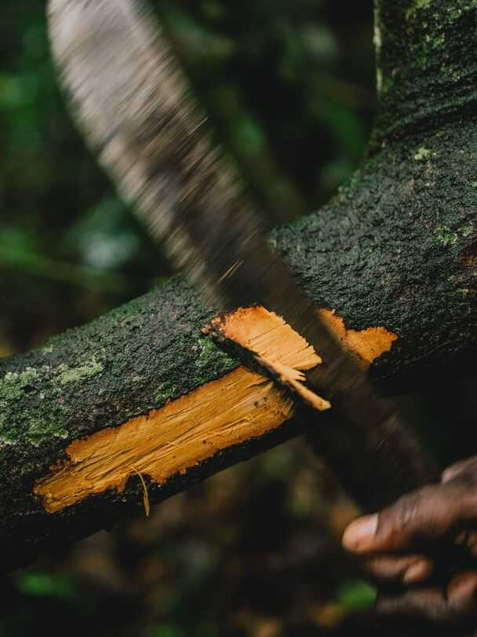
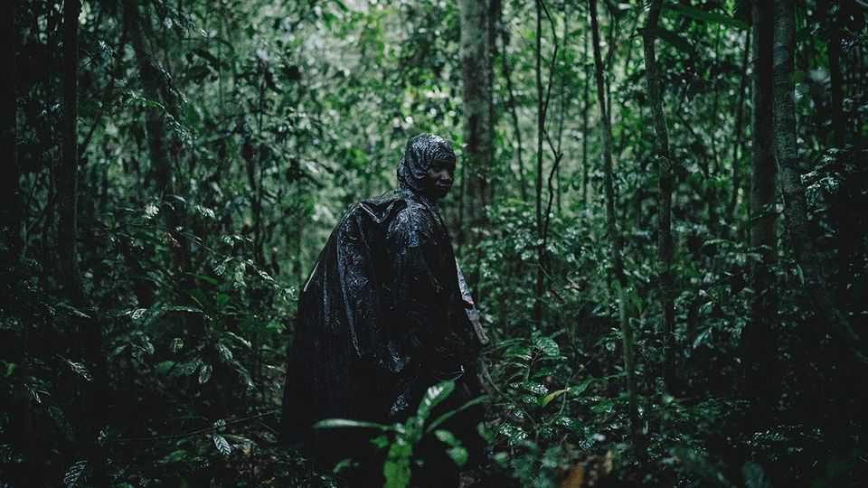
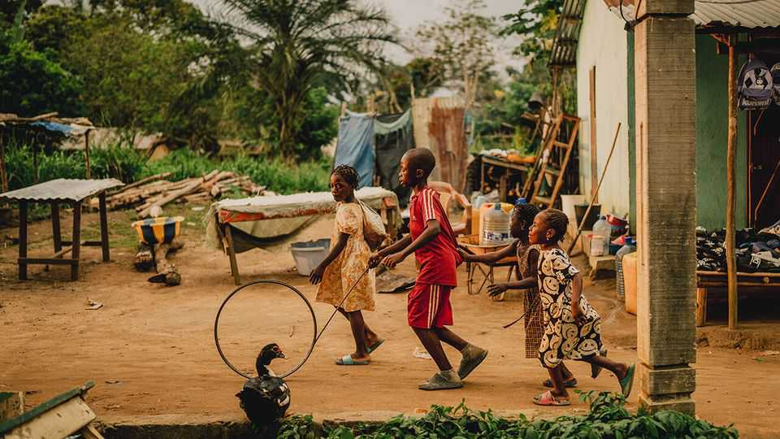

Christmas Specials | Inside Africa’s great green lung
A journey into the world’s most mysterious rainforest
The secrets of the Congo basin are only slowly coming to light
December 18th 2025
“Welcome to my office,” says Juan Thomas, as his plane soars over Odzala- Kokoua National Park in the Republic of Congo. The pilot for African Parks, a conservation NGO, puts on an incongruous playlist of upbeat dance tracks and anthemic rock as he glides above the epic greenery. Only the occasional elephant or scampering antelope interrupts the stillness of the forests that stretch to the horizon. It is hard to think of another place as important, yet as poorly understood. The tropical rainforest of the Congo basin is the world’s second-largest. (The Amazon is slightly bigger, but far better studied.) Via the Congo river, water drains into the Atlantic largely from six countries: the two Congos plus Cameroon, the Central African Republic, Equatorial Guinea and Gabon. The forest is the world’s largest terrestrial carbon sink, a place of bewildering biodiversity and an archaeological treasure trove. Working there “is exciting because pretty much anything you find is new”, says Andrew Davies of Harvard University, whose research lab studies Odzala. He says that the only part of the world we may know less about is the deep sea. “It is one of the frontiers of scientific discovery.” In October The Economist took a journey to the frontier, in Odzala, where researchers have made startling discoveries in three areas: climate science, ecology and archaeology. Your correspondent criss-crossed the park, on foot, by road, in the air and, with the help of a chain-smoking skiff captain, via a tributary of the Congo river, where slender-snouted crocodiles yawned on the banks. Wonder comes easily here.

Yet Congo’s tropical forest is under threat. Loggers, miners and oilmen covet its resources. Rising populations are slashing down trees for fuel and farmland. At the COP climate summit in November experts warned that deforestation rates in the Congo basin mean it may soon emit more carbon than it absorbs. The race is on to uncover its secrets before it is too late.

Over the past 10m years the Congo basin has been the site of a slow battle between savannah and rainforest. At the peak of the last ice age, 25,000 years ago, the area was mostly grassland. As temperature and humidity rose conditions became more propitious for tropical forests. Today the vapour they release is vital to rain as far away as Ethiopia and the Sahel.

Over the past decade climate research—the first of three areas where research is breaking new ground—has led to the basin being dubbed “Africa’s great green lung”. It is estimated to absorb 600m more tonnes of carbon dioxide than it emits each year, roughly equivalent to the annual emissions of Germany, the world’s tenth-largest polluter.

One source of its importance is its vast peatlands. Scientists affiliated with the CongoPeat project, led by Simon Lewis of the University of Leeds, have mapped these carbon-rich bogs made of decomposed plant matter, using on- the-ground surveys and satellite data. The peatlands span almost 17m hectares, a larger area than England and Wales combined. Collectively they store carbon equivalent to roughly three years of global emissions from the burning of fossil fuels.

Now scientists are surveying the forests themselves using “light detection and ranging” (lidar) instruments. These can be attached to a drone, an aircraft like Mr Thomas’s or even the International Space Station. They emit pulses of light that, when they rebound, are used to build a three- dimensional model of the basin. “We can measure 10m trees within a few hours, down to an accuracy of 2cm,” says Mr Davies. “We know which trees are most carbon-rich and [so] which forest types are most in need of protection.”

Next year Odzala should get what is known as an “eddy covariance flux tower”, a big stick that measures how greenhouse gases are emitted and absorbed—a pulmonologist for the great green lung. Though there are more

than 1,000 towers globally, the tower in Odzala will be the first in the Republic of Congo and only the second in the basin (the other is in the much larger Democratic Republic of Congo).

Lidar is also being used to reveal the mysterious gaps in the forest known as bais. From above, these clearings look like randomly plonked sports fields. In 2024 a team led by Evan Hockridge, a researcher at Mr Davies’s lab, used lidar to map more than 2,000 bais in Odzala, many times more than were previously assumed to exist. Recent research has uncovered how forest elephants, which are smaller than the savannah elephants of east Africa (and children’s books), act as “ecosystem engineers”. One study estimates that, by trampling smaller trees and spreading the seeds of larger ones, forest elephants indirectly influence the climate. The study reckons that without them, carbon capture in Congo’s forests would be 7% lower.

Bais are like sociable pubs for pachyderms. At night in Odzala their bellows get louder as they approach one. There is the sound of sloshing as a herd enters the clearing, then gurgling on an industrial scale, as the elephants “mine” the bai for its mineral-rich nutrients. They blow air out of their trunks to churn up the soil, before sucking up the water.

Forest elephants travel in smaller groups than their savannah cousins, as their food sources are more dispersed. Bais let them meet occasionally. By attaching tracking collars, and using new techniques that extract DNA from dung, researchers have mapped elephants’ journeys. Herds return to the same bais over many decades, passing the information down generations.

One morning The Economist walks through the forests with Gwili Gibbon, the conservation manager for African Parks, and Plaisance Mbounga, who grew up in the area and also works for the NGO. We weave through the trees as rain cascades off laminated-looking leaves. Snakes slither underneath. Termite mounds resemble miniature Sagrada Familias. To quench our thirst Mr Mbounga scythes open a branch with his machete, before pouring the tannic water into the mouth of your grateful correspondent.

When the bai opens up before us Mr Gibbon explains that these areas are, in effect, ecological entrepots: their mineral-rich soil attracts a plethora of animals from all across the forest. They are the meeting places for many of the 1,200 bird, 700 fish, 450 mammal and 280 reptile species that dwell in the basin.

The particular salt and water content of this clearing means it is a “gorilla bai”, he says. (Mr Gibbon, who became fascinated with primates on an

expedition to Ethiopia, politely deadpans that “I have never heard that idea before,” when queried about nominative determinism.) Soon enough a silverback meanders through the bai. It stops every few metres to peruse the vegetation, occasionally scratching its head as if it has forgotten something.

The male is one of a few hundred thousand western lowland gorillas found across central Africa. It was long assumed that they were basically the same as their larger, more endangered cousins, the mountain gorillas of the Great Lakes (and of “Gorillas in the Mist”). But ecological research—the second field that is uncovering vast secrets of the basin—has upended that assumption. The lowlanders groom less, socialise less and enjoy a more varied diet.

Much research into lowland gorillas was done by Magda Bermejo, a Spanish primatologist who worked in Ngaga, on the outskirts of Odzala. Today tourists can visit gorilla troops she and her associates habituated through Kamba, an outfit founded by Sabine Plattner, a German philanthropist. In Ngaga, The Economist watches as half a dozen lowland gorillas scamper up the trunk of a strangler fig tree in search of fruit. Their mother follows, more slowly, a tiny infant clasped to her thigh, wet and black like an oil slick.

Above us the mother utters a series of grunts and growls. The sounds are complemented by hand gestures, some of which primatologists have deciphered. They think some gestures are specific to a given area, akin to the accents of human speech.

Research in the basin is also uncovering new insights into that other primate: humans. At Lango, another camp run by Kamba, your correspondent waits for elephants to leave before sloshing his way through a swampy bai. After a short walk, conical stones appear on the ground, small enough to hold in one’s hand. These are the remnants of salt pans used by people known as the Mboko and Kota, around 150-200 years ago. They loaded the devices with salty sludge, heated them, and after water evaporated the conical end was broken off, leaving a salt ball. The elephants have quite literally helped unearth history.

Archaeologists are salivating. An initial dig by a Franco-Congolese team found axes from the Neolithic period (2,500-4,000 years ago) and tools cut with quartz that could date back to the late stone age, some 10,000 years ago. The site could help illuminate the Bantu expansion: the migration of black Africans from west-central Africa to the rest of the continent, a process that began 4,000-6,000 years ago. The items found in Lango may give a better grasp of who those early movers were, when they migrated— and why.

What, though, of the future of the Congo basin? A study earlier this year found that from 1990 to 2020 it lost 8.5% of its total forest area and warned of further loss over the next 30 years, as more roads are built and more chainsaws wielded. This is folly. The value of its carbon, flora and fauna is far greater than its wood, oil, bushmeat or gold. The World Bank estimates that the forest supplies $1.15trn a year in global benefits, largely climate- related; roughly six times the GDP of the countries that contain it. In a vast tragedy of the tropical commons, what makes sense for each individual logger or farmer is disastrous for humankind.

At the COP Brazil launched a Tropical Forest Forever Facility, which promises to raise capital to protect forests globally, including the Congo basin. It is the latest of several initiatives that involve outsiders trying to pay for conservation. They offer some promise, but the money on offer remains

meagre and donors remain wary. Rewarding people for not chopping down trees is especially hard in the Congo basin, since the governments there are dysfunctional and corrupt, and it is seldom clear who owns the land.

Mack Zola Kanda, a Congolese gorilla researcher, recalls how his college friends said he should get a “suit-and-tie” job that paid better. But, he says, “the rainforest is a treasure we have to protect.” The more scientists reveal the wonders of the basin, the better we will understand what is at stake if it is lost. ■

This article was downloaded by zlibrary from https://www.economist.com//interactive/christmas-specials/2025/12/18/a-journey- into-the-world-s-most-mysterious-rainforest