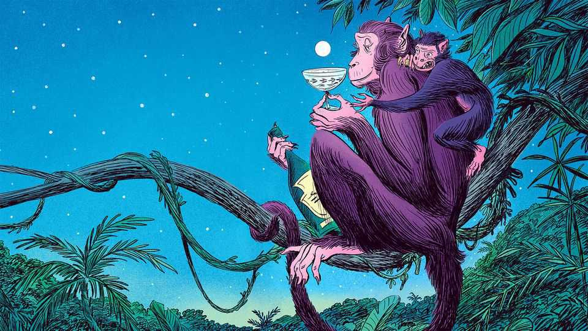
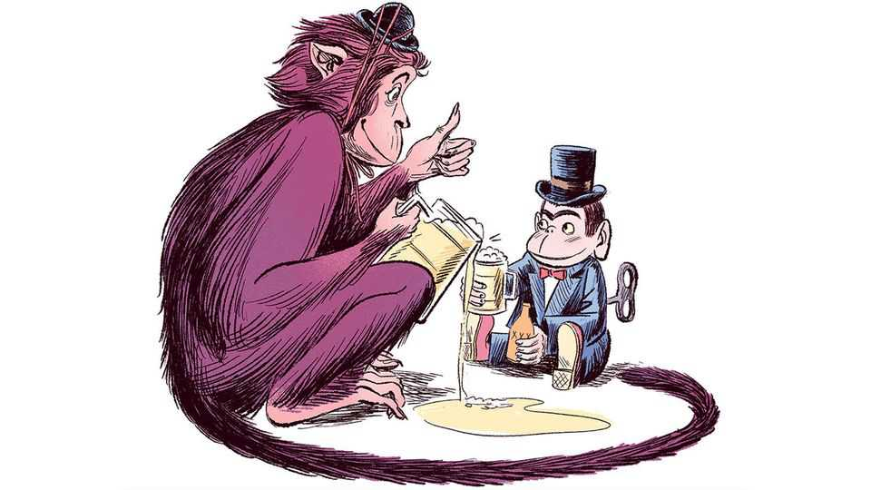
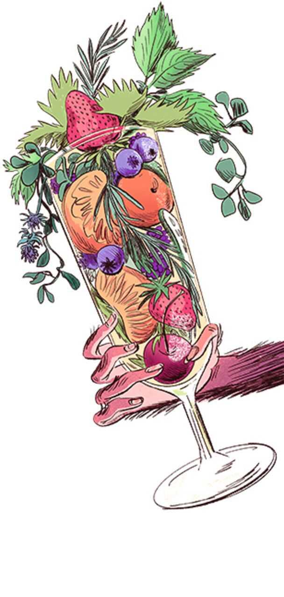

Christmas Specials | Drunken monkey, dry future
How humankind’s 10m-year love affair with booze might end
Civilisation was built on alcohol. Technology may sober us up
December 18th 2025

Whether it is champagne fizzing on the tongue, a hoppy beer coating the palate, or a plummy wine staining the lips, alcohol announces itself instantly. First there is a faint burning sensation, a little chemical spark, as the thin mouth membranes absorb a drop. If the stomach is empty, the booze starts to pass into the bloodstream within minutes—and then reaches almost every cell and tissue in the body. The secret to its rapid transit is in its chemistry. Ethanol, to give booze its proper name, is a tiny, agile molecule. It has a backbone of two carbon atoms and is soluble in water. It can hop over the blood-brain barrier like a ninja. And then the fun begins.

By gatecrashing our brains, alcohol has shaped human history, from our ancestors’ descent from the trees to the formation of modern cities. Yet because it brings misery and sickness as well as joy and conviviality, our species’ love affair with it is on the rocks. Sales are sliding in rich countries; some think global consumption has peaked. Is the greatest party of all time coming to an end? To answer this question one needs to understand a relationship whose molecular fingerprints are first visible millions of years ago.

A good place to start is with biochemistry. Ethanol is so toxic that most animals that consume it either quickly get drunk or poison themselves. Humans, unusually, have a pair of enzymes that turf it out like night-club bouncers. Our ability to process alcohol has deep evolutionary roots.

Ten million years ago a common ancestor of humans, chimpanzees and gorillas acquired a mutation that let them remove ethanol from the body more efficiently. This adaptation coincided with a change of habitat. Tropical forests were collapsing, notes Robin Dunbar of Oxford University. Some 90% of apes went extinct. One lineage survived by leaving the trees and foraging on the ground.

Whereas apes in trees gobbled fresh fruit, those on the ground found fallen fruit, which ferments. Thus, our ancestors may have acquired a taste for alcohol–which allowed them to use these scarce calories. This “drunken monkey” hypothesis suggests that a love of the smell and taste of alcohol, the sign of an energy-rich fruit, gave our ancestors an edge. Their chosen poison would have been fairly weak. A study of overripe wild Panamanian palm fruits found none stronger than 5% alcohol—about the same as a Heineken.

At some unknown point, people discovered how to make booze intentionally. The first solid evidence is from nearly 10,000 years ago. At a Neolithic site in Jiahu in China, residues in jars suggest they contained an early form of mead blended with rice and fruit wine. Alcohol was probably brewed long before this, perhaps in gourds or animal skins.

Booze helped human settlements grow without falling apart. If a group has more than, say, 100 members, direct personal relationships are hard to

sustain. New social mechanisms are needed to build trust among those who may not know each other well. Dr Dunbar argues that rituals involving mild intoxication may have kept large social groups cohesive.

There is plenty of evidence of shared feasting in early societies. Alcohol amplifies other tools that foster group cohesion: laughing together (which evolutionary biologists see as a form of chorusing), singing, dancing, storytelling and worshipping. All these activities trigger endorphins (as does booze). Known as the brain’s natural opioids, endorphins create feelings of pleasure, reward and stress release. At low concentrations this eases anxiety and strips away inhibitions.

The endorphin system can lift one’s pain threshold, says Dr Dunbar, and inculcate a sense of belonging. Thus, social drinking reinforces social bonds, helping early societies to co-operate, manage conflict and form alliances. Just the ticket for helping groups of angry neighbours to get along, should a dispute arise over, say, whether someone has eaten an overly generous portion of the communal grain supply.

Booze also boosts two neurotransmitters, serotonin and dopamine. This rewires us for sociability. We become more talkative; other people’s jokes seem funnier. Potential mates seem sexier (hence: “beer goggles”). A drink or two even makes the drinker look more attractive to someone who is sober. It is not clear why. One theory is that moderate alcohol consumption makes the face look slightly more vibrant, which signals good health. Another is that a drop or two puts the drinker in a positive mood.

Booze also dampens the activity of the pre-frontal cortex, the part of the brain responsible for self-monitoring and judgment. This makes us less critical and more spontaneous. Around the world alcohol spurs young people to have earlier, riskier sex.

Modern experiments support the idea that drinking strengthens social bonds. Dr Dunbar’s work shows that regulars at a local pub have larger and closer support networks, which are associated with greater life satisfaction and even well-being. Strong relationships can act as a buffer against mental and physical illness.

Thus, human civilisation has marched forward to the sound of clinking goblets. In ancient Mesopotamia, Egypt, Greece, China, the Mayan empire and many more, people have offered libations to the gods, held tipsy festivities to cement political hierarchy and paid pyramid-builders partly in grog.

Edward Slingerland of the University of British Columbia argues that alcohol was not merely a companion of progress but a precondition. His “drunk hypothesis”, proposed in 2021, is that alcohol’s effects on the human pre-frontal cortex drove the emergence of large-scale, stratified societies by allowing “fiercely tribal primates to co-operate with strangers”. Human societies are so complex, and depend so much on creativity and the cultural transmission of knowledge, that humans could not have built civilisation without first getting drunk enough to intermingle and co-operate to a degree that is unusual for other species.

How large the influence of being under the influence was remains open to question. A study in the journal of Humanities & Social Sciences Communications in July 2025 looked at 186 non-industrial societies and found a modest positive relationship between the presence of fermented drinks such as mead, wine and beer and higher levels of political complexity. However, this effect is small when one removes the confounding effect of

agriculture—a common driver both of higher political integration and of brewing. Were early humans plastered because they were planters? Or civilised because they were sozzled? The debate will continue, over many a glass of scholarly sherry.

Fast forward to the present day, and alcohol is far easier to obtain than it was when our forebears had to forage for rotten berries. Enough gin to kill a grown man can be made for pennies in a factory. Most countries apply heavy taxes to curb consumption, but if they are too high people turn to moonshine.

Winston Churchill was fond of boasting: “I have taken more out of alcohol than alcohol has taken out of me.” But what may (or may not) have been true of Britain’s bibulous wartime prime minister is untrue for many. Worldwide, alcohol abuse results in nearly 1.8m deaths each year. It can ruin livers, marriages and careers. For a long time it was thought that moderate drinking was healthy. But in recent years officials have advised that even small amounts are harmful.

Studies fifty years ago suggested that one or two drinks a day were beneficial for cardiovascular health. Alcohol seemed to boost good cholesterol and reduce blood clotting.

Alas, these benefits were probably overstated. Scientists had compared the health of moderate drinkers with non-drinkers, but failed to distinguish between non-drinkers and never-drinkers. Since some people stop drinking because it is making them unwell, this omission disguises some of the harm alcohol causes. Dr Tim Stockwell of the Canadian Institute for Substance Use Research says those who continue to drink may simply be those who have not yet become unwell.

In January 2023, as New Year revellers were regretting their excesses, killjoys at the World Health Organisation declared that no amount of alcohol was safe. It is, they said, “a toxic, psychoactive and dependence-producing substance” and “a Group 1 carcinogen”. They cited growing evidence that alcohol raises the risk of cancers of the mouth, throat, liver and colon.

Such risks are much higher for people who are genetically less able to metabolise alcohol (one of their molecular “bouncers” is less adept at removing it from the body). Some 540m people, largely of East Asian ancestry, struggle to break down acetaldehyde, a toxic metabolite of alcohol. Many visibly redden after drinking, an effect known colloquially as “Asian flush”.

For those who can metabolise alcohol normally, the risks are less severe. David Spiegelhalter, a statistician, argues that if you don’t drink much, the danger is trivial. One study found that if 25,000 people had one drink a day for a year it would give rise to one extra serious health event, such as cancer, diabetes or stroke. Knute Rockne, an American football coach, was onto something when he (reputedly) said: “Drink the first. Sip the second slowly. Skip the third.”

Yet stopping is hard. As the joke goes, “I only drink a little, but when I do I turn into someone who drinks a lot.” Humans can metabolise roughly eight grams of alcohol an hour—not enough to eliminate half a pint of beer. Drink more and blood alcohol and harmful byproducts like acetaldehyde start to accumulate.

A new wariness of booze is spreading, especially among the young. Adolescent drinking has declined since the turn of the millennium in almost all rich countries. During the school week young people are more likely to use social media than slip out of the house to meet friends. Teenagers kill boredom by meeting online and gaming. Many see booze as an expensive way to fog your brain and wreck your sleep.

Sales of alcohol have been slowly declining in rich countries. Each person in the OECD drank on average the equivalent of 8.9 litres of pure alcohol in 2011. By 2021 that had fallen to 8.6. Volumes in the world’s top 20 markets have continued to fall, by 2% between the pandemic and 2024. Headlines speculate that the world has reached “peak booze”.

The past few years have seen a dramatic rise in the use of weight-loss drugs such as Ozempic. Such drugs may also help people drink less. They seem to influence the brain’s reward pathways, making booze less appealing. They also heighten the nausea one feels after drinking too much.

The drinks industry is paying attention to all these trends. It is furiously concocting no- or low-alcohol alternatives to booze (NoLo, in the jargon). Non-alcoholic beer, which used to be revolting, is now quite palatable. Sales of non-alcoholic beers, wines and mocktails, which replicate familiar flavours without the side-effects, are still only 1.4% of the alcoholic sort. But the global market is growing fast. It was worth $26bn in 2024 and is projected to reach $47bn by 2034.

Another approach is to create new drinks that deliver some of alcohol’s pleasurable effects with different ingredients. Pepped up with plant extracts such as ginseng, l-theanine, ashwagandha, lion’s mane or CBD, such “functional” drinks promise to be calming, enlivening or socially lubricating. The plant kingdom offers a cornucopia of unexplored possibilities. Mineral additives such as magnesium, which promises a calming effect, are also increasingly popular.

Yet it is tricky to mix a herbal tipple as delicious or effective as the real thing. Brands such as Impossibrew, Gabyr, Three Spirit and Collider have tried. Your correspondent sampled five brands of functional beer and wine. Her favourite was a hoppy creation from On Beer, a British firm, with a floral note that comes from rhodiola—a medical plant that is supposed to reduce stress. All the herbal beers she tried offered a noticeable unwinding effect and even a slight buzzy sensation. Her friends and family offered reviews ranging from distaste (husband) to mild enjoyment (friends). The functional wine, alas, was undrinkable.

For a boozeless booze that packs a stronger punch, some firms are making “functional spirits”. These are typically concentrated herbal extracts. With mixers and creativity, they can yield a passable and mildly mood-altering mocktail. They are not subtle, though. They can have “a challenging flavour profile” admits Dash Lilley of Three Spirit, a firm that employs herbalists, phytochemists and bartenders in a quest to create something as lovely as a gin and tonic.

No single functional drink can replicate alcohol’s broad effects. Three Spirit offers three basic functions: drinks that boost energy, those that help people socialise and those that help them relax. Ingredients such as caffeine, ginseng, tryptophan, 5-HTP, lemon balm and ashwagandha can all tinker with dopamine, serotonin, GABA and other neurotransmitters. Nothing triggers the release of endorphins like alcohol, though.

GABA, which is part of the brain’s natural calming system, is strongly affected by alcohol. Scientists think this is the mechanism by which drinking can reduce stress and anxiety. GABA Labs, a firm based near London, is trying to develop a flavourless substance called Alcarelle that has a similar effect. Trials to show that it is safe could take years. But if they are successful, the firm will be able to market Alcarelle to drinks makers as a

way to create soft drinks that mimic the buzzy feeling of booze, with none of the downside.

PepsiCo and other firms are trying to make encapsulated, and thus flavourless, versions of functional ingredients. This could allow drinks makers to add any of their functions to any drink, without spoiling the taste. Bartenders of the future may be serving cola that calms or lemonade that gives you a lift.

“Why do billions of people drink caffeine every day, or smoke tobacco, or drink alcohol?” asks Mr Lilley. “It’s because of the human condition. We all require some kind of relief or state-changing mechanism to [stop] us from going insane.” Humans have found many ways to tinker with their minds: meditation, psychedelics, speaking in tongues, dancing, drumming, chanting. All shift the brain state directly, or focus the mind on the here and now, ignoring our chattering brains. For the past 10m years, though, nothing has matched the versatility, portability and fun of alcohol.

Such an old habit will not vanish overnight. Societies accustomed to toasting success with bubbly, venerating Jesus with wine or ramping up a party with tequila slammers will not easily switch to ginseng soda.

But over time, drinks cabinets may change. As no-alcohol beer grows tastier, more people will use it to help them socialise and drive home safely. As functional drinks improve, more people will seek that booze-free buzz. If GLP-1 drugs can reduce the craving for ethanol, perhaps one day a wonder- pill will help people stop after one glass.

The future will throw up more choices for precise neurological tinkering. Humans could rediscover moderation, imbibing no more than our primate livers can metabolise. Churchill would find such a future dispiriting. Others may celebrate it, popping corks from bottles of sparkling fruit juice laced with some as-yet-undiscovered plant extract. ■

This article was downloaded by zlibrary from https://www.economist.com//christmas-specials/2025/12/18/how-humankinds-10m-year- love-affair-with-booze-might-end