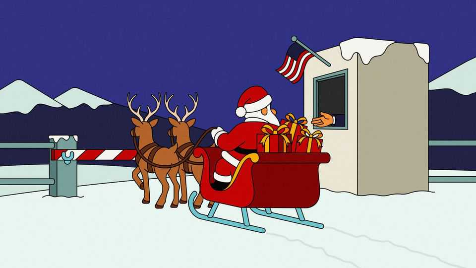

Christmas Specials | A wonderful, awful idea
The tariffs that nearly stole Christmas
The Economist spent a year talking to toymakers battling President Grinch
December 18th 2025

For toymakers, Christmas starts early. As the world is grouching through dry January, toy firms are finalising festive designs and signing deals with factories. By the start of summer, containers packed with play-sets and dolls must be crossing the ocean, so that shelves in America can be stocked by autumn. Co-ordinating the global supply chain of childish delight is a delicate, intricate feat, like building a Death Star out of Lego. In 2025 it was disrupted by President Donald Trump’s tariffs. Throughout the year, The Economist asked toymakers how they were coping. April. “At 145% there’s not going to be Christmas this year.” Isaac Larian’s mood is midwinter bleak. His firm, MGA Entertainment, sells Bratz dolls. Like four out of five toys sold in America, they are made in China. The

“Liberation Day” tariffs have just been unveiled, including a rate of 145% on imports from China. Most toys cost between $1.99 and $19.99. Margins are Barbie-thin. “President Grinch” is our headline.

Production for Christmas is already under way. Duties will have to be paid on anything set to arrive in America, long before the cost can be recouped. “Nobody’s shipping; they may be making things, but nobody's shipping,” says Jay Foreman, head of Basic Fun!, which sells Care Bears. Firms that have already placed orders are in a bind. Some owners must decide: “Do I mortgage my house to get the merch out?”

Mr Trump insists that foreigners will pay the tariffs, not Americans. Then he contradicts himself: “Maybe the children will have two dolls instead of 30.”

May. The chairman of Mattel, a dollmaker, complains. Mr Trump threatens 100% tariffs specifically on his firm, so “he won’t sell one toy in the United States.” Then, a few days later, a reprieve. After stockmarkets swoon, Team Trump agree to a 90-day pause on most tariffs with China. “We live to fight another day,” Mr Foreman quips darkly. Instead of going out of business, it’s a case of “just maybe losing our profit this year”. He has taken a gamble to keep Christmas production going, while other firms waited. It has paid off.

July. Not everyone has been so lucky. An estimated 60% of American toymakers have laid off staff. Joann Cartiglia has run The Queen’s Treasures, which specialises in traditional-style dolls, for two decades. She tells The Economist she is living in a camper and renting out her home to keep her business afloat. She can’t afford to import her dolls at the current tariff rate. Most items on her website are marked “SOLD OUT-ETA SUBJECT TO TARIFFS”.

April to December. Is any of this legal? Rick Woldenberg, the boss of Learning Resources, an educational-toy firm, doubts it. Mr Trump claims that America’s trade deficit, which has been there since the 1970s, is an emergency, and that the International Emergency Economic Powers Act (IEEPA) of 1977 gives him the power to raise tariffs in an emergency. Snag: IEEPA doesn’t mention tariffs. On April 22nd Learning Resources sues to have the IEEPA tariffs struck down.

“What else could I do?” Mr Woldenberg asks. A former lawyer, he joined the family business decades ago, for a calmer life. Before “Liberation Day”, his firm was ready to absorb a 30-40% tariff. Now it faces bankruptcy— most educational toys used to be tariff-free.

If any industry illustrates how global trade has changed in ways Mr Trump dislikes, it is toys. America used to make nearly all of its own. Mr Foreman remembers it well; he cut and sewed stuffed animals on an assembly line in 1980s Brooklyn. “79 Bogart Street”, he laughs. “Today that’s the hottest neighbourhood.”

Even in the 1980s, toymaking in America was precarious. Half his co- workers were illegal immigrants, Mr Foreman recalls. Then “China got more competitive, and everything in America got more expensive.” The toy firm he worked for went under. Mr Foreman moved to Mexico, then South Korea, before going all-in on China with his own toy business in the 1990s. The old Brooklyn factory building he remembers is set to be replaced by a block of luxury offices, complete with a wine bar and video-game room.

Could toy manufacturing (as opposed to design, marketing and other high- value-added activities) return to America? Stitching bears and painting faces on dolls is skilled work, but dull. Paying Americans to do it, when they have so many other opportunities, is therefore expensive. Even small “Made in USA” teddies can cost $100 or more. At that price, even two dolls would be a stretch for many families.

One winner from the tariffs is Build-A-Bear Workshop, a firm that lets kids stuff their own bears. It reported record revenues for the first three quarters of 2025. It helps that “about 25% of our ‘manufacturing’, if you want to call it that, is onshore as part of the experience,” jokes Sharon Price John, Build- A-Bear’s boss.

September. Lego is doing what Mr Trump wants: building its first-ever American factory. Though plans for a plant in Virginia were first unveiled in 2022, and the firm has long made bricks close to customers, the new protectionism surely swayed its decision.

Your correspondent visits a Lego factory in Vietnam, a near-copy of what will be in Virginia. The factory, which churns out bricks for Asia, is more Duplo than Lego: giant grey blocks sprawl over 44 hectares. Inside is both cavernous and sweet. It takes ten minutes of walking to reach the production line. Lego sculptures decorate the way.

Keeping production local has paid off, says Carsten Rasmussen, Lego’s head of operations. But smaller toymakers may struggle to copy it. Lego makes the world’s most popular toy, so it has the demand (and margins) to split production across the world. Its factories are high-tech: plastic-injection moulding machines handle most of the work. Humans fix the machines and move containers of bricks. So few are needed that Lego’s Danish factory sometimes runs with the lights off. If Mr Trump thinks tariffs will bring lots of factory jobs back to America, he may be disappointed.

Not least because no one trusts American policy to be consistent. During Mr Trump’s first term, toy firms thought they could satisfy him by shifting out of China (but not necessarily back to America). Mr Woldenberg moved production of 160 of his toys out of China to Vietnam and India. On “Liberation Day”, those countries were tariffed sharply, too.

October. “This has been the year from hell for us,” says Ms Cartiglia. She has just opened a gourmet-food business and a shop in her warehouse, hoping to generate cashflow until Christmas sales begin. (“We have space in the warehouse now, sadly.”) Her only goal is to stay afloat until then. She is expecting a grand-daughter on December 21st. “I worry about all the things I’m not going to be able to do for her that I planned all my life to do for her.” Her voice breaks. “My desire to make a sweet toy-line has turned into [a] nightmare.”

November. Ms Cartiglia is surviving, but only just. Her shop has turned out to be popular with locals.

On November 5th Mr Woldenburg hears his case, Learning Resources v Trump, argued before the Supreme Court. The president has called plaintiffs like him “enemies of the country”. Mr Woldenberg is not perturbed. “We’re going to win,” he says.

The justices sound sceptical of the president’s case. As this article went to press, they were expected to rule soon. If Mr Woldenberg triumphs, Uncle Sam might owe him, and everyone else who paid tariffs under IEEPA, some $140bn in refunds. Mr Trump would lose his most powerful (but not only) tool to impose tariffs as and when he pleases. If the toymakers’ bid to save Christmas ends up curbing a president’s power, that would be a nice gift to America—and the world.

But they have more immediate concerns. Mr Foreman has returned from the Shanghai toy fair. He almost cancelled his trip, but is now glad he went. It has been a hard year, he says, but there were silver linings. Shops might need to restock sooner if they didn’t order enough during the spring panic. The Labubu fad has given him all sorts of ideas for new toys.

His thoughts are already on next Christmas. ■

This article was downloaded by zlibrary from https://www.economist.com//christmas-specials/2025/12/18/the-tariffs-that-nearly- stole-christmas