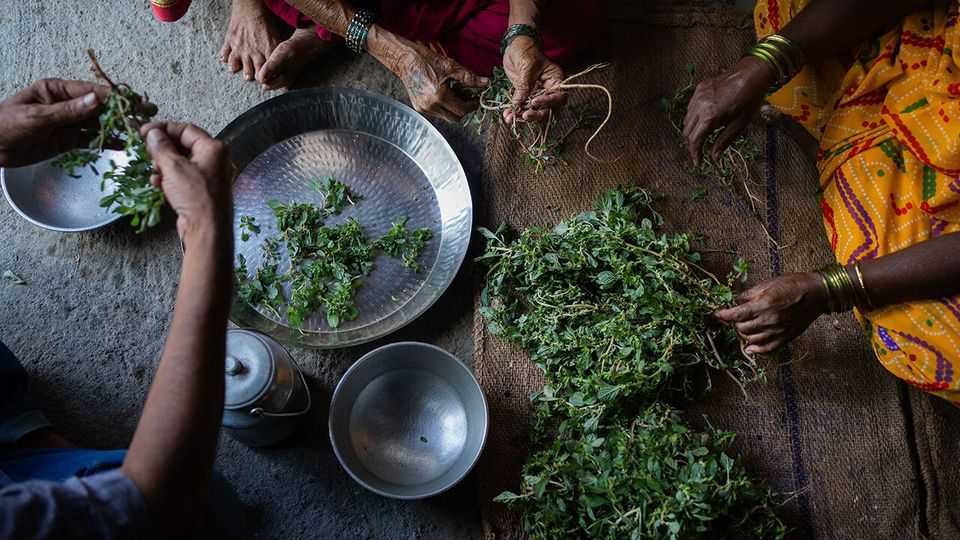
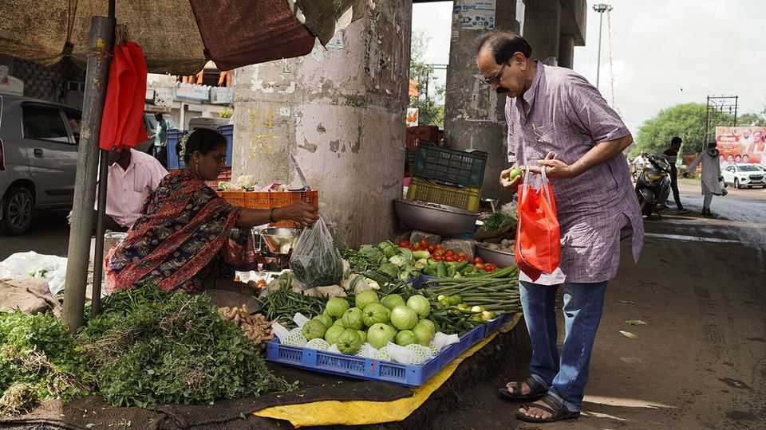
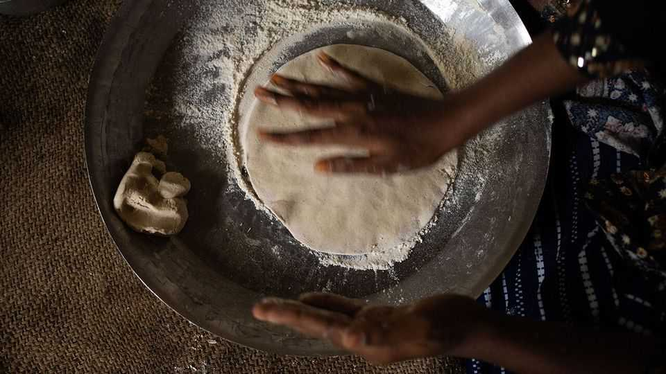
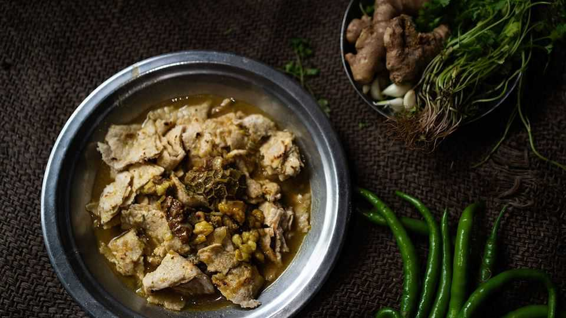
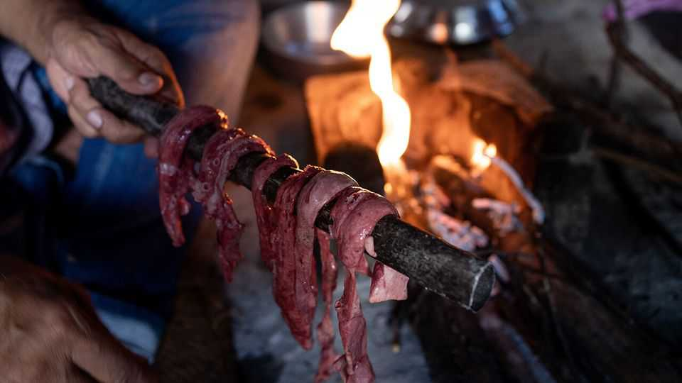
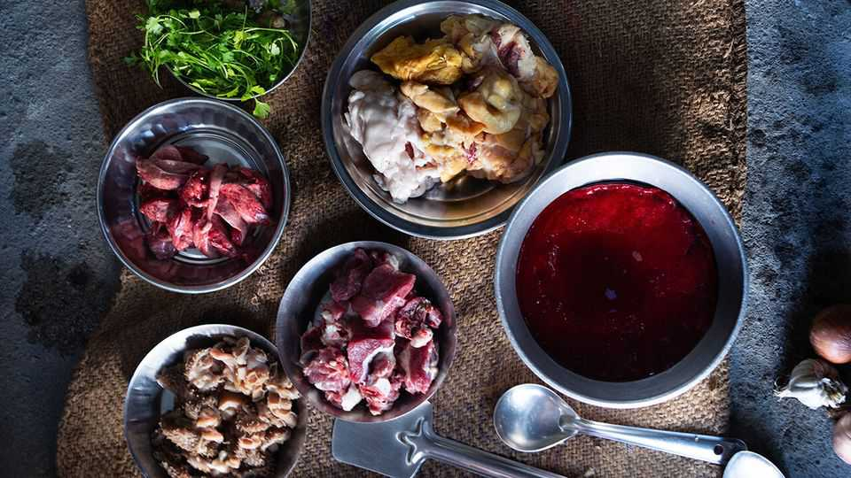
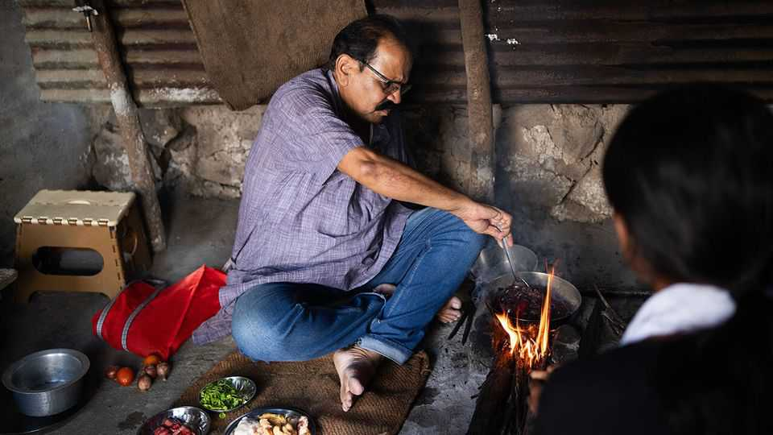
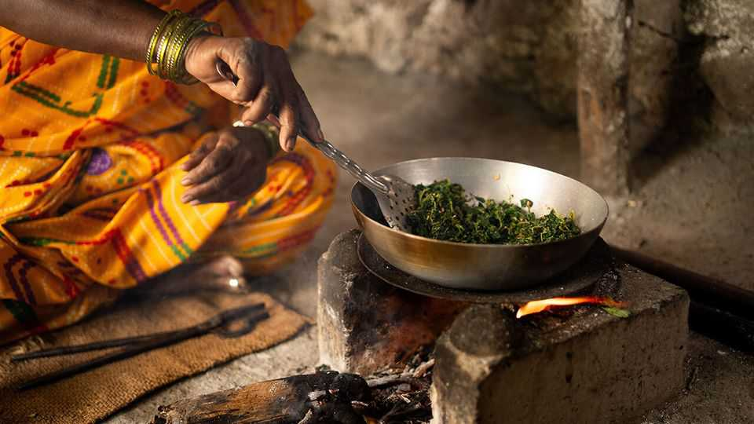
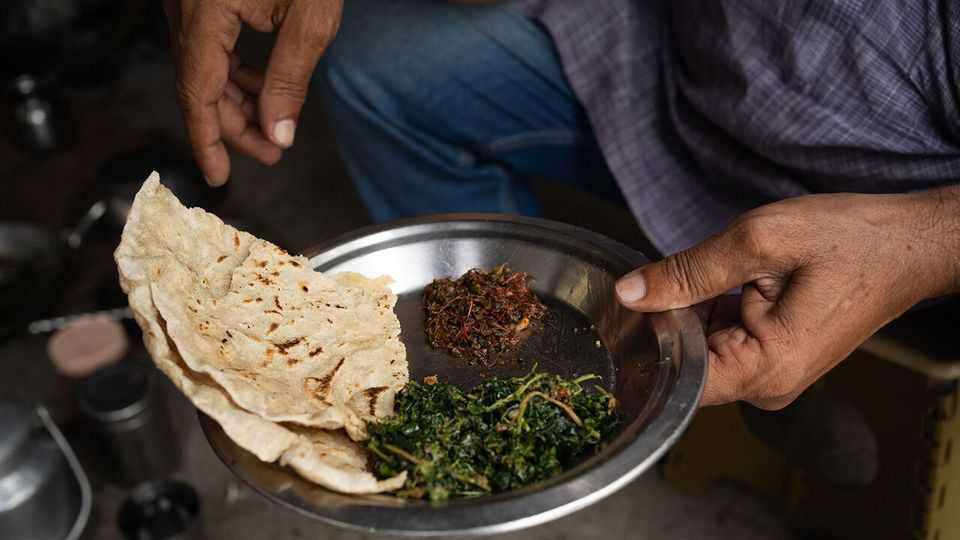
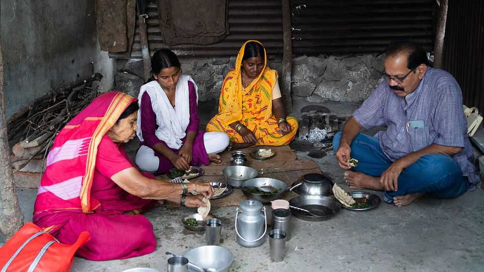

Christmas Specials | Caste and cuisine
From honeycomb curry to blood fry: India’s “untouchable” cooking
The hidden joys of a cuisine shaped by cruelty
December 18th 2025

Smoke a hive of wild kagadi bees. They flee, leaving behind a honeycomb packed with eggs and larvae. Chopped, spiced and simmered, it makes a dish with a sweet and spicy kick. For many foreigners “Indian food” means safe, reliable treats such as butter chicken, onion bhaji and naan. Even to many Indians, curried bee larvae sound alarmingly exotic. They belong to another India: to a cuisine that is one of the world’s richest, yet practically invisible. Its recipes are shaped by cruelty, scarcity and shame. This is the food of Dalits, once called “untouchables”. It is widely shunned—yet fabulous.

In millions of Indian kitchens pork, beef and offal, horrifying to upper-caste Hindus, take centre stage. Generations of cooks have turned wild greens, foraged roots and thousands of overlooked ingredients into culinary masterpieces. A handful of historians and Dalit activists are now trying to bring these foods from the margins to the mainstream.

Dalits, who are between a fifth and a quarter of India’s 1.4bn people, occupy the bottom rung of its ancient hierarchy. For thousands of years the caste system has divided people into hereditary groups. At the top were Brahmins, or priests; below them came kings and warriors; then traders and farmers. Beneath all were the Dalits, born to do jobs deemed degrading, such as cleaning latrines or disposing of carcasses. Hindu texts explained these divisions through divine anatomy: Brahmins emerged from the head of God, warriors from the arms, traders from the thighs—and Dalits from the feet.

Dalits were shut out from much of society; even their touch was considered polluting. Their homes were pushed to the edge of villages. They could not use the well from which higher castes drew water. Caste discrimination was outlawed in 1950, but remains rife. Many higher-caste Hindus would never eat with Dalits, let alone treat them as equals.

In Hindu scripture food has a hierarchy, too. At the top is sattvic (“pure”) fare—rice, fruit and fresh vegetables meant to calm the mind. Below is rajasik (“fit for kings”) food—meat, fish and heavily spiced dishes thought to excite body and spirit. At the bottom lies tamasic (“sinful”) food—beef, offal and other “impure” meats said to dull the senses and sap energy.

Dalits are less picky than their compatriots. And though caste taboos blight their lives, there is a culinary upside. Food that others shun is likely to be cheaper. So skin, intestines, tongues, feet and ears all find their way into Dalit pots. Leftovers from upper-caste homes where Dalits skivvy are seldom wasted. When cows die naturally, no Brahmin would touch their flesh, but for Dalits it is affordable protein.

In other ways, their diet is dictated by scarcity, notes Shahu Patole, a Dalit historian. Ingredients taken for granted in upper-caste kitchens, such as ghee (clarified butter) and asafoetida (a pungent spice), are often out of reach. Dalit women, who are likelier than other Indian women to work outside the home, have little time to cook. So they have devised recipes that are often quick, simple and ferociously flavourful. One of many listed in Mr Patole’s book Dalit Kitchens of Marathwada is blood fry, a spicy mix of onions, garam masala and tender cubes of congealed goat’s blood.

It should not be surprising that a group more populous than France and Japan combined has invented some tasty dishes. What is remarkable, though, is the obstacles Dalit cooks face. Such as violent mobs who object to their ingredients.

Pious Hindus revere cows. Any task relating to bovine butchery therefore falls to Muslims or Dalits. This can be hazardous. Cow-killing is banned in most Indian states. Disposing of cows that have died naturally is not, but

cow vigilantes sometimes fail to make that distinction. One July day in 2016 four young Dalit workers were flogged and paraded through Una, a village in the state of Gujarat. They had been caught skinning a cow. Their attackers, members of a “cow protection” group, accused them of having slaughtered it. Their pleas of innocence were ignored.

Such incidents of “cow vigilantism” have grown more common since the Bharatiya Janata Party (BJP), a strident Hindu outfit, won national power in 2014. Some politicians exaggerate the threat minorities pose to cows, hoping to fire up their supporters and intimidate their opponents. Cow-related violence is more likely to erupt in states run by the BJP, notes the Armed Conflict Location and Event Data Project, an NGO.

In 2015 Maharashtra banned not only the slaughter of cows, but also their transport out of the state for slaughter elsewhere. Buffalo meat was exempt. However, because it is hard to tell whether meat has come from a buffalo or a cow, the law gave cow vigilantes a pretext to harass anyone dealing in bovine products.

Farmers in Maharashtra have lost out. Previously, when their dairy cows were too old to yield much milk or their buffaloes were too frail to pull a plough, owners could sell them to a slaughterhouse and use the proceeds to

buy new stock. Now they are left with unproductive animals or forced to buy expensive tractors. Once-bustling cattle markets have shrunk.

Meat is far more widely consumed in India than Hindu nationalists pretend. Hindus are four-fifths of the population; surveys suggest that about three- quarters eat some form of meat. Among members of “backward” castes, nearly nine in ten do. Yet the image of a vegetarian nation endures, both at home and abroad.

Sri Vamsi Matta is an artist whose performances explore the history of Dalit food. In a solo show, “Come Eat With Me”, he weaves personal stories with traditional ones, and then invites the audience to share a meal he has prepared. He finds the rhetoric of “purity” baffling. Of cows, he says: “How can something so pure when alive become impure the moment it dies?”

Over time, he says, upper-caste notions of what counts as “pure” food have seeped into the mainstream, setting the standard to which others are expected to aspire. This can have nasty consequences. Landlords often refuse to rent to Dalits or Muslims, insisting that their tenants be “pure vegetarian”.

In March 2024 Zomato, a food-delivery app, launched a “Pure Veg Mode” that allowed customers to order only from vegetarian restaurants. Couriers assigned to these orders were given green uniforms. This caused uproar; critics warned that drivers without green uniforms might be harassed. The service was withdrawn the same day.

Yet the sentiment lingers. Many cities routinely ban the sale of meat on Hindu religious days. Zealots demand purity even on film sets. Ranbir

Kapoor, a Bollywood star, has been cast as Lord Ram, one of the most important deities, in a new adaptation of the Ramayana, a Hindu epic. Hindu nationalists were furious to discover that Mr Kapoor had once cheerfully described himself as a “big beef guy”—and demanded that he be sacked. His handlers rushed to limit the damage, stressing that Mr Kapoor had given up meat and alcohol for the duration of filming.

Not all Dalit food is meaty. For many poor families, even cheap cuts are a rare delicacy. For daily fare, most rely on grains and vegetables. Dalits who labour on other people’s farms are sometimes paid with a share of the harvest. During the monsoon, when farm work is scarce, many resort to foraging, says Dr Patole. Wild plants cost nothing but time and sweat.

City-dwellers forage, too. Vinay Kumar, a professor at Azim Premji University in Bangalore, recalls that until the early 2000s his relatives would go out to the lake to wash clothes. On the way back they would pluck “various leaves” from the water’s edge, or gather mushrooms and greens from nearby fields in the monsoon. Such greens were cheap, seasonally abundant and nutritious—but also stigmatised.

Dalit cuisine is seldom listed on restaurant menus. A few places serve it, but only if you know what to ask for. Ordering it is “a marker” that the eater is a Dalit, says Mr Kumar; few people wish to do so in public. It will be a while before it is widely available, he predicts.

Yet you can buy it if you know where to look. At busy intersections in Bangalore, vendors set up makeshift stalls with giant pots of home-cooked blood fry, beef curry and goat-trotter soup. The blood fry is soft and

yielding, almost like tofu, but with a far deeper flavour sharpened by a mix of spices. After a few bites it feels like tucking into paneer (Indian cheese), only hotter, darker and more intense. It pairs well with rice.

Next year India will conduct its first caste census in more than 90 years. It will record how many Brahmins, Dalits and other groups live there, what jobs they do and whether they have indoor toilets. It will not measure the persistence of prejudice.

Caste clings. “Culture, literature, even food flows from the top down,” says Mr Patole. Yet there are hints of change. Dalits today are only half as likely to live below India’s (very low) poverty line as they were a generation ago. And whereas only around a tenth of Dalits could read in 1961, that had risen to two-thirds by 2011, the time of the most recent national census.

Other countries have embraced the cuisine of the oppressed. Brazil’s national dish, feijoada, is said to have been created when slaves were given black beans and the parts of pigs their owners didn’t want to eat, and turned these humble ingredients into a mighty stew. Might Indians one day learn to love Dalit food?

When Mr Patole first published his recipe book in Marathi in 2015, other Dalits rebuked him for drawing attention to food habits they feared would be

ridiculed. However, he noticed curiosity among younger ones eager to learn about their heritage. An English translation in 2024 drew interest from food writers and sparked discussion on social media. For many upper-caste Hindus, it was their first encounter with Dalit cuisine. With luck, it won’t be their last. ■

This article was downloaded by zlibrary from https://www.economist.com//christmas-specials/2025/12/18/from-honeycomb-curry-to- blood-fry-indias-untouchable-cooking