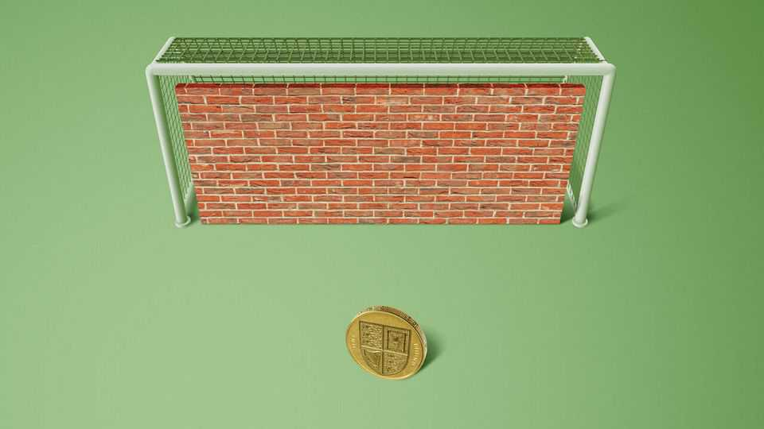
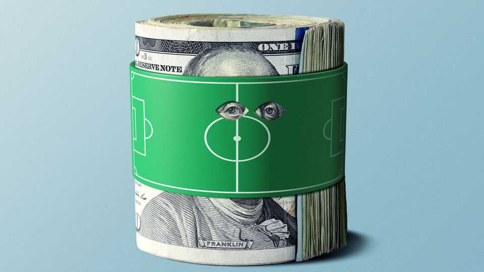

Christmas Specials | Geeks, mules and whales
The battle to stop clever people betting
The tools bookmakers use to block data-savvy gamblers, and how to get round them
December 18th 2025

Everyone loves a winner, goes the saying. Sports-betting firms don’t. Indeed, they dislike winners so much that they deploy complex tools to stop them from wagering more than a pittance—as your correspondent discovered in 2018, when Ladbrokes, a British bookmaker, told him he couldn’t bet more than £5 ($6.50) on the winner of the National Basketball Association’s Most Valuable Player award. For skilled players, or “sharps”, such “stake restrictions” are common. Your correspondent, a data journalist for The Economist, is a sharp in his spare time. He builds statistical models to work out the probabilities that various teams or players will win, and looks for instances where bookmakers

are offering better-than-justified odds. This geeky approach got him restricted at every betting shop in Britain. Stymied, he was inspired to investigate how sharps who gamble for a living evade the bookies’ efforts to exclude them.

Most punters are unaware that betting firms, whose adverts promise glittering riches, are at pains to shut out winners. If pressed, the firms stress that very few players are restricted. A report by Britain’s Gambling Commission found that 4.3% of accounts active in the past year have “stake factors”—the proportion of the maximum bet offered to a new customer— below 100%. American books give a longer leash: only 0.64% of accounts in Massachusetts are limited, for instance. But restrictions are rare only because most customers are “square”—that is to say, losers.

No one knows how many people make a living betting. However, they range from stealthy lone wolves to “syndicates” as big as a hedge fund. Contrary to popular perception, advantageous wagers are everywhere if you know how to look for them. The profit margins sportsbooks build into their odds are as low as 4.5%, and they accept bets on far more events than their algorithms can price accurately. So their business model works best if they strive to identify and restrict sharps. “Betting is easy,” says Antonino de Rosa, whose syndicate has 17 employees and wagers an average of $12m a week. “Betting a lot of money is hard.”

A good “player-profiling” strategy can boost a betting firm’s margins by 10- 20%. It is not simply a case of shutting out people who win large sums. Such folks may be lucky rather than skilled. If so, bookies want to give them a chance to lose it all again.

At the same time, they want to hook big losers, or “whales”. When betting firms spot punters who appear deep-pocketed and reckless, they raise their limits and offer them VIP treatment to keep them playing. Such inducements are especially lavish in America, where rules to protect problem gamblers are comparatively lax. However, some “whales” are sharps in disguise.

In 2023 DraftKings identified a man called Felix Baum as a rash high roller and pampered him, inviting him to travel on the Indiana Pacers basketball club’s team plane, stay at the Four Seasons and sit in courtside seats for a

game. He turned out to be a sharp, and his VIP limits were soon cut nearly to zero.

Nonetheless, the expected profits from bagging a whale typically dwarf the cost of letting a sharp linger too long. In March 2024 PointsBet, another betting firm, raised its share of online sports-gambling revenue in New Jersey from 11% to 24% after wooing a single cash-spouting customer away from DraftKings.

The profiling process starts before you place a bet. Are you using a phone, like most punters? Good. Or a computer, which makes it easier to compare odds? Not so good. Did you deposit by debit card, or via the e-wallets preferred by syndicates? Are you a woman? That is suspicious. Far fewer women bet than men, and many sharps get women to place bets for them.

The first wager you place speaks volumes. Normal punters bet on the most popular spectacles, such as English Premier League football or America’s National Football League (NFL), starting around half an hour before kickoff. They generally bet on who will win, what the scoring margin will be and which statistical milestone a star player will achieve, paying little attention to the odds. Square players love to combine multiple bets into a “parlay” or “accumulator”, which delivers a big payout only if all of them win.

Sharps have the opposite tendencies. They target less popular leagues and bet as soon as odds are published, when they are most likely to be mispriced. They shop around. They like obscure “derivative” markets, such as how many points will be scored in the third quarter, and bets on lesser-known players to perform poorly. They rarely use parlays. They make big deposits, and seldom withdraw winnings. “By the time a customer places his first bet, [sportsbooks] are 80-90% certain they know the lifetime value of the account,” says Ed Birkin of H2, a gambling consultancy.

If that bet happens to snipe an outdated or off-market price, says Phillip Gray, a former head trader at Sports Interaction, a betting firm in Canada, the player will usually be limited on the spot. Otherwise, it takes only a few more wagers to identify a sharp. Sportsbooks look at a player’s “closing-line value”—a measure that compares the odds at which he bets with those available right before a match begins. If it is consistently ahead of the

market over his first ten wagers, he is highly likely to beat the book in the long run.

Surveillance never lets up. An internal document summarising the “scorecard” system used a few years ago by GVC, a big firm now called Entain, tells traders to monitor mathematically modelled “risk scores”—an estimate of the probability that customers will wind up unprofitable—every six to eight hours. It highlights e-wallet users, women and bets over €100 ($115) for scrutiny. Suspected sharps are allowed a 30% stake factor; confirmed undesirables are restricted to 1%.

Even after learning all this, your correspondent still couldn’t work out how so many betting sites caught on to him so quickly. So he went to Dublin to find out.

On the ground floor of a grand red-brick building is the single-room office of ak Bets, a sportsbook with roughly 50,000 accounts whose website launched in 2023. Anthony Kaminskas, the site’s owner, said that in the previous week it had kicked out 13 users. One had identified a football league for which data feeds tend to be slow. As soon as a goal was scored, the customer tried to bet £400 before ak’s odds caught up. Other accounts were banned for consistently targeting obscure events, like the number of perfect scores in darts tournaments, at odds far superior to the closing price. In contrast, a golf bettor with £23,000 in profits on £25,000 of wagers remains in good standing. “He’s betting into prices we’re comfortable with,” Mr Kaminskas says. “If he wins, he wins.”

Your correspondent’s first wager with ak was, apparently, too clever by half. “I recall the bet straight away,” says Mr Kaminskas. It was a £25 basketball bet whose result would take five months to determine. With normal customers focused on that day’s football, such a wager is “an incredibly rare sight on a bet monitor”. He factored yours truly down to 30% on the spot, appending a note saying that this punter had found a price where he had an edge over the house. The next account note was more than a year later, when your correspondent wanted £165 on the Los Angeles Rams, and ak’s odds were the best in the market. Suspicions confirmed, the firm slashed his stake factor to 1%.

“Rrrrrrotate!” It’s a sweltering day in Las Vegas, and hundreds of bleary- eyed men scramble to get up from their chairs and find their next appointment. BetBash, a conference for sports bettors, features a “speed- networking” session in a windowless ballroom. Sharps with the maths skills to spot good bets are seeking partners with the social skills to get the money down.

Once you have been limited at every betting outlet, all other options have drawbacks. Betting shops and casinos accept modest cash wagers anonymously. But it is a hassle to keep mixing up hats, sunglasses and other disguises to avoid detection. Furthermore, gambling firms sometimes refuse to pay players who buy small tickets in bulk. Last year Caesars voided $800,000 in winnings by Thomas McPeek, a shaggy-maned 24-year-old punter, for placing repeated bets on the same parlay at its wagering machines.

A handful of “sharp books” offer the same limits to all customers. However, these sites are not available in Britain or most American states, and because they draw a lot of well-informed wagers, their odds are hard to beat. Similarly, peer-to-peer betting exchanges often charge high fees. And anyone offering a large wager on an exchange probably knows more than you do.

The remaining venues are offshore. Websites in lightly regulated jurisdictions such as Costa Rica welcome cryptocurrency deposits and are not obliged to vet users for problem gambling or the source of their funds. But the easier it is to get your money in, the harder it can be to get it out. SingBet, a huge Asian bookmaker, routinely cancels wagers after matches finish, citing unspecified “abnormal” betting patterns. Less reputable sites may spuriously accuse you of cheating and take your money.

An alternative is to get someone else, known as a “beard” or “mule”, to bet on your behalf. Such “proxy betting” is a violation of every sportsbook’s terms, and if they catch you doing it, they will void any winnings. Moreover, according to Elihu Feustel, a gambling lawyer, if the punter executes bets in a mule account himself, it is arguably fraud. Nonetheless, it is widespread.

The safest beards are close friends and relatives, who can be trusted to pay out winnings. With appropriate operational security—never logging into different accounts from the same device or wireless network; never having multiple users place the same bet; and maintaining a distinct set of physical locations for each user—such artisanal bearding is almost impossible to detect. One BetBash attendee says he owns around 20 iPads, each with its own data plan, and routinely drives around his state so that each wager comes from an appropriate address.

To get the most out of beards, sharps engage in “priming”, a digital version of the old pool-hall hustle. This involves intentionally making large losing bets to get an account’s limits raised, and then earning the losses back and more before the books realise they’ve been had. “They want to prey on degenerates and irresponsible gamblers,” says Chris Dierkes, a veteran sharp. “So you want to dress yourself as the most degenerate, irresponsible gambler out there.”

Good primers make the type of bad bets that VIP managers love, such as multi-leg parlays on major sports. To reinforce the image of a gambling addict, they can get a bot to log in at 3am whenever a wager is pending on an overnight sporting event, says Isaac Rose-Berman, another priming guru.

The best strategy of all is “whale-flipping”. Sharps befriend big losers and get them to place bets on their behalf, thus hiding their shrewd punts in a big bucket of dumb ones. Billy Walters, perhaps the most successful American sports bettor of modern times, wrote that Phil Mickelson, a squillionaire golf star and avid gambler, routinely placed wagers for him at vastly higher limits than he could get for himself.

Whale-flipping works best if the sharp is not too hasty or greedy. “You can come in like Dracula,” says Gadoon “Spanky” Kyrollos, the founder of BetBash and one of America’s largest bettors. “But we prefer the mosquito way, taking a little bit of blood at a time.”

Most sharps eventually run out of friends and relatives they can use as beards. Then they call in the professionals. Middlemen known as “movers” sell access to networks of paid mules, and remain on the hook even if mules run off with the cash. (Stiffing is a cost of business, generally estimated at 3- 5%. Happily, no one gets their kneecaps broken any more.) Lower-end movers pocket 10-20% of any winnings and eat none of the losses. The top tier work with data-driven gamblers, move larger sums and typically split profits or losses down the middle.

Moving requires marketing, discretion and occasional moral gymnastics. One Kentucky-based mover at BetBash, with 35 active beards, has mined his church for recruits. “Greed is a sin,” he concedes. “You’re lying to the sportsbooks, but these are evil companies. Jesus had a beard, and Jesus would have been a beard.” Still, even in a business built on subterfuge, there’s one authority no mover dares deceive: the taxman. God may forgive, but the IRS shows no mercy.

A few jurisdictions have tried to place limits on betting limits. Every Australian state has set minimum amounts that punters must be allowed to win for wagers on horse and greyhound races, usually A$2,000 ($1,300). In Spain, thousands of bettors have won lawsuits grounded in consumer- protection law requiring operators to reset their stake factors or reopen their accounts. On September 26th Alex Bores, a state legislator in New York, submitted a bill banning account limits altogether. Regulators in both Britain and Massachusetts are reviewing the practice, but sound sceptical. “Being a

successful bettor is not a protected characteristic in discrimination law,” noted Britain’s Gambling Commission in July.

Perhaps surprisingly, sharps have not lobbied against the rules designed to keep them down. One reason is that, paradoxically, they don’t mind them. If there were a limit on limits, bookmakers might worsen the odds, lower maximum bets for everyone or stop offering bet types that pros can exploit. “Limits are the best thing that’s happened to me,” says Mr Dierkes. “I do not want them to be gone. It keeps the people that can’t scale where they are, and makes me money.” ■

This article was downloaded by zlibrary from https://www.economist.com//christmas-specials/2025/12/18/the-battle-to-stop-clever- people-betting