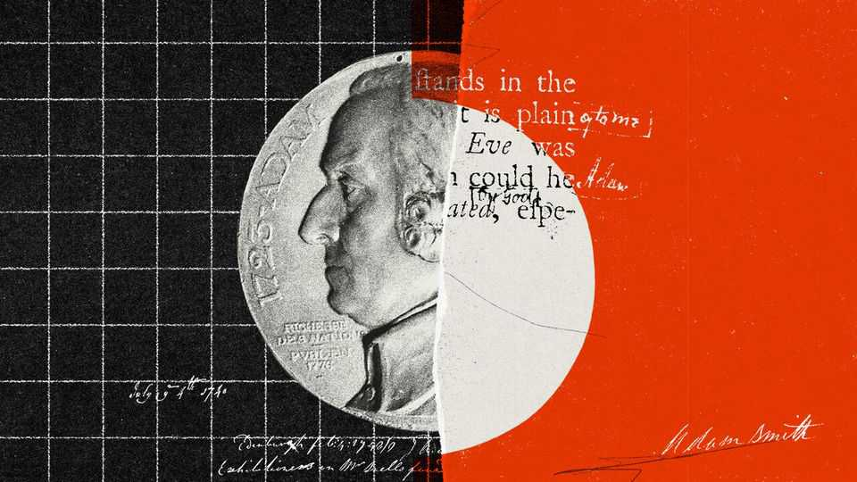

Christmas Specials | The “Wealth of Nations” at 250
Adam Smith is misinterpreted and his influence overstated
The most famous book in economics is less revolutionary than you think
December 18th 2025

BEHIND ONLY Karl Marx, he is the best-known economist in history. As with Darwin or Newton in their fields, Adam Smith’s ideas seem so foundational that attribution is often unnecessary. Marx inspired socialist revolutions across the world; Smith inspired liberal ones, including the turn to free-market economics in America and Britain in the 1980s. Javier Milei, Argentina’s libertarian president, is a Smith devotee. Margaret Thatcher supposedly carried a copy of his most famous book in her equally famous handbag. In 2026 that book, “An Inquiry into the Nature and Causes of the Wealth of Nations”, will turn 250. People will sagely nod at the mention of the

anniversary; they will claim to have read it. Yet its reputation exceeds its contents. The book contains fewer genuinely novel ideas than many assume, and more weaknesses than its modern admirers acknowledge.

Kirkcaldy, a small town on Scotland’s east coast, is a nice place. But aside from a small alleyway, Adam Smith Close, the town has largely forgotten that Adam Smith lived there. The Adam Smith Heritage Centre is rarely open. The house in which he wrote the “Wealth of Nations” no longer exists.

Kirkcaldy’s lack of boastfulness about Smith is in keeping with the man’s character. Smith was shy, though he enjoyed drinking claret with friends. He never married. He had little time for pomp, quitting a scholarship at Oxford in 1746 because he thought the teaching was poor. He was also fantastically absent-minded. Lost in thought, he once wandered out of town in his dressing gown. He brewed a beverage of bread and butter and pronounced it the worst tea he had ever tasted.

He was nonetheless brilliant. By his early thirties he was the professor of moral philosophy at Glasgow University. Before long he decided that becoming an independent scholar would allow him to make a bigger impact. Following his great work’s publication in 1776, the reading public wanted more. But Smith never felt that he had completed a worthy successor. On his deathbed in 1790, he ordered his papers to be burned.

The popular view of Smith is that he celebrated self-interest. John Ruskin, a Victorian art critic, called him a “half-bred and half-witted Scotchman” who advised his readers to “hate the Lord thy God, damn His laws, and covet thy neighbour’s goods”. Many people today associate Smith with “Greed is good”, a line from the film “Wall Street”, released in 1987. How else to understand Smith’s second-most famous quotation?

“It is not from the benevolence of the butcher, the brewer, or the baker, that we expect our dinner, but from their regard to their own interest.”

Many people also believe that Smith was a libertarian on consequentialist grounds. To simplify: when governments step back, the “invisible hand” of the market delivers something near a socially optimal outcome—even if

people act selfishly. This is an idea that Mr Milei, Ronald Reagan and Thatcher came to espouse. According to Smith’s most famous quotation:

“He intends only his own gain, and he is in this, as in many other cases, led by an invisible hand to promote an end which was no part of his intention.”

A cottage industry of academics, led by Amartya Sen, a Nobel prizewinning economist, has encouraged people to read Smith’s work more closely, however. Do so, and the caricature melts away. His first big work, the “Theory of Moral Sentiments” (1759), opened with a clear statement opposing greed-is-good:

“How selfish soever man may be supposed, there are evidently some principles in his nature, which interest him in the fortune of others...though he derives nothing from it except the pleasure of seeing it.”

In this book Smith introduced the “impartial spectator”, a model of human decision-making. A human, he insisted, does not make decisions purely from selfish impulses. Instead he or she consults others—sometimes family and friends, but sometimes himself or herself. The “impartial spectator” is a sort of inner monologue, a third party who judges our actions.

The impartial spectator reveals the true meaning of the “butcher, baker” quotation. Trade works because each party frames his offer in terms the other can accept: wouldn’t you enjoy my bread, says the baker, and wouldn’t you enjoy my mutton, says the butcher. To get what you want, says Smith, you need to imagine what the person on the other side would like. Good dealmakers will “never talk to [others] of our own necessities but of their advantages”. By contrast, two perfectly selfish actors would struggle to strike a bargain:

“Nobody ever saw a dog make a fair and deliberate exchange of one bone for another with another dog. Nobody ever saw one animal by its gestures and natural cries signify to another...I am willing to give this for that.”

Smith was wrong about animals, but then again Kirkcaldy does not have chimpanzees. More importantly, his argument is almost the opposite of the popular understanding. Selfishness did not create markets in meat, beer and

bread. Rather, those markets encouraged people to think both of themselves and others at the same time. Smith was tapping into the contemporary idea of doux commerce, found in the works of Montesquieu and others. Montesquieu argued that markets civilised people and softened manners, making societies peaceable. Under capitalism, the argument went, humans no longer fought like dogs.

The popular understanding of the “invisible hand” is even further off the mark. Smith borrows the phrase from Macbeth, who talks about a “bloody and invisible hand” shortly before murdering Banquo. In all his works, the economist mentions the phrase just three times, in three different contexts— and never in reference to the price mechanism. “Smith did not particularly esteem the invisible hand,” writes Emma Rothschild of Harvard University.

In fact, he often favoured the visible hand of government. He urged the state to provide education. He favoured legal caps on interest rates. Today, almost all free-market economists despise America’s Jones Act, which requires that shipping between American ports be conducted on vessels that are built, owned and largely crewed domestically. Smith, by contrast, favoured the Navigation Acts, a similar British law.

Smith acknowledged the benefits of markets, but also their costs. Consider his famous pin factory. The division of labour within it allowed workers to produce thousands more pins than if they were working alone. Countries that perfected the art of dividing labour, Smith argued, would grow rich. Yet he also worried that a life spent on a few simple operations would make a labourer “as stupid and ignorant as it is possible for a human...to become”. Did Smith think the costs outweighed the benefits? It is hard to be sure.

When the “Wealth of Nations” came out, everyone agreed it was a Very Important Book. But does it warrant calling Smith the “father of economics”? That may be going too far, for three reasons. Smith was a flowery writer; he made strange errors; and he is credited for ideas that were not his.

Take the book itself first. Full of long, winding sentences, it is not nearly as readable as Milton Friedman’s “Free to Choose” or Marx’s “Communist Manifesto”. Even in the 1770s people found it hard to digest, with a

contemporary review noting that the work “may be sometimes thought diffuse”. Small wonder that even Smith scholars admit that they have not read the whole thing in one go.

Second, Smith sometimes got economics wrong—not just in his support for the Navigation Acts. In the “Wealth of Nations” he argued for the “labour theory of value” (the idea that the amount of work that goes into a product determines its price, rather than how useful that product is). This theory distracted economists for decades and laid the groundwork for Marxism. Exploitation, in Marx’s view, arose from the difference between how much workers had laboured to create a good and what they were paid for producing it. Without Smith, there could have been no Marx.

Third, Smith introduced fewer core ideas of economics than you might think. He did not invent GDP (William Petty, in the 1660s, probably gets that accolade). He was not the first to recommend free trade. François Quesnay, a French economist, got there earlier. Nor was Smith the first to recognise the benefits of the division of labour. Plato beat him by 2,000 years.

Some argue that what makes the “Wealth of Nations” revolutionary is not individual ideas, but its method. Often using his favourite claret as an example, Smith treats the “economy” as a system with regularities. He did not use the term “equilibrium”, yet he clearly understood the interaction of supply and demand. When governments meddle, they distort the process. All interesting; yet these ideas were common in late 18th-century Europe.

Finally, what of his intellectual honesty? The rules about plagiarism were vague in Smith’s day. People often cited others obliquely, or assumed that the reader would already know who originated an idea. Smith, as it happens, was fiercely jealous of his insights, calling out rivals who he believed had stolen them, including Adam Ferguson, another Scottish philosopher, in 1767.

Which makes it funny, then, that the “Wealth of Nations” contains what Salim Rashid of the University of Illinois, Urbana-Champaign, delicately calls “unacknowledged borrowings”. Smith does not mention Ferguson’s analysis of the alienation of the worker under the division of labour. Or

consider the pin factory. Did Smith personally observe it? Perhaps—he travelled a fair bit. Yet there is circumstantial evidence, including from the details of how the pins were made, that he “borrowed” the idea from the “Encyclopaedia”, a French work. Discussing the charge of plagiarism, John Maynard Keynes shrugged: “It seems unlikely that the question can ever be answered for certain.” So in 2026 raise a glass to the “Wealth of Nations”. But there is no need for the best bottle in your cellar. ■

This article was downloaded by zlibrary from https://www.economist.com//christmas-specials/2025/12/18/adam-smith-is- misinterpreted-and-his-influence-overstated