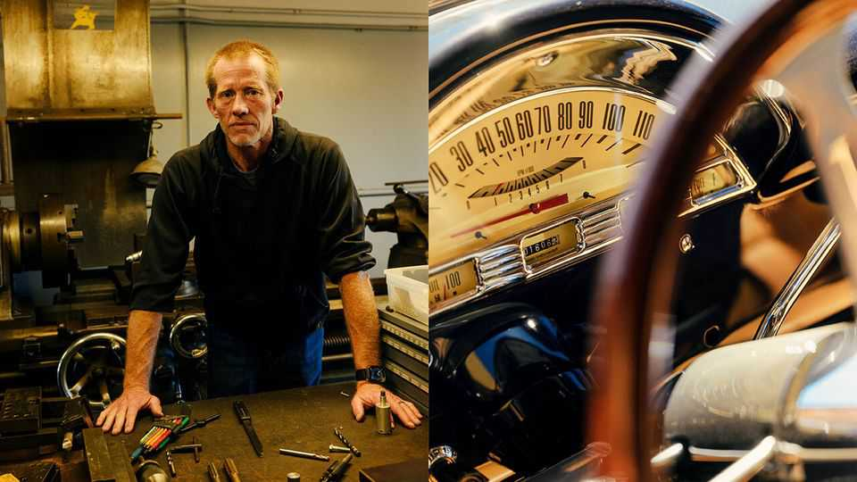
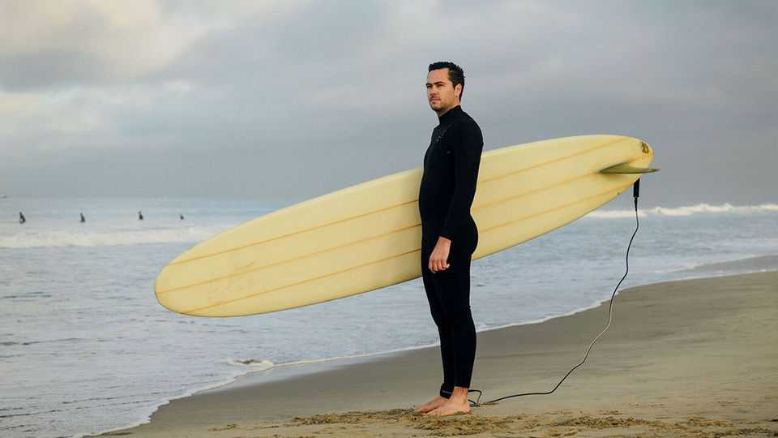
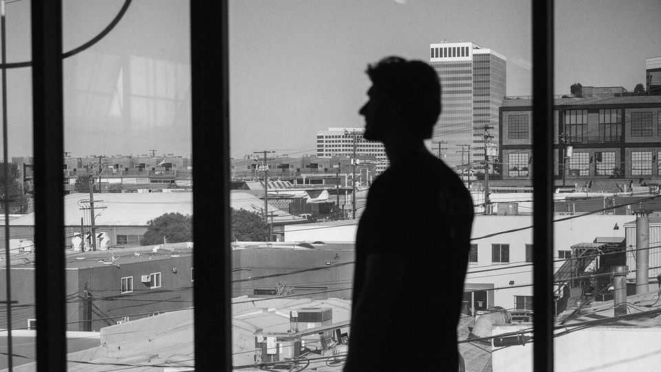
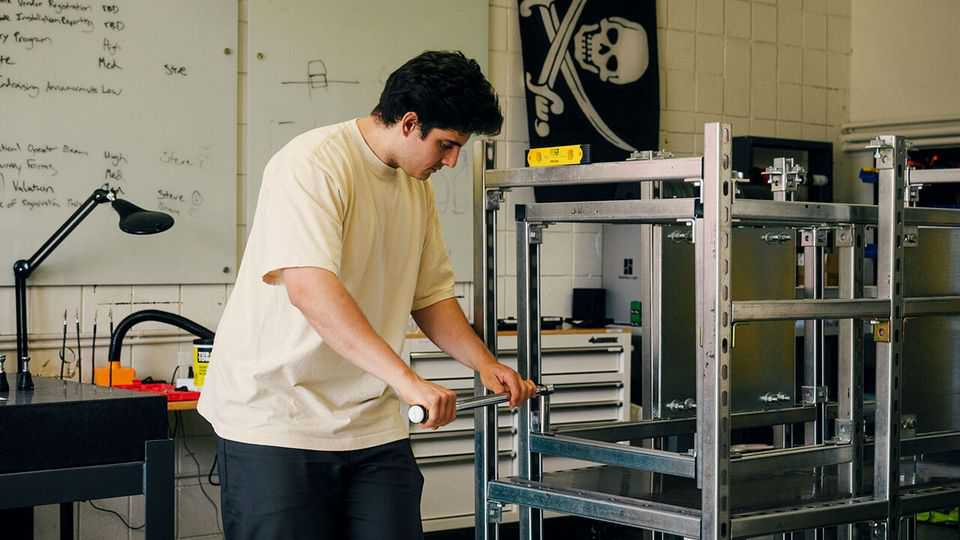
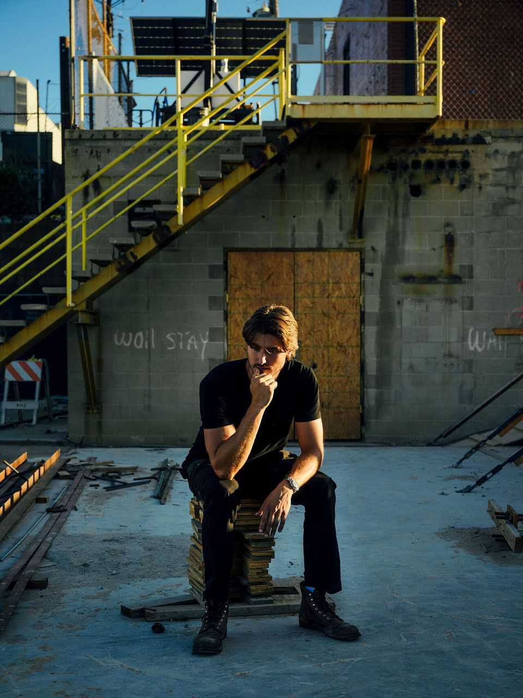
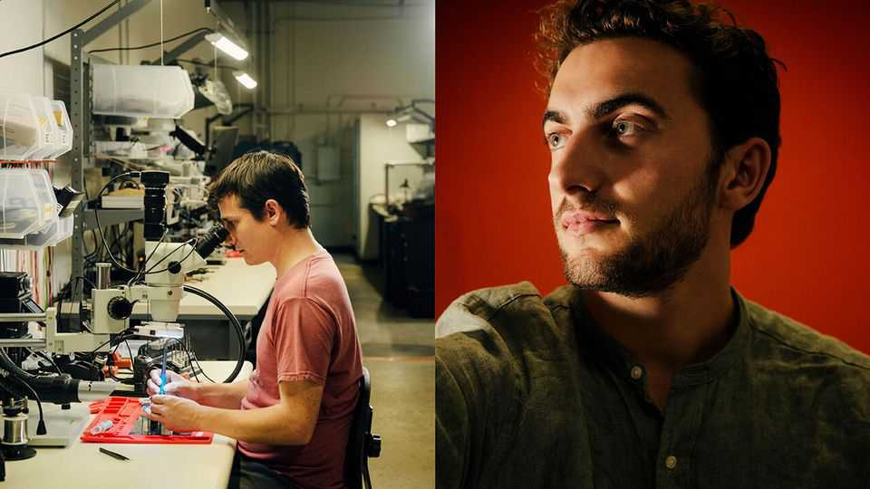
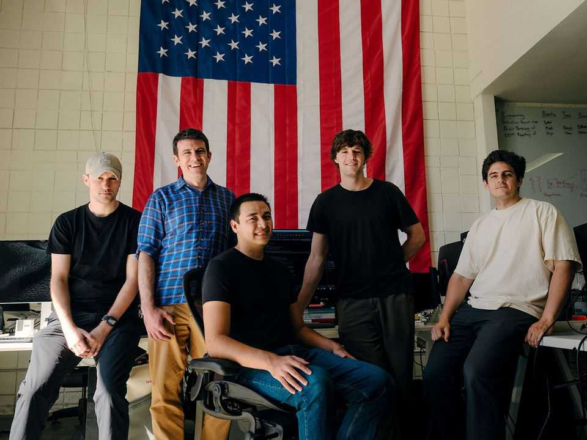

Christmas Specials | Muscle beachhead
America’s fight back against China starts in Los Angeles—in flip-flops
“Gundo” is the Silicon Valley of hard-headed patriotism
December 18th 2025

Brandon chrisman is using a rag to polish his 1956 f100 Ford truck, even though the paintwork—“Ferrari blue”— could hardly shine brighter. The fifties resonate with Mr Chrisman. When he throws open the doors to his nearby factory, the patina of history is even more dazzling than the car. Inside are squat machines with cranks, gearsticks, shafts and handles that date back to 1958 when his grandfather started the firm. With his buzz-cut, rust-coloured hair and square jaw, Mr Chrisman looks like he was forged there. His firm, HydraWedge, is in El Segundo, a beachside city near Los Angeles International Airport (lax), known by industrial metal-heads as “Gundo”.

From before the second world war until the 1990s, it bristled with machine shops that cast, milled and ground metal for the defence and aerospace industries—once the lifeblood of la’s blue-collar workforce. Then China drew away some of the metalworking and the machining industry hollowed out. Once Mr Chrisman had about 20 employees. Now he works alone.

And yet he is remarkably chipper. In fact he is more hopeful for the future of American manufacturing than ever. That is thanks to a bevy of startups springing up around him that share an animating principle: they want to wrench industrial supremacy back from China. They are surfing on a rising tide of venture capital. “They spend money like it is going out of style,” Mr Chrisman chuckles.

la’s palm-fringed coastline is one of the last places you might expect to find an enclave of pro-American, Bible-thumping, tobacco-loving space nerds whose main aim in life is to make stuff—as long as it’s not movies. Yet El Segundo, which looks like a Hollywood set for small-town America, with only 17,000 residents, diners galore and a theatre that still boasts a Wurlitzer, is a perfect hiding-place for engineers building an anti-China beachhead. Adding to the disguise, many surf in their spare time and come to work in flip-flops.

From afar, the city has nothing going for it. It is not just its proximity to the din of LAX. Situated next to a sewage-treatment plant that leaks so regularly into the ocean that locals call a nearby surfing spot “shitpipe”, and the second oil refinery ever built by Chevron (hence El Segundo, Spanish for “the second”), few beach towns sound less alluring. Yet Gundo is an increasingly important part of America’s attempt to win a high-tech arms race against China.

Visit the startups and they look like throwbacks to the 1950s. Firms drape their walls with vast American flags. They deck their offices with the parts of customised cars. They adopt prosaic company names, such as General Matter, Varda Space Industries and Metal Cross, that echo the General Electrics and General Motors of America’s industrial heritage more than the twee nomenclature of Silicon Valley. Young, buff entrepreneurs, almost all men, bench press and brandish wrenches; they do anything to distinguish themselves from what they see as software dilettantes farther north. Silicon Valley may be the cradle of modern life, from artificial intelligence (ai) to burrito deliveries. Gundo is its equivalent in hardware innovation—and the harder it is to build, the better. If ai is to be the brains of America’s tech supremacy, Gundo hopes to provide the muscle, the energy and the firepower.

Take some of the firms in Smoky Hollow, a red-brick district of El Segundo where Mr Chrisman works. One is a startup established by one of the first employees of SpaceX, Elon Musk’s rocket firm, which is working on enriching uranium for the nuclear reactors emerging to power ai. It has a cia aura of secrecy about it; ex-spooks are on the payroll and the building is unmarked. The only clue to what is going on inside another company called Rangeview is the word BUILD on the number plate of an Audi parked

outside, adorned with the Stars and Stripes and an exhortation to “Support Our Troops”.

Rangeview’s founder, Cameron Schiller, who has the looks of a film star and the zeal of a Mormon missionary, is building a foundry to do high-precision casting of metals and superalloys for components such as turbine blades. He will not let it be photographed because the technology is proprietary.

As a teenager, Mr Schiller won a robotics world championship and flew back and forth between America and China. In China, he says with an eyeroll, he discovered “the American dream”—which he wants to steal back. “We need to take Chinese jobs and put them back in America,” he says. It’s a Quixotic-sounding endeavour, especially in one of the world’s priciest metropolitan areas. On one of Rangeview’s walls is a photo of a recent visitor, Aaron Paul, who plays Jesse Pinkman in “Breaking Bad”. Safe to say, casting metal in la is a lot harder these days than cooking meth.

El Segundo has patriotic capitalism in its foundations. From 1932 until 1962 the “aerospace capital of the world” hosted a factory of the Douglas Aircraft Company that produced navy planes flown in three different wars. The Hughes Aircraft Co, based in El Segundo, built the first American unmanned vehicle to land on the moon. The city still has towering offices for the likes of Boeing, Northrop Grumman and Lockheed Martin (Mattel’s Barbie is a Gundo girl, too).

The mom-and-pop machine shops were integral to its culture. The machinists who worked there tinkered with classic cars and raced hotrods at night. Even today, El Segundo has a classic car show in August that brings the cold-war era back to life. But in the 1990s consolidation, bean-counting and the lure of Pentagon cash drove the defence industry closer to Washington, killing the industrial heft of la and wiping the west-coast Republicanism it once fostered off the political map. As the machinists shut up shop, the city took an “artsy fartsy” turn, say locals. The high school shut its metalworking shop. Manual labour was discouraged. That was until 2002, when a young Mr Musk founded SpaceX and moved into a nondescript building in El Segundo. It marked the start of the city’s rebirth as a Mecca for engineers with ambition.

SpaceX’s original headquarters are hard to spot. There are no blue plaques. The premises are now occupied by a seafood wholesaler called “Lee Fish USA”. The Economist was driven there (in a Tesla) by Scott Nolan, one of Mr Musk’s first employees. He scrolled on his phone to find a cover story of Aviation Week, a magazine, from 2004, showing the first 60-foot Falcon One rocket laid out on the building’s floor. “Can tiny SpaceX rock Boeing?” the story asked.

It did. Estimates of the value of SpaceX, one of the world’s biggest private firms, are in the hundreds of billions of dollars, and far more than that of Boeing (Mr Nolan says he still owns shares). But its place in El Segundo is more than a historical footnote. Its diaspora of ex-employees is the basis of Gundo’s startup culture; Mr Nolan, for instance, is founder of General Matter, the company trying to enrich uranium.

SpaceX’s success in sending reusable rockets and satellites into orbit also opened the way for a flurry of startups hoping to piggyback on the new space infrastructure. Delian Asparouhov, co-founder of Varda, a Gundo- based firm building pharmaceutical labs to operate in space, likens SpaceX to Andrew Carnegie’s railways in the 19th century. “The point of the railroads was so Rockefeller could ship oil on them, right? Elon and SpaceX have built the railroad. Now someone has to figure out what the equivalent of oil is.”

Mr Nolan and Mr Asparouhov are both partners at Founders Fund, a venture-capital firm led by Peter Thiel, a shrewd la-based billionaire who was one of SpaceX’s earliest investors. It is tempting to see Mr Thiel’s Svengali-like hand at work over Gundo’s startups scene; he is a strong advocate of America-first capitalism. Yet his influence is probably clearest in the contrast many of Gundo’s engineers draw between their quest and that of Silicon Valley. They are crusaders for what Mr Thiel calls “atoms” versus “bits”.

Steve Cohen and William Carroll, two aspiring entrepreneurs whose startup, Metal Cross, aims to make x-ray testing equipment to support precision manufacturing, have seen the contrast first hand. Mr Cohen grew up in Silicon Valley. Mr Carroll worked for Google there during the pandemic. There he slept in his Prius, ate from the Google canteen and enjoyed a weekly massage at the firm’s expense, in order to save money to help him start a business.

Compared with Silicon Valley, their startup is spartan; there are no colourful slides, dog treats or kombucha fountains. You spot its premises down a narrow alley because the roll-up doors are open and a star-spangled banner hangs prominently on an inside wall. The open-door approach means anyone can drop in. The co-founders talk of fellow entrepreneurs stopping by to borrow tools. They visit their neighbours for advice, too, such as how to unjam a stubborn bolt (“take a flame thrower to it”). Such startups begin small. The premises in Smoky Hollow are little more than garage- sized. But if their businesses prosper and funding increases, they “hermit crab” into bigger premises in neighbouring cities along la’s South Bay. SpaceX’s la facility now sits in a factory the size of an airfield in Hawthorne, a short drive from El Segundo.

Mr Carroll, who used to surf before work and remains sandal-clad in the workshop, calls himself a renegade from the Silicon Valley culture. He calls tech workers he met there “anti-American”. Gundo’s lack of perks appeals: “Could you imagine a masseuse in a molten-metal foundry?” he asks. The business model is different, too. Whereas software is a scale business, with zero marginal costs and a winner-takes-all mindset, hardware is more like craftsmanship; products are bespoke and so high-tech that somewhere, a market for them exists, even if it is only in space.

Venture capitalists have started to pay attention to Gundo. vc giants like Andreessen Horowitz have diversified from software to promote a pro- American hardware culture. But some Gundoites are wary of being mythologised into world-changers in the way their Silicon Valley counterparts have been. They have an engineer’s mindset: to shoot for the moon you have to crack one problem at a time. You don’t talk big. You think in minute detail.

All this makes Gundo a bottom-up example of something that countries around the world try in vain to replicate: a genuine entrepreneurial cluster. It starts with that diaspora. Locals say many of the startups are built by former employees not just of SpaceX, but of Palantir, a data platform used by spy agencies and law enforcement, and Anduril, a defence-tech pioneer. Their early employees, cashing in multi-million-dollar stock options, became founders in their own right. This trend has grown big enough to become self- reinforcing. Many startups fail. But when they do, there are enough opportunities nearby to give employees the confidence that they will find other jobs.

Gundo also has that indefinable lure that clusters require. Some say it is the beach; Zane Mountcastle, co-founder of Picogrid, which provides platforms for linking up military systems, finds the early-morning peace as he waits for a wave on his longboard vital ahead of a day negotiating with defence contractors. Other say it is the countercultural aversion to Tinseltown that adds to the glue. There’s a bar-room culture. There are cigarettes. There is church on Sunday. Whatever it is, some industrialists now list Gundo, along with Silicon Valley and Tel Aviv, within a triumvirate of the West’s most important innovation hubs.

No government master plan lies behind the success. Yet there is little disguising the excitement about President Donald Trump’s ambitions to revive American manufacturing, especially when it comes to defence, space and energy technologies. Mr Nolan stood by the president’s side in May, speaking on behalf of Mr Trump’s executive orders aimed at restoring America’s nuclear industry. Mr Schiller, a keen student of Chinese manufacturing, says the Trump administration “seems to get the importance” of what is happening in El Segundo. The president’s belief that a manufacturing renaissance will revive blue-collar America does not appear to be borne out. Only a few machinists like Mr Chrisman remain employed there. But if the entrepreneurs build the bare bones of a manufacturing base

that can be scaled up multiple times in the event of war, it might make more sense.

The sense that Gundo’s founders are quietly working on a Plan b for America as tensions rise with China is palpable at Neros, a manufacturer of lethal drones that Soren Monroe-Anderson, its co-founder, says has the highest production rate of drones in America, mostly for sale for use in Ukraine. He shows how Neros has sought to strip all traces of Chinese technology from the products, including their circuit boards.

Each drone is hand-assembled along a small production line, and tested behind the warehouse. The output is about 2,000 drones a day, up from 100 a month at the start of the year. That is “truly nothing” compared with China, Mr Monroe-Anderson says; the biggest Chinese drone manufacturer produces about one per second, he reckons. “We’re trying to make the American drone industrial base competitive on a global scale,” he adds. “That’s a really hard mission; we’re set up to fail. But we think it’s essential to try.”

Asked why Neros does this in California, rather than in a more pro-business, pro-Pentagon state like Texas, he smiles mockingly. “The best engineers in the world don’t want to live in Texas,” he snorts. Mr Schiller, his close

friend, walks with your correspondent out into the building’s car park, and points scornfully at a Boeing aerospace complex across the road. “Neros is just taking Boeing’s business from under their nose—literally in their back yard—and they don’t even know it,” he says. Yet even if most Americans are clueless about the disruptive beachhead emerging a stone’s throw from the Pacific coastline, China surely isn’t. ■

This article was downloaded by zlibrary from https://www.economist.com//christmas-specials/2025/12/18/americas-fight-back- against-china-starts-in-los-angeles-in-flip-flops