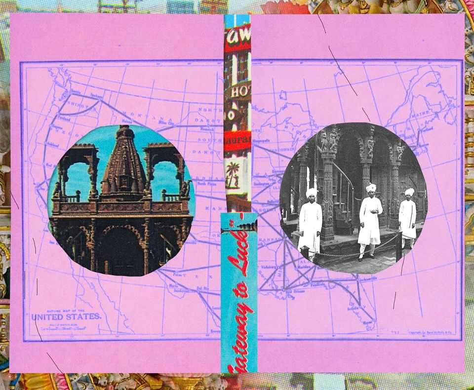
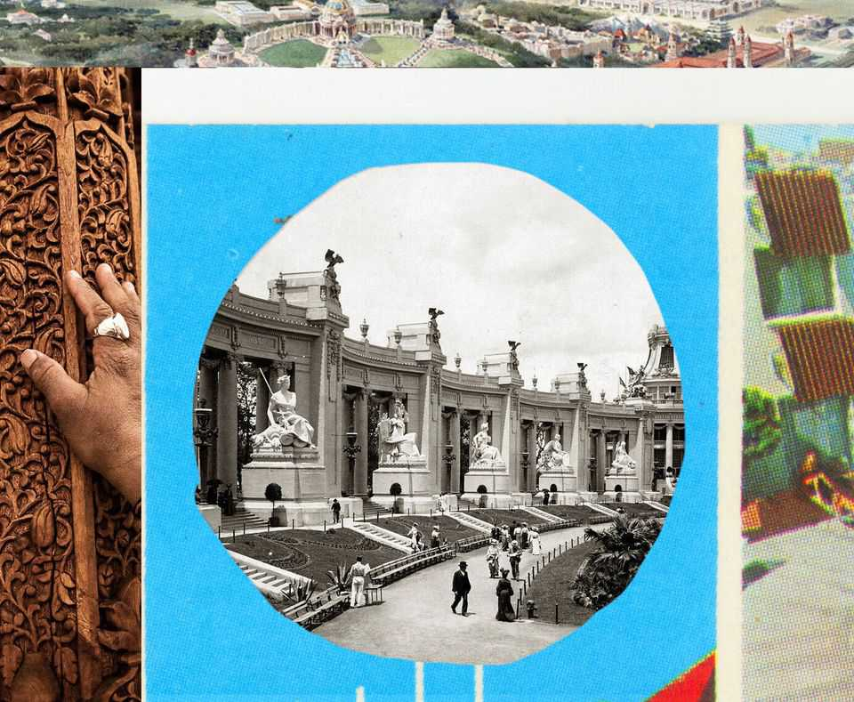

Christmas Specials | Jainism in the world
The long, strange journey of a temple from profane to sacred
How an object made to sell tea, then used to promote gambling, finally became holy
December 18th 2025

On the outskirts of Los Angeles, on a four-lane suburban street adorned with palm trees, laundrettes, Korean dentists and car-repair shops, stands the tan marble and limestone facade of the Jain Centre of Southern California. Step inside, and you encounter a magnificent wooden structure with a sanctum, sculptures of gods, and a shikhara, or spire, reaching to the heavens. It is an intricately carved replica of a Jain temple in India, and to Americans of the Jain faith in the here and now, it has profound significance. But the structure’s origins are more crass and commercial, and its significance has changed dramatically depending on where it has gone and who has come into contact with it. This is the story of the wandering temple,

of its century-long journey from what was then Calcutta to a World’s Fair in St Louis, Missouri, onward to a casino in Las Vegas and finally to Buena Park, California. It is also a journey in the meaning of an object, from the profane to the sacred.

The tale begins in the early 20th century, with British colonialists in India keen to boost tea sales in America. By 1901 America had become the world’s biggest industrial economy and its population of nearly 80m made it a giant consumer market. It was undeniably attractive. But foisting tea on Americans was a tall order at the time. British colonialists and tea had something of a checkered history in America, dating back to a certain party in Boston. Tea-drinking was a pursuit of ladies who were upper-class or aspiring to be so; Americans drank far more coffee (nearly 5kg a person in 1901, compared to half a kilogram of tea).

Enter the 1904 world’s fair in St Louis, held to commemorate the centennial of the Louisiana Purchase. Sixty-two countries and 43 of 45 American states would participate, and nearly 20m people would visit over its seven-month span. The Indian Tea Association, a trade body of British planters based in Calcutta, under the leadership of Richard Blechynden, a prominent planter, saw an opportunity to make a marketing splash.

At a time when few in the middle-class could afford far-flung travel, fairs brought the world to the middle-class, albeit in highly exoticised form. One teahouse in Japan’s pavilion was modelled on a temple in Kyoto, where “40 genuine Geisha girls performed their graceful dances, and sang”. Ceylon, now known as Sri Lanka, took as its inspiration the Temple of the Tooth in Kandy, and included “handsome specimens of the mild and gentle Singhalese race, dressed in their native costume”. China sent a replica of an entire palace, complete with Prince Pu Lun, the heir to the imperial throne. For local visitors, a ticket to a World’s Fair was the Ryanair flight of its time.

World’s Fairs were also where new ideas and inventions were unveiled or popularised. Among the innovations the St Louis fair is remembered for is iced tea. The legend goes that Blechynden, despairing that the muggy weather was deterring Americans from trying his steaming drink, started serving tea over ice instead. It was a massive hit. The story is probably made up; iced tea was known before the fair. But Blechynden did serve iced tea

and indeed took credit for inventing it, and the fair exposed millions of visitors to the concept. It is still a popular American refreshment.

The literal centrepiece of Blechynden’s efforts to push tea in America was the wandering temple, designed to draw gawpers to the Indian pavilion at the fair. The planters in Calcutta commissioned an ornate replica of a shrine from a Jain temple complex on the other side of India, near Palitana, a remote pilgrim town in the state of Gujarat. Exactly why they settled on a structure of the Jain faith thousands of miles away remains a mystery, says John Cort, America’s leading Jain-studies scholar.

Perhaps it eluded them that the temple was from a small, little-understood faith (then, as now, Jainism was often considered a branch of Hinduism). Or they simply did not care about the particulars. In St Louis the fake shrine would be placed at the heart of another replica, of a 17th-century Mughal mausoleum in Agra, making the Indian pavilion an odd synthesis of Islamic and Jain sites (along with a smattering of Hindu iconography among the carvings). A more cynical concoction it could hardly be. As long as it looked the part to hayseed Americans, it would do the trick.

And look the part it did. A photograph from the fair shows three moustachioed Indian waiters in cummerbunds and magnificent turbans in front of a teakwood structure some 35 feet high and 20 feet wide. The entire thing is covered in sculptures and detailed carvings. Two small spiral staircases lead to chattris, or canopied pavilions, on the roof, which is topped with the shikhara. One contemporary report gushed that it was “a wonderful piece of carving which represented the labour of 65 skilled carvers for two years”.

The planters counted the exhibit a success. Their tea proceeded to flow. According to the Civil and Military Gazette, published from Lahore, exports of tea from India and Ceylon to America grew from 7m lb in 1898 to 16.5m lb in 1907 under Blechynden’s direction.

After the fair the organisers sold the buildings, machinery and other things on the site to the Chicago House Wrecking Company for $450,000 (roughly $16m today). Its catalogue lists for resale everything from windows and

lightbulbs to “10,000 carloads of lumber”. The Jain temple joined the scrapheap, forgotten for almost 60 years.

Until September 1st 1963, when the Castaways hotel and casino opened its doors for the first time. It was “a magical South Sea island resort in the heart of Las Vegas”, reported the Las Vegas Review Journal. The theme was Hawaiian or thereabouts, with “Chinese modern, Polynesian and South Seas decor”. The decorative highlight, “glistening in the Las Vegas sunlight”, was something the paper called “The Jewel of Palitana”.

The temple-teastall had been reborn as what the casino called the “Gateway to Luck”, installed in a well-trafficked site near the pool. Gamblers could seek fortune from the temple-totem and throw coins in a nearby wishing well. Over time, it became part of the brand (and fell into the possession of Howard Hughes, the reclusive billionaire, who purchased Castaways in 1967). The temple was a selling point on the casino’s postcards and brochures. Performers such as Jan Sutton, a blonde showgirl who featured nightly in a cabaret called “Bottoms Up”, were among those pictured posing on its steps.

Ben Jaffe, the hotel’s owner, told a local newspaper that the dismantled and crated-up temple had been purchased by a private art collector who never bothered to reassemble it. When the collector died, the temple was passed to a dealer, and eventually was acquired by Jaffe. It took four men three months to reconstruct it piece by piece.

Of all the places the temple could have turned up, Las Vegas is in some ways the most fitting. Like the St Louis fair, it attracts millions of transients who come to be amazed and enthralled. Its sparkliest attractions are replicas of famous sights—among them the canals of Venice, the pyramids of Giza and the Eiffel Tower—which are, as their analogs in St Louis were, mostly cynical confections designed to lure in visitors for profit. In the case of the wandering temple, the same structure had now evolved from one crass purpose, selling Americans tea, to another, selling gamblers a quasi-spiritual promise of good luck.

But also like the world’s fair, much of Las Vegas is ephemeral. Castaways, which replaced an earlier casino called Sans Souci, shut in 1987, to be

replaced by the Mirage. The temple was about to disappear again—though as fate would have it, not for ever. By the late 1970s the temple was drawing more than curious looks from a small subset of Las Vegas visitors: recently arrived Jain migrants from India.

Congress had in 1965 passed the Immigration and Nationality Act, which in effect abolished race-based quotas. The first wave of Indian migrants started trickling in soon after. Many were doctors and pharmacists, who qualified for instant green cards. But few states allowed foreign-degree holders to practice without retraining.

California was one of them. The new rules also prioritised family reunification, so many new arrivals soon invited other family members. By the late 1970s Los Angeles area was home to a tightknit but growing Jain community of 65 or so families (today there are maybe 1,500). In 1979 they formed the Jain Centre of Southern California to serve as a locus for worship and communal events.

In time Jain migrants were among the many southern Californians drawn to the bright lights of nearby Las Vegas. Visiting Castaways, they stopped in their tracks. “Whoever visited in the early ’80s, they easily identified that as a Jain temple,” says Hasendra Shah, who moved to Los Angeles as a pharmacist in 1981. “And the Jains’ feeling was this is our place, our object of worship.” It did not belong, they felt, among slot machines and scantily clad cocktail waitresses: “We believe the display of the temple in this way is an insult,” Lalit Shah, the Jain Centre’s then vice-president, told the Las Vegas Review Journal.

The casino, for its part, said that the temple had “nothing to do with their religion”. Until the Jains had come along, that was true. The temple had been an instrument of commerce. But that was changing.

Eventually the casino was sold to a new buyer who wanted to tear down the entire property. In its last four weeks, Castaways held daily raffles in which it gave away everything from ashtrays to the 90-foot marquee outside. The one thing that was not raffled was the temple: that it donated to the Jain centre.

The Jains had a modest plot of land in Buena Park about 20 miles from downtown Los Angeles. But their community hall was too small to fit the wooden temple. It took until 2008 for the centre to become what it is today: an $18m, 75,000-sq-ft complex encompassing a cavernous marble temple, study rooms and event spaces.

Its focal point is the wooden temple, which the centre describes as “priceless”. The structure utterly dominates the space, its soaring shikhara terminating just underneath a skylight. A hundred years after it was commissioned in Calcutta and hand-carved in Gujarat, the wandering temple was finally home, among the followers of the faith it represented.

Yet the temple is still not a temple. The open flames involved in Jain worship would run afoul of fire-safety regulations given all that wood. It is also a bad idea to assemble groups of people in a rickety structure in an earthquake zone. And in any case the temple is too delicate to accommodate

the several-times daily rituals that Jains must perform. Besides, the centre already had a consecrated place of worship.

The Jains knew all this before acquiring it. Why, then, did they make all the effort, pursue the casino, and spend money storing and restoring it and building a virtually hallowed space for it?

One reason is that, even though it was merely a replica of a holy site, the Jains believed it deserved reverence. However it was initially conceived by its makers, then reconceived by casino bosses, to Jains the temple’s very shape signifies holiness.

But there is a deeper reason. Jainism has always been a minority religion. There are between 5m and 8m Jains in the world, mostly in India. In America they are a rounding error. Yashwant Malaiya, a computer-science professor in Colorado, has calculated that there were around 160,000 Jains in America in 2019, or less than 0.05% of the population. As the American Jain community enters its third generation, it is assimilating, both into the 4.8m-strong Indian-American diaspora and the mainstream of 330m Americans. Its distinctive identity is at risk of vanishing altogether someday.

The wooden temple reinforces that identity both within and without. Young Jain couples pose for their wedding photographs in front of it. Feasts are held in its shadow. When local or Indian officials visit the centre, it is the first thing they are shown. And it has been a fundraising draw for the faith. Members of the centre have donated millions of dollars to erect the temple and the structure that houses it. They also endow chairs in Jain studies at universities across the west, including a dozen in California alone. “We want them to learn about Jainism, the Jain way of life,” says Jasvant Modi, a philanthropist.

Like the Hinduism with which it is often confused, Jainism is a religion of karma and reincarnation. The temple may have started life as a crass promotional device, deployed by British colonials who had no comprehension of the culture and faith they were appropriating. But it makes sense that eventually the wandering temple would find new life and meaning among wandering Jains, half a world away from their homeland. “In India to have a temple, it is not uncommon. Here it is a special thing to have a

temple,” says Hasendra Shah. “We live in the west of the West. We live in the world of Hollywood.” That fits, too. Hollywood: the land where people, and the occasional temple, fake it until they make it. ■

This article was downloaded by zlibrary from https://www.economist.com//christmas-specials/2025/12/18/the-long-strange-journey- of-a-temple-from-profane-to-sacred