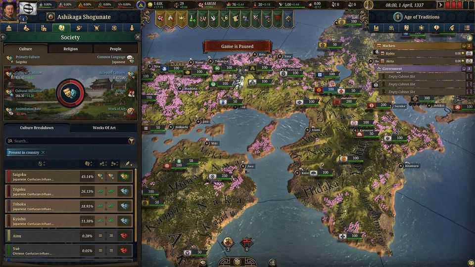
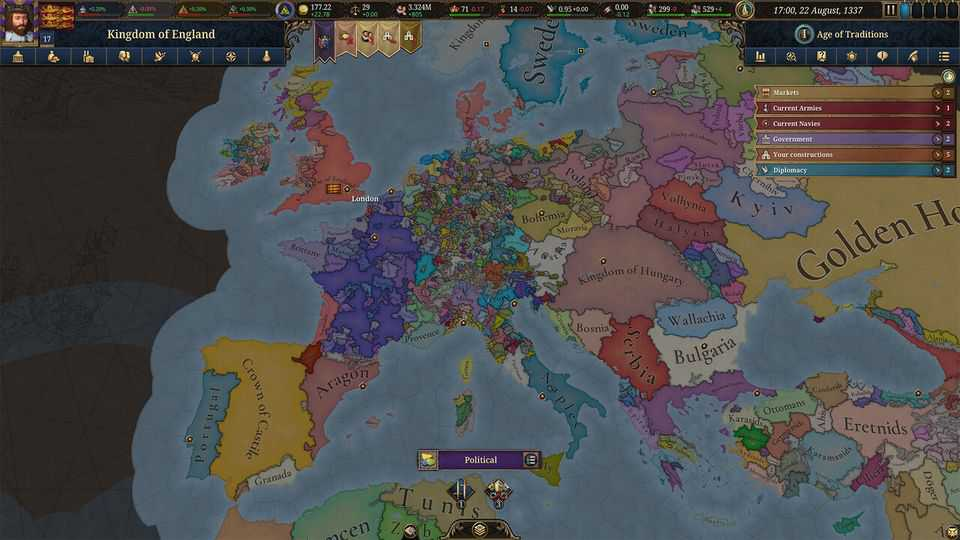

Christmas Specials | The Great Games
What if the best way to learn about history is by playing with it?
Video games are changing the way people understand the past
December 18th 2025
When it comes to education, there is no substitute for learning by doing. To teach children Spanish, have them speak it. To teach them art, give them paper and paints. Plenty of tech titans got their start by playing around on a computer in their youth. But some subjects are less suited to such learning, notably history. The past is fixed, and—until one of those tech titans invents a time machine— inaccessible. You can read about it in books, or watch re-enactments. But even the most eager student cannot get any hands-on experience. They cannot tinker and experiment as they can with a car or a foreign language. Or can they? On November 4th Paradox Interactive, a Swedish video-game developer and publisher, released Europa Universalis 5 (eu5), the latest in a series of best-selling historical video games. eu5 lets players take control of any one of hundreds of early-modern historical states in the year 1337, on the brink of the Hundred Years War, and guide it through the centuries as they see fit. Paradox specialises in these high-concept historical games and sells millions of them. The medievally inclined can try Crusader Kings, set in the Middle Ages. The Victoria series covers the Industrial Revolution, while Hearts of Iron focuses on the second world war. Imperator: Rome does what it says on the tin.

Other game-makers offer similar experiences. The Civilization games let players guide everyone from the Assyrians to the Prussians or the Vietnamese through six millennia of history, from the Stone Age to the space age. It has sold more than 70m copies since the first version in 1991. The more militarily focused Total War series invites players to take command of intricately simulated armies in historical periods from feudal Japan to Napoleonic Europe or Republican Rome.

The influence of such games goes beyond entertainment. In 2021 Nicholas Mulder, a historian at Cornell University, noted on Twitter that a new kind of student was turning up in his class on early-modern Europe; one whose interest had been explicitly sparked by Europa Universalis 4. “You’ll get at least a few in every class,” agrees Bret Devereaux, a historian at North Carolina State University. As he put it on his blog: teachers now encounter self-taught history buffs for whom “Paradox [games are] the historical mother tongue, and actual history is only a second language.”

The idea of simulating history in games is not new. Perhaps the best way to think of a game like Europa Universalis is as a fever-dream remix of Risk, a board game first published in 1957. But whereas board games have to have fairly simple rules, in a video game a machine keeps track of everything. That means those rules and systems can become very complex indeed.

Risk divides the world into a few dozen territories, and allows for up to six players. The map in eu5 features thousands of territories and hundreds of different polities, from tiddlers such as the Free Imperial City of Bremen to historical big cheeses such as the Byzantine Empire. The player chooses one; the computer controls the rest, but all are active participants in the game. The game keeps an eye on everything from armies and navies to a state’s administrative capacity, its diplomatic relations and its trade.

Playing for the first time can be bewildering. Players must conduct diplomacy with vassals and rivals, manage their economies, pacify peasant revolts and balance fractious interest groups. eu4, the previous game in the series, starts in 1444. Play as England and the decisions come thick and fast. Should the royals accept a marriage proposal from Leinster? Should you honour the Treaty of Tours (signed just before the game starts) and hand over Maine, a chunk of English territory in what is now France? Or will you go back on your word and risk reigniting the Hundred Years War? Will you grant a monopoly on the wool trade? And what to do about Scotland, your northern rival?

That means the games are practically certain to generate “alternate histories”, in which the world develops along a different path from the one it actually took. If England does manage to hang on to Maine in eu4, for

instance, the country can be played as a land power rather than the maritime one it actually became. But doing so may also spark another war with France —albeit one that England can sometimes win. An ambitious Dai Viet player can turn the historical tables and conquer China. Academic historians are often sniffy about alternate history. But it can be a good way to get students thinking about the subject as more than a tedious list of events, says Jeremiah McCall, who teaches history at Cincinnati Country Day School and has written on the educational uses of games.

It is this freewheeling agency, adds Dr McCall, that makes games— especially those that lean towards simulation rather than linear narratives—a unique form of media. Reading about history is a passive experience. Play a game, and you have to get your hands dirty.

People will learn things while they are having fun, too, via something that Ian Bogost, a video-game critic, dubs “procedural rhetoric”—the ideas and assumptions that the rules and systems of a game smuggle, often unnoticed, into the player’s mind. An obvious one is a better knowledge of what the past looked like; that the Grand Duchy of Lithuania was a behemoth in its day, or that an unwise royal marriage risks giving foreign rulers a claim to your throne.

Another idea, more profound, is that history did not have to happen the way it did. Some of Paradox’s earlier games try to keep things trundling roughly along their historical tracks by forcing certain big events—the Manchu conquest of China, say, or the Reformation in Northern Europe—to happen mostly on schedule. But that “railroading”, as players call it, has diminished in later releases in favour of letting the simulation play out as it will.

Some of the lessons can be surprisingly sophisticated. Dr Devereaux has written about how Paradox’s games can teach players about a concept known in international relations as the “security dilemma”, without ever mentioning the phrase. The idea is that though economic growth is not a zero-sum game, security is. A state may beef up its own army because it is feeling insecure next to powerful neighbours. But that makes that country seem more threatening, prodding those next door to build bigger armies, too.

Dr Devereaux uses Burgundy in eu4 to illustrate the baleful consequences. It begins the game next to an expansionist France, with its territory dangerously split in two. To play Burgundy is to fret constantly about France’s intentions and your own precarious position. To safeguard your country, you need to become more powerful. Before the Industrial Revolution, when almost the entire economy is built on agriculture, the easiest way to do that is to acquire more land. That draws the player’s eye inexorably to the small statelets of the Holy Roman Empire to the east. “To avoid becoming a victim of France,” writes Dr Devereaux, “Burgundy effectively must victimise its own smaller neighbours.” But those neighbours face the same incentives, as you will discover if you play as them. It is one thing to read about the security dilemma in a textbook. It is another to experience it for yourself.

The strength of games like Europa Universalis—that they are simulations, with consistent rules—can also be a weakness. Savvy players can exploit the systems, and the unimaginative play of their computer opponents. And if a decision proves catastrophic, the player can always reload and avoid making it again, an option unavailable to real historical decision-makers.

But all forms of media are imperfect. Dissecting a game’s assumptions and flaws is good practice for doing the same to academic articles or historical sources. History is not in fashion today: science and engineering degrees are in the ascendancy. Something that makes history—or at least a gamified version of it—so alluring that students will voluntarily sink hundreds of hours into “is a huge positive” for the field, says Dr Devereaux. “No question about it.” ■

This article was downloaded by zlibrary from https://www.economist.com//christmas-specials/2025/12/18/what-if-the-best-way-to- learn-about-history-is-by-playing-with-it