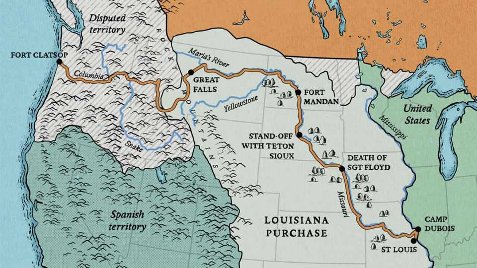

Christmas Specials | Lewis, Clark and Pompey, too
How two explorers, a mother and a baby made America
The “great man” and “tiny infant” views of history
December 18th 2025
The urge to make America bigger is back. President Donald Trump wants to buy Greenland, 2m sq km of sparsely populated Danish territory. He wants it because it is rich in minerals, strategically located as the polar ice melts, and might fall into hostile hands (Russia’s or China’s, say) if not better defended. So it is worth studying the last time America took over 2m sparsely populated, richly endowed, strategically located square kilometres. In 1803 President Thomas Jefferson pulled off the Louisiana Purchase, snapping up all the French territory in the middle of the continent, nearly doubling the size of the United States for a mere $7 ($150 in today’s money) per sq km. Jefferson’s reasoning was similar to Mr Trump’s: that this vast, valuable tract would fall to a rival power if not absorbed by the United States. Russia was probing south from Alaska; Britain was doing the same from Canada. Spain ruled most of what is now the south-western US (see map). But asserting control over French Louisiana was not simple. France had hardly governed any of it. The inhabitants were unaware that their hunting grounds now belonged to a state run by men in red waistcoats. And Jefferson, though a polymath with the largest personal library in America, knew almost nothing about the new territory. He imagined it home to mastodons, mountains of salt and a lost tribe of Israel. Yearning to know more, he ordered his bright, resourceful secretary, Meriwether Lewis, to trek across it, mapping the land, scaling the mountains, befriending the natives and finding out whether a navigable waterway linked the Mississippi river to the Pacific.

Lewis brought in his former comrade-in-arms, William Clark, as co- commander. The Lewis and Clark expedition yielded a cornucopia of discoveries that accelerated the westward expansion of the United States. It offers support for the “great man” view of history—and also for the less- known “small baby” view of history: had the expedition not included an infant, it might have ended in disaster. To find out why, read on.

The Economist retraced some of their steps, starting at Camp Dubois, near St Louis, where the Missouri river meets the Mississippi. Jefferson had given Lewis an unlimited letter of credit—surely the most generous travel expenses ever. Lewis recruited more than 40 men, mostly soldiers. Clark brought his slave, York.

Supplies included a compass, a theodolite and writing paper; beads and tobacco for gifts to Native Americans; opium for pain and “pewter penis syringes” for venereal diseases; and a hefty arsenal: swords, pikes, rifles and a swivel cannon mounted on a keelboat. A replica of that 55ft boat is now on display at Camp Dubois. Children are urged to think how to pack it.

On May 14th 1804 the Corps of Discovery set off. They knew the precise location of only three points along their route: the start, the destination at the mouth of the Columbia, and some villages of the Mandan tribe, near what is

now Bismarck in North Dakota. The rest of the map, they would have to fill in.

Paddling upstream was famishing work. The men ate some four kilos of meat a day: deer and beaver in the woods, buffalo on the great plains. Discipline was maintained with military severity. Whisky was rationed, and all the men knew it would run out after 100 days or so. One night a sentry and his mate got furtively pickled. One was sentenced to 100 lashes; the other to 50. “We have always found [the men] verry ready to punish Such Crimes,” wrote Clark in his journal.

On August 20th Sergeant Charles Floyd died, probably of a burst appendix. He was the first American soldier to die west of the Mississippi. A towering obelisk in Sioux City, Iowa marks his grave.

The expedition met Native Americans for the first time near what is now Council Bluffs, Iowa. Lewis tried to impress the Oto tribe with a display of soldiers drilling and firing their rifles in unison. He then gave a long speech, addressing them as “children” and advising them that Jefferson was now their “great father”.

How much they understood is unclear. But one chief, Big Horse, who arrived naked to highlight his tribe’s poverty, complained that if they made peace with the other tribes, the young men would have no opportunities to loot. Several were unimpressed with gifts of beads, tobacco and certificates declaring the bearer a “friend and ally” of the United States. They would rather have whisky, said Big Horse.

“It never occurred to [Lewis] that his actions might be characterised as patronising, dictatorial, ridiculous, and highly dangerous,” writes Stephen Ambrose in “Undaunted Courage”, a magnificent history of the expedition. “[H]is idea of how to make them into allies was to give them worthless medals and wardrobe trappings rather than the guns and powder they needed… In general, it would be impossible to say which side was more ignorant of the other.” For many, though, “The desire for friendship overrode ignorance.”

An encounter in September 1804 with the Teton Sioux nearly turned calamitous. The interpreter was no good. Lewis’s “great white father” speech fell on uncomprehending ears. An offering of whisky made a chief belligerent. A tussle began. Lewis ordered his men to fall back and prepare to defend the boats. Sioux warriors pulled arrows from their quivers.

“Had Lewis cried ‘fire!’, and touched his lighted taper to the fuse of the swivel gun, the whole history of North America might have changed,” argues Ambrose. Volleys of musket balls would have mown down many Sioux. But there were hundreds of them, and they could reload fast. Lewis and Clark might have been killed on the spot. The expedition might have been aborted. The Sioux might have turned foe to America and ally to the British in the war of 1812, “perhaps strong enough to wrest Upper Louisiana away from the Americans and make it part of Canada”.

Fortunately for all, another Sioux leader, Black Buffalo, ordered his men to back down. After a tense couple of days of talks, the expedition was able to press on. “I am Verry unwelle for want of sleep,” Clark wrote.

They wintered in Fort Mandan, in what is now North Dakota. It was, in Ambrose’s memorable phrase, “sometimes so cold a man’s penis would freeze if he wasn’t quick about it”. They became friendly with the Mandan tribe. Very friendly, in fact. Not only did the Mandan supply them with corn, without which they might have starved; they also offered their wives.

The Mandan believed a man could gain another’s power if both had sex with the same woman. And they thought the whites very powerful. Most caught syphilis during the journey, though Lewis and Clark seem to have abstained. The afflicted were treated with mercury, which may later have hastened their deaths.

At Fort Mandan they hired a 17-year-old Shoshone woman, Sacagawea, as an interpreter, along with her French husband. In February 1805 Sacagawea gave birth to a boy, Jean Baptiste (nicknamed “Pompey”). Perhaps it was rash to take a baby on such a perilous journey, but they needed Sacagawea, so the baby came, too. This turned out to be a blessing. His presence reassured the tribes they met later that the heavily armed expedition was

peaceful. For who, they reasoned, takes an infant on a war party? Without Pompey, the Corps might have been wiped out.

On April 15th they passed the farthest point upriver that any white man was known to have reached. Lewis ecstatically likened himself to Christopher Columbus. In June they had to carry their canoes arduously around the five Great Falls in what is now Montana. They thought that when they reached the continental divide—the edge of the Mississippi watershed—it would be a gentle paddle down to the Pacific. Far from it. At Lemhi Pass, on what is now the border between Montana and Idaho, Lewis saw “immence ranges” of snow-capped mountains stretching far into the West.

Then they met Sacagawea’s tribe. And—a stroke of luck—Sacagawea recognised the Shoshone chief as her long-lost brother. (She had been kidnapped at 12 by the Hidatsa.) The Shoshone promised to help, selling the Corps horses and suggesting a route.

Next came the hardest part of the entire journey—a 260km slog over the rugged Rockies, shuffling through snow and carrying a baby. Clark complained of the “rockey hill Sides where our horses were in [constant] danger of Slipping to Ther certain destruction”. By the time they reached a Nez Percé village on September 22nd, they were shivering, starving and dysentery-racked. Ambrose calls it “one of the great forced marches in American history”.

It would have been easy for the Nez Percé to kill their sickly guests and steal their arsenal, but they resisted this powerful temptation. When the Corps had recovered, they made dugout canoes and paddled downstream. On November 7th, as the fog lifted over the Columbus river, a great cheer went up. “Ocian in view! O! the joy,” wrote Clark. They had travelled 6,666km from the mouth of the Missouri.

They had to decide where to spend the winter. On the north side of the river, in what is now Washington state, where the local Chinook kept stealing their things? Or on the south side, in what is now Oregon, where the friendlier Clatsop tribe told them elk were plentiful? They put it to a vote. Sacagawea and York joined in, making it the first time that a woman or a black slave had voted in America.

They chose the south side, and built Fort Clatsop. A reconstruction now gives visitors a feel for their cramped, Spartan quarters—and for the majesty of the surrounding forest. A long hike leads to the beach where they found a dead whale, which “resembled the beaver or the dog in flavour”. Lewis ventured a rare joke about it, contrasting his good fortune in swallowing it with that of Jonah being swallowed.

Lewis and Clark’s journals and maps caused a sensation. Jefferson devoured them and ordered them published. They gave priceless, detailed guidance to the vast numbers of Americans who followed them westwards, on everything from farming to defence. The soil of the great plains was “fertile in the extreem”, Lewis wrote, though there was not enough timber. He noted rapids that might make water-works, and good spots to place garrisons to keep out the British.

It is hard to exaggerate their contribution to science, too. They identified 122 species of animal, from coyotes to prairie dogs, and at least 178 plants. On one day they recorded two new species, the pronghorn and the white-tailed jackrabbit. At first they discounted Native American descriptions of the size and ferocity of grizzly bears. Then they met some. Of one specimen, Lewis noted that it was “extreemly hard to kill notwithstanding he had five balls through his lungs”.

They also described native customs in unprecedented detail (and with some priggishness). Lewis tut-tutted that the Chinook and Clatsop went naked from the waist down. Yet he conceded this made sense, since they were in and out of canoes all day. He frowned that they would “prostitute their wives...for a fishing hook”; yet noticed that they paid more heed to women’s opinions than other nations did. Though he was naively optimistic about prospects for the natives’ peaceful absorption into the United States, he faithfully reported facts that undercut his narrative, such as that many tribes selected chiefs for their courage. As one young brave put it to him, if they made peace, what would they do for chiefs?

The Corps of Discovery are remembered as an exceptional crew. Yet the towering figure in the story is Jefferson. He had the inspiration to buy Louisiana from a France that couldn’t defend it. He understood the value of trade, and the strategic importance of rivers in binding together a country

without trains or trucks. He pressed a reluctant Congress to fund research that helped turn America into a transcontinental power. He personally taught Lewis essential skills in botany, astronomy and navigation. He was, as Ambrose puts it, a “man of facts”. Unlike his most recent successor, he yearned to learn about the lands he sought to rule. He had grave faults, such as owning more than 600 slaves. But he was a visionary.

He was badly mistaken in thinking that the march of settlers could be controlled, and war with the Native Americans avoided. In fact, “No force on earth could stop the flow of American pioneers westward,” writes Ambrose. “Good cheap land was a magnet that reached all the way back to Europe.” Jefferson ensured that the pioneers remained, or became, American.

For some of the Corps, the story ended tragically. Lewis, an alcoholic, may have killed himself. York, having contributed heroically to the mission, asked for his freedom. Clark, disgracefully, said no. Pompey grew up to be a successful explorer.

Today, hordes of Americans visit landmarks on the Lewis and Clark trail, which crosses 16 states. Some dress up as members of the Corps and re- enact their adventures, albeit with the safety-net of credit cards and antibiotics. Larry Boschen, a retired boilermaker who played the doomed Sergeant Floyd during a re-enactment, points out the crucial difference. “We knew where we were going. They didn’t.” ■

This article was downloaded by zlibrary from https://www.economist.com//interactive/christmas-specials/2025/12/18/how-two- explorers-a-mother-and-a-baby-made-america