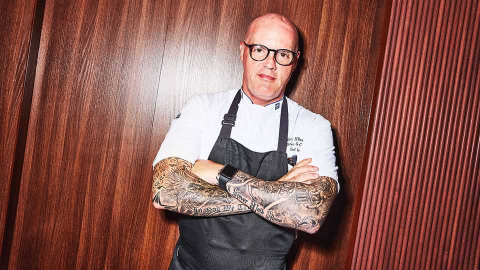
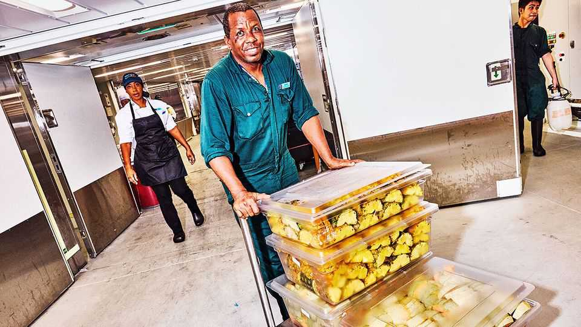

Christmas Specials | The feeding of the 7,600
The titanic task of catering on the world’s biggest cruise ship
How to spend $1.5m on ingredients
December 18th 2025
As you sweat over your Christmas dinner for a mere 12 or even 20 guests, spare a thought for Gary Thomas. When he stands in the dining room of his restaurant at 1pm, all is quiet. Come 7pm it will be heaving. Around him are tables laid for 500. Those tables will be turned three times over the course of the evening. And the restaurant has two more floors. Chef Gary says almost 6,000 people will dine in under two and a half hours. This is not his only concern; he has 25 other restaurants under his command. By the final wipedown, his 344 chefs and 1,700 front-of-house staff and pot-washers will have prepared, served and cleared up 100,000 meals over the course of the day. And they will have done it all while floating over the azure waters of the Caribbean, aboard the Star of the Seas, the largest cruise ship in history. Chef Gary has been working on cruise ships for nearly 17 years. He is now in charge of catering for Royal Caribbean, one of the largest cruise companies in the world. He oversees thousands of culinary professionals over a fleet of 29 ships and two private resorts. Those vessels have been getting bigger and bigger. Chef Gary has commanded catering operations on vessels that were each, at the time, the largest cruise ship in the world. The Star of the Seas is his 16th. At full capacity it can carry around 7,600 guests and 2,350 crew. It is longer than the Eiffel Tower is tall. It boasts more than 20 decks, seven swimming pools, an ice rink and the world’s largest water park at sea. It weighs 250,000 tonnes (almost five Titanics). Officially, it is powered by liquid nitrogen gas. In reality what keeps the ship going, and the passengers satisfied, are the vast quantities of food produced by Chef Gary and his battalions of catering staff.

A cruise ship is not an aeroplane; there are no reheated ready meals. The meat is butchered, the fish filleted, the bread baked, the potatoes chipped, the meringues beaten, the eggs fried, all aboard a ship pitching over the waves. “The only thing we don’t have is a live cattle farm,” grins Chef Gary. “But never say never.” It requires a dizzying degree of preparation, the keenest eye for detail and military discipline.

To understand Chef Gary’s operations, start not in the main dining room, or even one of the gargantuan walk-in fridges, but rather in 19th-century France, with the godfather of the modern restaurant kitchen: Auguste Escoffier. Born in 1846 to a poor family in Villeneuve-Loubet, in the south of France, Escoffier was sent to work in a professional kitchen at the age of 13. It was a world away from the gleaming calm of the kitchens on the Star of the Seas. The kitchens of the 19th century were full of noise, chaos and drunks. Fights broke out regularly. Escoffier was bullied mercilessly, shoved aside by other chefs to get to the stoves they needed to cook on.

Then he joined the army. The experience was transformational, for Escoffier and the world of professional cooking. Inspired by the army’s discipline and hierarchy, he remade the restaurant kitchen. He forbade chefs from drinking and instructed them to keep quiet. Chef Gary is cut from the same cloth. Signs banning talking abound in his kitchens.

Until Escoffier, chefs had been responsible for entire meals, cooking everything served on a plate. Instead Escoffier put chefs in charge of individual components of a dish. A senior chef would then assemble the plate of food. In this Escoffier anticipated two other principles embraced by industrialists in the 19th century—specialisation and the division of labour.

All of Escoffier’s principles go into making a day’s meals on the Star of the Seas. Preparation starts long before the thousands of diners sit down to eat. At 6am the main deck is eerily empty. The restaurants here have yet to open and the only people out are staff polishing surfaces (and the odd travel influencer trying to capture a selfie for TikTok).

The sun is rising over the Caribbean, with clouds the colour and texture of candy floss. Take a lift down several floors and you reach the crew-only decks. Randy Nicolas, the ship’s inventory manager, stands waiting. His hair is neatly parted and he sports a pressed white uniform that is only slightly whiter than his teeth when he beams his kind smile, which is often. Everything starts here, with Randy.

The lift opens on to a corridor affectionately known as the i-95, an American highway that stretches for over 1,900 miles (3,100km) from Maine to Florida. It runs the full length of the ship, over 300 metres. Randy’s job is to ensure that at no point do the chefs on board run out of anything needed for those 100,000 meals a day (there may be only 10,000-odd people on board but passengers eat many more “meals” than humans usually consume in 24 hours. A running joke in the cruise-ship industry is that passengers gain a pound a day). He is in charge of 25,000 line items including 15,000 lobster tails and 400 tonnes of bottled water. Unsurprisingly, Randy loves a spreadsheet. The ingredients for a weeklong cruise cost $1.5m, and some sailings are twice that long.

On any given day, the chefs serve 6,800kg (15,000lbs) of protein; there are chickens to debone, spatchcock and grill; lamb to french-trim, roast or braise; salmon to pin-bone; sea bass to fillet; tuna to skin; prawns to devein and pop out of their shells. This cornucopia is stored in numerous walk-in fridges and freezers that branch off i-95. The largest, the fish freezer, is 210 square metres, or about five times the size of the average London flat. The dry store holds two tonnes of sugar in 20kg-sacks stacked nearly two metres (six feet) high, and almost four tonnes of rice. Multiple chiller rooms are devoted to milk in various stages of churn: single cream, double cream, whipping cream, butter, ice-cream.

All are spotlessly clean. Chef Gary frets not just about running out of food but even more anxiously about the safety of everything he serves. A norovirus outbreak can destroy a cruise. This spring the Queen Mary 2, another luxury cruise ship, saw 266 passengers fall ill on a four-week cruise around the Caribbean. The worst case for Royal Caribbean was back in 2014, on the Explorer of the Seas, when 630 passengers fell ill, as well as 54 crew. That’s why the kitchens are immaculate—as clean as any hospital, boasts Chef Gary.

Randy knows exactly what is in each one of them. “I always say that the captain is the brain of the ship. The chief engineer is the heart of the ship.

We are the blood,” he grins. Chefs order from Randy like home cooks do from supermarkets. They use software called Crunchtime to monitor how much of each ingredient is being used at any one time by the various restaurants on board. Randy then can use the program to tweak his orders for future sailings.

For a Caribbean cruise he has to put his orders in three weeks in advance; ships travelling to Europe require ten weeks’ notice. Randy is an ingredients oracle, parsing previous orders and the demographic make-up of passengers to determine what is needed. “Americans want burgers and fries; Europeans want pasta and a wider variety of vegetables.” More children means even more burgers and fries: pity the poor chef peeling potatoes if a lot of American children are due on board. He keeps abreast of the ever more detailed dietary requirements that guests are asked to log when they book their cruise; is there an unexpected glut of gluten-free buffet-warriors? A surfeit of vegans? Randy adjusts accordingly.

Crunchtime takes another of Escoffier’s innovations, mise-en-place, and turbocharges it. Mise-en-place literally means “putting in place”. In a kitchen, at its most basic, it involves a careful calculation of what chefs work out they need to have ready for service and charting the most efficient course to get it all in place. When Chef Gary was rising through the ranks he prepared his mise-en-place intuitively. Now Crunchtime makes those predictions, using artificial intelligence, historical data and information that the staff enter daily: “It can tell us, for example, for tonight, we need 1,422 portions of calamari,” Randy explains.

This kind of precision matters not only because keeping hungry cruise-goers happy is essential, but also because, overwhelmingly, what sinks restaurants is their razor-thin margins. This is even more challenging when considered at cruise-ship scale; in 2023 the top three cruise lines spent $2.5bn on ingredients alone. Consistently over-ordering is a recipe for a stomach- churning level of waste.

Wastage nonetheless remains a problem on board. The nature of seafaring buffets makes it inevitable. All-you-can-eat seafarers are rarely content with just one dessert; but if someone loads up on two or three puddings, they are unlikely to finish them all. And food served as part of the buffets can be

exposed for only three hours before it has to be disposed of for reasons of health and safety. The excess food is ground to a pulp. Some is thrown into the ocean; some is incinerated. Enough waste is torched to help generate the power for the water-park on the top deck, which features slides that skim passengers over the side of the ship and back up again.

There are three loading bays along the i-95; the ship docks parallel to piers so more off-ramps means quicker loading and unloading. At 6.30am the Star of the Seas has just made landfall at Royal Caribbean’s private island for its customers, “Perfect Day at CocoCay”. The island’s white sandy beaches and garish water-park stand out against the sky, washed the colour of a candy beetroot as the sun peeks over the horizon.

Work must start immediately. “What they say is, early is on time. On time is late. And late is unacceptable,” Randy stresses. Today he and his team are unloading food. But this is also where Randy picks up ingredients for on- board consumption. On loading days the pressure is even greater. If the ship is not stocked on time, its departure could be delayed. That either means burning through more fuel to make up time reaching the next destination, or it means thousands of passengers missing the activities they have booked at specific times at their next stop.

That is why scores of pallets of food have already been prepped, labelled and divided into sealed containers, ready to be taken by forklifts onto the island to stock the restaurants there. The working conditions for chefs and crew throughout a voyage are strenuous at the best of times.

They work seven days a week for the entire length of their contracts, which sometimes last as long as eight months. The chefs are usually from emerging markets such as the Philippines, Indonesia, India and South Africa. They are paid far less than the American minimum wage, and have no access to the luxury amenities enjoyed by paying passengers. Stops at the private island can be especially taxing for them. Almost all of the food served there is prepared on the ship the night before, so the chefs and crew have been working through the night for this moment.

As passengers are disgorged onto the island throughout the day, a new shift of chefs is busily preparing for their return that evening. Chef Gary is doing the rounds, checking that each of his kitchens is up to scratch. Later that evening your correspondent will stand in the middle of the buffet, admiring the watermelons intricately carved into lotus flowers, the grill chef expertly cooking 30 steaks at a time, and the sunburnt revellers crowding around the serving platters, stacking their plates ever higher. They have no idea how much work went into making all this food. Your correspondent appreciates their toil; but even more so, he appreciates how good the meal is. He makes sure none of it is left to waste. ■

This article was downloaded by zlibrary from https://www.economist.com//interactive/christmas-specials/2025/12/18/the-titanic- task-of-catering-on-cruise-ships