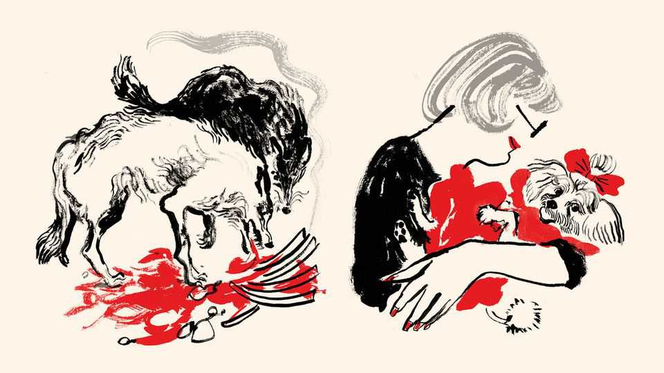

Christmas Specials | Your flexible friend
How wolves became dogs
The strange symbiosis between two hyper-predators: humans and hounds
December 18th 2025

Who said it first, no one knows. But Frederick the Great, warrior ruler and enlightened despot of 18th-century Prussia, said it well. “The only, absolute and best friend a man has, in this selfish world, the only one that will not betray or deny him, is his dog.” Relations between dogs and people are so normal and pervasive as to pass almost unregarded. Yet viewed objectively, this affiliation is among the most peculiar in the animal kingdom. Somehow, the descendants of a large and dangerous predator, the grey wolf, have integrated themselves into human society in a manner unmatched by any other species.

Domesticated animals abound, but most exist only to serve. Cattle, sheep, goats, buffalo, yaks, horses, asses, pigs, ducks, geese and chickens yield food, transport or materials. Cats, it is true, have inveigled their way into people’s dwellings, where they provide a certain level of companionship beyond their working role as mousers. But dogs are different. They are true and trusted friends, even those that are also servants.

Moreover, such servants—sled dogs, sheep dogs, hunting dogs, guide dogs —are skilled operatives, not mere drudges. They collaborate in a sophisticated and willing manner with their masters and mistresses in ways no other domesticated animals can manage. How this strange symbiosis came about is now being pieced together. Clues come from disciplines ranging from genetics and psychology to archaeology and anatomy, and places as far apart as China, Germany, Alaska and Australia. One of the most telling facts, however, is just how far back the relationship between dogs and people goes.

Sheep, goats, cattle and pigs were all domesticated between 11,000 and 9,000 years ago, during the transition to agriculture—and cats, according to recent research, a mere 4,000 years ago. Dogs stretch back much further. A burial at Bonn-Oberkassel in Germany, of a young dog alongside two humans, is more than 14,000 years old—a time when Homo sapiens was still a hunter and a gatherer. Genetic evidence suggests pre-Columbian American dogs shared an ancestor that lived 23,000 years ago. And a few ambiguous fossils, which some interpret as dogs and others as wolves, are older still than this.

Much of the evidence, both modern and fossil, points to the eastern end of the Eurasian land mass—either China or Siberia—as the place where the switch from wild wolf to domestic dog occurred. It is also possible that another domestication happened farther west, with its descendants subsequently subsumed into the wider canine population which flooded out of its Asian homeland alongside its human companions. For, once dogs had teamed up with humans, they spread rapidly throughout the rest of the world.

They arrived in North America about 15,000 years ago, crossing from Siberia to Alaska, and spreading thence as far as Patagonia. A South-East

Asian clade gave rise to distinctive groups such as the singing dogs of New Guinea, which yodel rather than bark, and the dingoes of Australia. And in Europe and the Middle East, the close relations between dogs and humans are reflected in joint burials like that in Bonn-Oberkassel.

None of that, however, answers the question of what prompted the strange symbiosis between canines and humans in the first place. In fact, that is two questions. One is ecological and behavioural: how did wolf and human societies mesh together so that dogs were the outcome? The other is genetic: what changes happened to wolves to turn them into dogs?

Wolves are, in many ways, ideally suited to get along with people. They are sociable, collaborative and respect authority. They also live in small groups, rather like humans in their hunting-and-gathering days. But by themselves, these “pre-adaptations” are not enough. To stimulate the evolution of the behavioural toolkit which allows dogs to thrive in proximity to people would have required something else. That something was probably food.

One explanation for how wolves became dogs, proposed in 2001 by Raymond and Lorna Coppinger, two American biologists, is thus the scavenger hypothesis. The Coppingers studied feral dogs around the world, realised that most of them make their livings by scavenging from refuse tips near human settlements, suggested that this way of life is, in fact, the one to which dogs have been tailored by evolution (a point backed up by estimates that half or more of the 700m dogs on the planet live this way, rather than sharing dwellings and social relations with humans), and proposed that such behaviour was thus the driving force behind canids and people getting together.

It is an attractive idea, with dogs cast, from the human point of view, as useful four-legged garbage-disposal units. The problem is that settlements of the sort which accumulate refuse dumps are manifestations of agriculture. Hunter-gatherer camps tend not to develop middens. But the idea that edible matter surplus to human needs was the force behind dog domestication has not gone away. Maria Lahtinen of the University of Helsinki has devised a different version of it. She thinks hunter-gatherers in ice-age Eurasia might, indeed, have accumulated surplus food from which wolves could have benefited.

Dr Lahtinen’s crucial observation is that, unlike carnivorous wolves, omnivorous humans cannot live on protein alone. Their bodies cannot cope with the quantities of nitrogenous waste products, such as urea and ammonia, that would be generated if they extracted all the calories they need from the chemicals of which proteins are made. They therefore require carbohydrates or fats as well. But both of these would be scarce in ice-age winters, since plants would have died in the cold and animals’ fat reserves would be depleted. To get enough fat, in particular, would involve killing more game than would otherwise be required. The discarded lean meat might then be consumed by wolves tame enough to exploit it.

The main alternative to the food-driven route to domestication is the idea that people simply kidnapped wolf pups and adopted them, perhaps as playthings for children or to act, when they had grown to adulthood, as hunting companions. This cannot be discounted, but it seems less plausible. Wolf cubs taken immediately after birth can be tamed, but it requires weeks of hard work and constant attention. And for the genetic changes involved in domestication to occur, such animals would then have to be bred, with the tamest retained and the others disposed of.

It seems simpler, and thus more plausible, that good-old Darwinian natural selection did the job, with one particular population of wolves gradually developing the nous needed to get along with their new human friends—a process dubbed “survival of the friendliest” by Brian Hare of Duke University, in North Carolina. And dogs do, indeed, seem to display a whole suite of psychological adaptations best explained by the idea that the niche they are adapting to is human approval. Dr Hare, founder of the Duke Canine Cognition Centre, calls this skill-set “dognition”.

Some dognition-promoting differences between wolves and their domesticated descendants manifest early on. Experiments by Kathryn Lord of the Broad Institute in Cambridge, Massachusetts, show that, in contrast to the weeks involved in taming a wolf, a dog pup requires only about 90 minutes of human attention to learn the knack of getting on with people.

Dr Lord is now looking, with the assistance of some wolf-dog hybrids, for the genetic changes which underlie this ability. And other work has already identified one plausible candidate—a pair of neighbouring genes lost in the

transition from wolf to dog which, if missing in humans, cause a disorder called Williams-Beuren syndrome. This results in characteristic anatomical changes and mild-to-moderate cognitive disability, but it also promotes extreme friendliness.

Besides being friendly, dogs have evolved as well to be good at reading human minds. Work by the Clever Dog Lab in Vienna suggests they can correctly ascribe motive and knowledge to humans in experiments involving the presence and location of food. They will approach crying strangers (or, at least, strangers pretending to cry for the purposes of the experiment), and their levels of cortisol, a stress hormone, rise when they hear a recording of a baby crying. Experiments which compare dogs’ reactions with those of miniature pigs kept as household pets suggest these sorts of responses are dog-specific, rather than a result of exposure to people making a non-human animal familiar with human ways.

Perhaps most intriguingly of all, that ultimate behavioural hack of human emotion, the puppy-dog-eye look, is a feature specific to dogs. To pull it off, they have evolved a special face muscle, which wolves lack. This lets them raise their eyebrows to make their eyes appear larger and more infant-like, and also more similar to a human expression of sadness.

Understanding how all these changes came about is a work in progress. A much-cited Russian experiment to breed tameness into foxes on a fur farm caused excitement some years ago by suggesting selective breeding could do this in ten generations, and also that a side-effect was physical changes in the animals reminiscent of those (including short muzzles, mottled coats and curly tails) which often distinguish dogs from wolves. However the relevance of this experiment to how rapidly these changes happen has been called into question by Greger Larson of Oxford University, who discovered that the animals used traced their ancestry back to a Canadian fur farm which had tried something similar in the 19th century, and presumably thus carried the genetic consequences of this earlier attempt when the experiment began.

However domestication originally came about, though, a deliberate hand on the tiller of dog evolution is soon detectable, as humans sought to benefit from their new companions. Zhokhov island, off the coast of Siberia, for

example, has yielded 9,500-year-old dog remains which are genetically akin to modern Greenland sled dogs and are buried alongside what look like dog sleds. Hunting dogs are similarly ancient. Carvings on cliffs in Saudi Arabia, thought to be between 8,000 and 9,000 years old, depict them.

This corresponds with the time when, according to a paper published in November by Dr Larson and his colleagues, dogs’ skull sizes were shrinking compared with those of their lupine ancestors, and the shapes of their skulls were becoming more variable, paving the way for the diversity of modern breeds.

Time brought more specialisation to the working dog. Terriers controlled rats and flushed rabbits from their burrows. Mastiffs guarded property and were let slip as dogs of war. Gun dogs returned game after the invention of firearms. And, more disturbing to modern sensibilities, bulldogs baited bulls for the entertainment of punters.

Keeping dogs as pets, rather than as working animals, was, however, largely an aristocratic indulgence. As befits a warrior king Frederick the Great’s penchant was for Italian greyhounds, thoroughbred versions of a hunting lineage which evidence from Egypt suggests go back at least 4,000 years. A century earlier, Charles II of England had a thing for toy spaniels, the modern versions of which bear his name. And a century before that Mary, Queen of Scots, was accompanied to her execution by her Skye terrier. Chinese royalty, meanwhile, favoured the small dogs known in English- speaking countries as Pekinese.

It was the rise of the middle classes which changed this. More people could afford the indulgence of an animal that was a non-working companion. And boy, did they indulge. The first British dog show happened in 1859, as animal breeders stirred the planet’s canine gene pool to come up with new versions of old models. The result, so far, is the 225 breeds now recognised by the Royal Kennel Club, Britain’s (and the world’s) oldest association for dog owners.

Sometimes, the results have been grotesque. Dalmatians owe their spots to genes associated with a urinary disease. Dachshunds, corgis and other short- legged breeds are achondroplasic—meaning that they have bred into them a

mutation which, in humans, causes a form of dwarfism. And several breeds, such as boxers and modern bulldogs, have had flat faces and other cranial distortions imposed which can affect their breathing and teeth, and also (because their facial skin is often folded) cause skin infections.

But working dogs, too, have continued to proliferate—most notably with the introduction, in 1916, of guide dogs for blind people, and in the 1970s of hearing dogs for the deaf. These assistance dogs have also now been joined by therapy dogs, trained to provide comfort to people in places such as hospitals and hospices, and thus make use of the mutual psychological understanding that makes dogs.

Pet dogs are proliferating, too. Half of American households (65m of them) include a dog, and dog food is a multi-billion-dollar industry. The best friendship in zoology shows little sign of coming to an end. ■

This article was downloaded by zlibrary from [https://www.economist.com//christmas-specials/2025/12/18/how-wolves-became-dogs](https://www.economist.com//christmas-specials/2025/12/18/how-wolves-became-dogs)