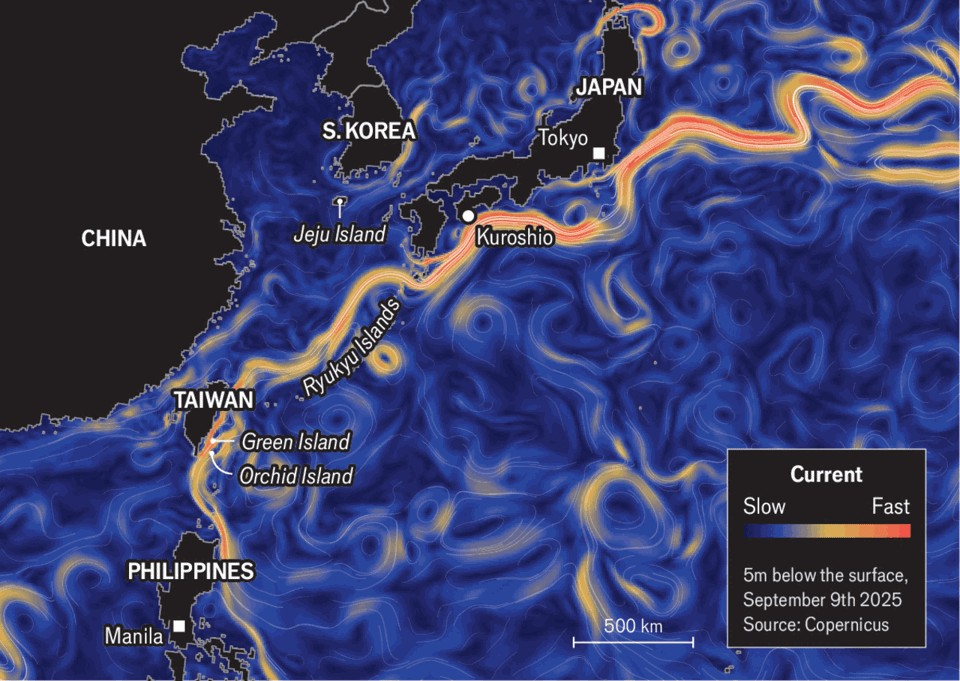

Christmas Specials | The Black Stream
A journey along East Asia’s hidden artery
How a mighty ocean current shapes societies
December 18th 2025
THE TOWN of Kuroshio in Japan is named after the swift ocean current that flows nearby. The Kuroshio (Black Stream) stretches as wide as a megacity and carries more water than the Amazon river. Kobayashi Eiji moved to the town three years ago to fish for skipjack tuna, which locals grill over piles of burning straw. “When I first entered the Kuroshio, it was like a rapid river, my boat was immediately carried away,” he says. “And it’s truly black.” A hidden artery running through East Asia, the Kuroshio has shaped life along its path for millennia. It gathers strength east of the Philippines, courses northward past Taiwan, swerves along the Ryukyu islands and bifurcates around Japan. It transports nutrients, sustains fisheries and transforms societies. Like its Atlantic cousin, the Gulf Stream, it carries tropical heat northward, helping to keep the region habitable. The Black Stream is a metaphor, too. It encourages people to see the region as an interconnected system, rather than as a patchwork of countries, argues Jonas Rüegg, a historian at the University of Zurich. People, goods and ideas flow, like the current, back and forth. On most maps, oceans appear static. They are anything but. The winds that howl across them, the “Coriolis effect” from the Earth’s rotation and the pressure gradients formed by the subtle slope of the water’s surface combine to create currents like the Black Stream. Engineers hope one day to harness their awesome power with underwater turbines. Currents, like rivers, follow regular paths, but can meander, shift and spin off into smaller eddies, like “cream in coffee”, says Nagai Takeyoshi of the Tokyo University of Marine Science and Technology. Currents also move vertically, as if along an invisible undersea spiral staircase. The underwater

landscape of sea floors and continental shelves pushes swells of water up and down. If static, the ocean’s heavier, more nutrient-rich layers would sink and separate “like miso soup”, Mr Nagai continues. When stirred, the layers mix, bringing nutrients to the surface.

To trace the Kuroshio’s circulation, begin in Manila, circa 1565. Spanish sailors realised they could catch a ride along the current from their colonies in the Philippines to those in Mexico. Evading typhoons and pirates, they ferried silks and spices, silver and gold, gemstones and slaves. An early example of globalisation, this underpinned the expansion of the Spanish empire, says Danilo Gerona of Partido State University in the Philippines. It also taught early lessons in microeconomics: one shipment of 1,000 white cotton shirts from the Philippines in 1792 found no buyers in Acapulco, as they were too small for people there.

The Black Stream gathers strength as it flows between the Philippines and Taiwan. American forces sank dozens of Japanese ships there during the second world war; the current carried the bodies to Taiwanese beaches. Control of these waters might be crucial in a future conflict over the self- governing island. Knowledge of currents helps submarines move undetected. China’s armed forces have studied the Kuroshio; Japan’s have named a submarine after it.

The Black Stream’s darkness comes, paradoxically, from its clarity. A dearth of plankton and sediment at the surface means the water absorbs most light, rather than scattering it. Another paradox, says Saito Hiroaki of the University of Tokyo, is that such seemingly impoverished waters sustain rich fisheries. The prevailing hypothesis holds that regular upwelling from deeper, nutrient-rich layers plays a big role, but the process is not yet fully understood.

On Orchid Island, off the south-east coast of Taiwan, the indigenous Tao people have a deeper knowledge of the ocean than most. “The Kuroshio, the ocean, the typhoon, the flying fish—they shaped my tribe,” says Syaman Rapongan, the modern-day bard of the Tao. Their culture revolves around flying fish and the elaborate wooden boats used to catch them. The Tao divide the year into three seasons: rayon (the flying fish season), teyteyka (the end of the flying fish season), and amiyan (the waiting for flying fish

season). The native language has no cardinal directions, only out to sea and returning to shore.

One day early this amiyan, Sinan Matopos prepared for a ceremony to celebrate her family’s new boat. Her husband, Syaman Matopos, had harvested and carved the wood himself, whispering to the trees to ask them to start new lives as part of his vessel. As always, he painted a set of eyes on the front of the boat, to help find the way home.

Si Matopos, the eldest son, had returned for the ceremony from Taipei, where he is studying at university. His friends from the mainland see the ocean differently, he reflects: it “is strange and dangerous for them”. But for the Tao, “the ocean is just like a human: it can be happy or sad, it can get upset with you, it can give you gifts and it can give you warnings.”

Under Taiwan’s dictatorship in the 1970s and 80s, the government dumped nuclear waste on Orchid Island. These days Taiwan’s current ruling party, the independence-minded Democratic Progressive Party, is keen to promote indigenous culture. Waves of migration from China to Taiwan have helped shape the dominant narrative of Taiwanese culture as an extension of Han Chinese culture—a story that China uses to buttress its claims to its democratic neighbour. Indigenous history offers an alternative tale.

In Taitung, a ferry ride from Orchid Island, scholars at the National Museum of Prehistory position Taiwan as a central maritime hub, rather than an appendage of the mainland. In this telling, the currents emerge as crucial byways for exchange and migration, stretching back tens of thousands of years. Taiwan’s indigenous groups are believed to have fanned out into the south Pacific, forming an arc of Austronesian peoples through the Philippines and Indonesia. “From an island perspective, the ocean is the pathway,” says Fang Chun-wei, a museum official.

Ancient humans from the coast near Taitung may have been the first to settle the Ryukyu islands, which stretch along the Black Stream for 1,100km between Taiwan and Kyushu, the southernmost of Japan’s main islands. Yanagita Kunio, a folklorist, suspected as much after coming across a coconut shell on a central Japanese beach and wondering about the currents

that carried it there. In “The Maritime Path”, a book published in 1952, he traced Japan’s cultural roots back along the waters of the Kuroshio.

Such theories have found scientific backing. The earliest traces of Homo sapiens on the Ryukyu islands date to the Palaeolithic era, some 30,000 years ago, more recent than the oldest specimens on Taiwan itself. Without a land bridge, the first settlers must have come by sea, across the Kuroshio. Kaifu Yousuke, an archaeologist at the University of Tokyo, assembled an interdisciplinary group of researchers and boat-builders to investigate this ancient migration. Computer simulations helped determine that the settlers could not have drifted over accidentally. Using only the stone tools that would have been available at the time, the team built a dug-out canoe to test the waters themselves. Four men and one woman set off from Taiwan’s east coast one hot day in the summer of 2019. After more than 45 hours of paddling, they reached Yonaguni, Japan’s westernmost territory. (Unlike their ancestors, they had to have their passports stamped.)

Having determined that the perilous crossing was possible, another question arose: why undertake it? If the voyagers needed to escape a conflict, they could have hidden in forests. Mr Kaifu argues the trip was instead an early instance of the “innovation mindset”. Yonaguni, like the moon, could be seen on the horizon, and people wanted to explore it. “This was their Apollo project,” says Mr Kaifu. “They sought new frontiers.”

Tens of thousands of years later, modern Japanese looked over the Black Stream with similar zeal. As Mr Rüegg describes in “The Kuroshio Frontier”, Japan’s empire ran through the current, with the search for resources at sea driving its expansion. The Pacific basin where the Kuroshio empties became the world’s most prolific whaling region in the 19th century, the “Japan Ground” of Moby Dick fame. In the early 20th century one baron built Japan’s first industrial tuna fishery on the remote outposts now known as the Senkaku, the source of a present-day territorial dispute with China. By the 1940s the imperial Navy sang of conquering the current: “We once stood in awe of the vast Pacific’s Kuroshio, the day has come on which, our blood boiling with ambition, we celebrate its crossing.”

Shared cultural touchstones extend along the Ryukyu chain and into the strait between Japan and the Korean peninsula, where the Kuroshio branches

into the Tsushima current. On Jeju, a Korean island, a recent art show focused on the current. Exhibits explored migrating fauna and floating rubbish, common religious sensibilities and recurrent basket-weaving techniques. The islands of the Kuroshio region are home to “cultures that use the current as their medium”, explains Lee Jong-hoo, the show’s director.

These islands also “share a lot of wounds from the colonial past”, as the sites of ideological and great-power competition, Mr Lee continues. One project imagined the Kuroshio as an invisible thread connecting Jeju and Taiwan’s Green Island. On Jeju the South Korean government massacred thousands of supposed communist sympathisers in the late 1940s, with the current carrying some of the victims’ bodies across the strait to Japan. Green Island, which sits near Orchid Island, became the site of a notorious prison camp during the White Terror, a decades-long anti-communist crackdown that also began in the late 1940s; at a facility called “Oasis Villa” prisoners could hear the ocean from their cells but never see it.

The Black Stream played an unsung role in America’s entry into the region. In early 1841 a Japanese boat got caught in it and ended up on Torishima, a small island 550km south of Tokyo. An American whaling crew came upon the castaways. One of them, 14-year-old Nakahama Manjiro, returned to Massachusetts with the whalers, where he adopted the name “John Mung”. When he eventually returned home, his rare knowledge of the West made him invaluable to Japan’s rulers. After proving he was not a Christian by stepping on a bronze plate depicting the Madonna and Child, Nakahama was given samurai status. When Commodore Matthew Perry arrived with his Black Ships in 1853 to force Japan to open to trade, he was summoned to help navigate the situation.

Having shaped human history, the Black Stream is now being shaped by human activity. Onishi Katsuya, the mayor of Kuroshio, grew up diving for shellfish and playing on the beach. Now he frets about the trash washing up on shore and the microplastics polluting the waters, about the depletion of fish stocks, the mining of the seabed and the intensification of storms.

Scientists can see those changes clearly. In 1893 Wada Yuji, a Japanese oceanographer, began releasing bottles with letters to map the currents. Now

researchers use many tools to study them, including unmanned vehicles, satellites and a network of surface moorings. Finer data and greater computing power have yielded a sharper picture. “It’s like putting on glasses,” says Meghan Cronin of America’s National Oceanic and Atmospheric Administration.

Global ocean temperatures have risen 0.6ºC over the past century; the Kuroshio zone has risen 1.3º. The oceans’ warming alters the circulation of nutrients within them. Higher surface temperatures mean more stratification, with the nutrient-dense lower layers settling deeper down, like the miso of an unstirred soup.

The currents themselves are also shifting. The Black Stream has moved 0.5º north in the past century. “The tropics are expanding and the poles are retreating,” notes Miyama Toru of the Japan Agency for Marine-Earth Science and Technology. “If someone showed me this Kuroshio state a few years ago, I would have said, ‘You must be kidding, it’s a badly behaving simulator, run it again.’ But this is the reality.”

Undersea ecosystems are wobbling. Coral reefs can now be found in Tokyo bay. The Ise ebi, a spiny lobster traditionally found in central Japan, is showing up ever farther north. In the region near Kuroshio town the wild

harvest of ulva prolifera, a delicious seaweed, has fallen from 10-20 tonnes annually to zero.

The shifting currents are contributing to more chaotic weather on land. As the Kuroshio gets warmer and moves north, it is helping fuel record temperatures across the north Pacific; it also releases more moisture, causing heavier winter storms and more humid summers. “People are not prepared,” says Mr Miyama.

In February a massive snowstorm struck the town of Obihiro, in Hokkaido, Japan’s northernmost big island. In a single day 124cm of powder fell, the deepest drift since local records began in 1953. Roads closed; trains stopped; many people could not leave their homes, as snow blocked their doors. At a cattle farm in the flat, open plains of Obihiro, Hirose Mayumi shakes her head as she recalls the day: “It wasn’t so bad for the cows, they’re northern cows, so the heat is worse for them. It was much, much harder for us.”

At first, meteorologists puzzled over the cause of the storm. But in July a paper by a team of Japanese scholars pointed to a marine heat wave. The culprit, the authors argued, was none other than the drifting, swelling, surging, whirling, warming Kuroshio. ■

This article was downloaded by zlibrary from https://www.economist.com//interactive/christmas-specials/2025/12/18/a-journey- along-east-asias-hidden-artery