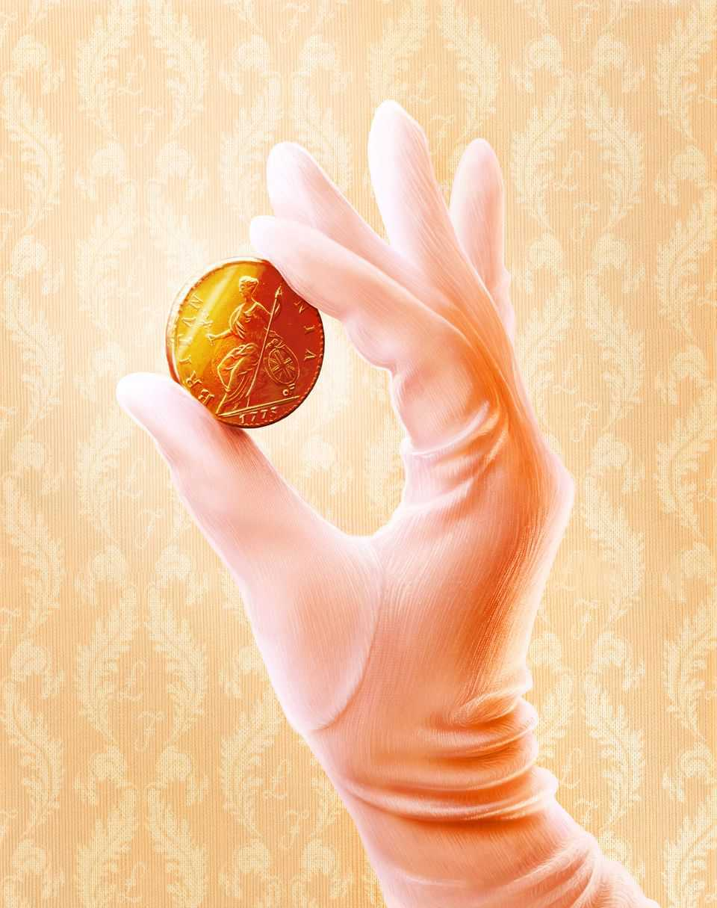

Christmas Specials | Austenomics
How Jane Austen revealed the economic basis of society
Some unacknowledged truths about money
December 18th 2025

The gemstone is a cool turquoise, not a ruby or emerald. The band in which it is set is only nine carats, the lowest concentration that can advertise itself as gold. The small ring nonetheless fetched £152,450 at auction in 2012. A fine result. But not everyone was happy. The ring once belonged to Jane Austen, author of “Pride and Prejudice” and other literary classics, born 250 years ago this month. The auction was won by Kelly Clarkson, singer of “My Life Would Suck Without You” and other pop hits, who triumphed in an American talent show 23 years ago. Rather than let the ring leave the country, Britain declared it a national treasure and delayed its export until Jane Austen’s

House, a museum in Chawton, Hampshire, could raise the money to buy it. When told this story, one museum-goer remarked: “Isn’t it lovely that money doesn’t always talk.”

Money does not have the last word in Austen’s novels. When Mr Darcy, with his country mansion, makes a peremptory marriage proposal to Elizabeth Bennet in “Pride and Prejudice”, she first turns him down. Fanny Price does the same to rich but libidinous Henry Crawford in “Mansfield Park”. Austen herself refused an offer of marriage in 1802 from Harris Bigg- Wither, young heir to Manydown, a large Hampshire estate.

In Austen’s novels and her life, a good fortune is not sufficient for happiness. But it is necessary. Austen insists on that necessity with a consistency and quantitative precision that sets her novels apart from most literary works. She reveals “so frankly and with such sobriety / The economic basis of society”, notes W.H. Auden in shocked admiration. But what discomfited the poet makes her a satisfying read for economists. To many, her novels are about beaux and balls. But she had just as keen an eye for “brass” and budgets. The woman who now appears on Britain’s ten- pound note, knew, without illusion, what money was worth.

In both her first published novel (“Sense and Sensibility”) and her last (“Persuasion”), the story begins with an economic setback, an inward lurch of the family’s budget constraint. Mrs Dashwood and her daughters must leave their beloved home shortly after the death of her husband. The prideful Elliots must rent theirs out to honour their debts: “They must retrench.”

Similarly “Mansfield Park” is set up like a natural economic experiment. Three sisters marry into different stations in life: high, middling and low. As well as the cross-sectional contrast between the siblings, Austen also provides a comparison over time. Fanny Price, daughter of the poorest sister, is taken in by her rich uncle, then cast out eight years later. She migrates between ranks, in both ascending and descending order.

The value of money is debated as well as dramatised in Austen’s novels. “What have wealth or grandeur to do with happiness?” asks Marianne Dashwood, the naive romantic. “Wealth has much to do with it,” replies her elder, worldlier sister, Elinor. Because this is an Austen novel, the debate

becomes quantitative. The two sisters each put a number on what they consider an adequate, respectable income. It turns out Marianne’s figure (£2,000 a year) is twice Elinor’s. It’s easy to rise above wealth if you expect so much of it.

Austen rarely introduces a major character without also enumerating their finances. “Before the mid-1780s, the sums doled out to heroines… had been large, vague, and all encompassing,” writes Edward Copeland of Pomona College in California. Austen is more particular. Elinor and Edward Ferrars were “neither of them quite enough in love” to think that £350 a year “would supply them with the comforts of life”. But the £850 they eventually secure does the trick.

These numbers would all have meant something to Austen’s original readers, argues Mr Copeland, serving as a useful “shorthand” for rank and station. £100 a year was required to afford a single maidservant—“a stout girl of all works”. At £400, a household could employ a cook, housemaid and perhaps a boy servant.

Roughly £700-£1,000 a year was required to keep a carriage. With the help of Highbury’s hypochondriacs, this prize falls within the sights of Dr Perry in “Emma”. The higher income target of £2,000 is eventually met by Marianne in “Sense and Sensibility” when she marries Colonel Brandon. That amount will cover a “proper establishment of servants, a carriage, perhaps two”, and horses for hunting. To satisfy the greater demands of a Mary Crawford, eager for a second home in London, would take at least £4,000 a year.

Good fortunes were rare: there were not so many rich men as there were pretty women to deserve them, Austen notes. In 1806 Patrick Colquhoun, a social reformer, estimated how the nation’s income flowed to its different ranks and occupations, from peers to paupers. Building on this, Robert Allen of New York University has calculated the average household income of each of these groups in 1798, a few years after the probable setting of “Pride and Prejudice”. With some tweaks to reflect the evolution of earnings over those years, Austen’s characters can be slotted into the economic hierarchy of the time (see chart).

Such an exercise shows that even Austen’s less fortunate characters are clustered near the top of the pile. After the death of their father, the Dashwoods are forced to live on £500 a year. They retreat to a cottage with “dark narrow stairs and a kitchen that smokes”. But they still had more to live on than the average income of over 95% of families. The garrulous Miss Bates, whom Emma Woodhouse insults in a pivotal scene in “Emma”, is deemed poor by Mr Knightley. “She has sunk from the comforts she was born to.” But if, as some scholars suggest, she lives with her mother on about £100 a year, she has more than the average income of perhaps 70% of families.

Austen’s grasp of these fine gradations of income was the product of experience, not just imagination. She could never afford to be complacent about cash. Her father, a clergyman, upheld the values of the landed gentry without ever holding down the assets. The third of her six brothers, Edward, was adopted by rich relatives, the owners of Godmersham Park. On visits to those lavish surroundings, Austen would “drink French wine & be above Vulgar Economy”. But she could not afford to tip the servants properly and paid half-price for her haircuts. She was only, but always, one step removed from wealth.

Her nephew claimed that she wrote for her own amusement. “Money, though acceptable, was not necessary for the moderate expenses of her quiet home,” he wrote. In reality, money was more than acceptable to Austen; she would have liked to accept rather more of it. She lamented that people were quicker to borrow and laud her work than to buy it. “Tho’ I like praise as well as anybody, I like…Pewter too,” she wrote.

Over her lifetime, she earned about £631 of pewter from her work, according to Jan Fergus, a biographer. It could have been better: Maria Edgeworth, a novelist admired by Austen, reckoned she earned £11,062.44 over her longer career. Fanny Burney, another of her inspirations, made about £4,280 from her four novels.

Austen’s dealings with her publishers provided a harsh education in risk and reward. She published “Sense and Sensibility” at her own expense in 1811. She then sold the copyright of “Pride and Prejudice” for £110. She thus missed out on the rewards from its surprise success. But neither she nor her

publisher knew it would be a hit when they struck the deal. Selling copyright spared authors the upfront cost (and hassle) of shepherding a book into print and relieved them of the risk of disappointing sales.

Those risks were real. In 1815 Austen turned down £450 for the copyright to “Emma”, “Mansfield Park” and “Sense and Sensibility”. But that too turned out to be a mistake in hindsight. The second edition of Mansfield Park sold poorly. And her publisher had little incentive to hurry her books into being.

Austen died in July 1817. Her 41 years spanned wild economic times. The first income tax arrived in 1799. Trading in slaves was outlawed in 1807. The Luddites broke knitting frames in 1811. The corn laws, imposing tariffs on grain, entered the statute books in 1815.

Her lifetime was also a seminal time for economics. Adam Smith’s “The Wealth of Nations” was published in the year following her birth. David Ricardo’s “On the Principles of Political Economy and Taxation” appeared in the year she died. In between was “An Essay on the Principle of Population” by Thomas Malthus.

Malthus argued that a country’s population tends to grow faster than the means to feed it. Poverty and distress were thus an inevitable, necessary check on the growth of the masses, discouraging early marriage and frequent childbirth. Labourers who could just about support themselves on their wage would hesitate to divide their daily pittance among four or five.

The same hesitation, Malthus pointed out, can intrude further up the social ladder. A man whose income only just admits him to “the rank of gentlemen” will also delay marriage, Malthus argued. Otherwise, he risked the “essential evil” of losing rank, sinking to the level of “moderate farmers” and “the lower class of tradesmen.” Worse, he would place his wife in the same predicament, “so discordant…to her tastes”. Malthus theorised what Austen dramatised.

Malthus argued that giving money to the needy was often self-defeating. England’s Poor Laws, which tithed the landed gentry to provide relief to penniless parishioners, discouraged abstinence and bid up the price of food. The laws “create the poor which they maintain”, he argued.

Austen had little patience with this line of thinking, according to Sheryl Craig, author of “Jane Austen and the State of the Nation”. As early as her teenage writing, she seems to spoof social reformers like Malthus who documented the misery of the poor only to argue against relieving it. “Many are unfortunate in their progress through the world,” notes one fragment. “To seek them out to study their wants, and to leave them unsupplied is the duty, and ought to be the Business of Man.” She was an ironist, even about economists.

Austen’s most ingenious economic villain is Fanny Dashwood. The reasoning she displays was not just of its time but ahead of it. She persuades her husband that his needy stepmother and half-sisters would benefit more from an occasional gift than a yearly allowance. “If they felt sure of a larger income,” he concedes, “they would only enlarge their style of living …and would not be sixpence the richer for it.” Followers of Milton Friedman, a Nobel prizewinning Chicago economist, will recognise the intuition behind his permanent income hypothesis of 1957: after unexpected windfalls, people increase their saving, but in response to a durable increase in their lifetime income, they “enlarge” their consumption.

Fanny Dashwood is even more wary of annuities, which make regular payments for the remainder of a person’s life, but no longer. “People always live for ever when there is an annuity to be paid them,” she complains. She thus anticipates by over 180 years the argument of two other Chicago economists, Tomas Philipson and Gary Becker, who theorised in 1998 that mandatory annuities can lead to “excessive longevity”.

In her work, Austen criticises people who cannot live within their means, like “expensive” John Willoughby, “extravagant” Tom Bertram, or vain Sir Walter Elliot. But profligacy is not the greatest economic sin in her novels: a spendthrift is better than a tightwad. She is far more forgiving of the Willoughbys and Bertrams of the world than she is of Mrs Norris, the eldest of the three sisters in “Mansfield Park”, with her relentless search for efficiency and economy.

Her tight-fistedness starts as a response to financial setbacks in life. On marrying a clergyman, she must accustom herself to a “narrower income” than expected. When he dies, she has to tighten her belt again. This is the same test faced by several of Austen’s more sympathetic characters—the Dashwoods, for example, or even the novelist’s own mother. But Mrs Norris makes the mistake of turning thrift into an end in itself. Laying aside money becomes her “infatuating principle”. For this, and her gratuitous unkindness to her niece, Fanny, she is exiled from the country, the same fate as a scandalous adulteress.

By disdaining the miser more than the profligate, Austen was echoing a rebel strand of early economic thinking. Overspending might hurt the person guilty of it, but at least it stimulated the economy around him. “Prodigality is a Vice that is prejudicial to the Man, but not to Trade,” noted Nicholas Barbon, an early free-trader in the 17th century. Malthus in his later years argued that “saving too much, may be really prejudicial to a country”, because it impairs the motive to produce. “If every person were satisfied with the simplest food, the poorest clothing and the meanest houses, it is certain that no other sort of food, clothing, and lodging would be in existence.”

The prudence that Austen champions (with some equivocation) in “Sense and Sensibility” is cast in a less flattering light in “Persuasion”. Anne Elliot wishes she had accepted the young sailor, Frederick Wentworth, when he first proposed. She should have trusted in a “cheerful confidence in futurity”, rather than siding with “that over-anxious caution which seems to insult exertion and distrust Providence!”

This debate between confidence and caution is continued in “Sanditon”, Austen’s unfinished, final work. The novel again pits a romantic against a realist. But in this story, the heart-throb is not a person but a project: a spa resort promoted by Mr Parker in the fictional coastal town of Sanditon. Mr Parker is an “Enthusiast” for the scheme, which blinds him to its potential flaws and drawbacks. But he is described as kind-hearted and good-natured. He is that rare character in literature, a sympathetic capitalist.

By contrast, Lady Denham, the voice of financial restraint, is described as thoroughly mean. “Her Love of Money is carried greatly too far,” says Mr Parker, “a Littleness will appear.” She worries that wealthy newcomers from the West Indies will do “mischief” by scattering their money too freely, thereby raising the price of meat and other goods. In response Mr Parker offers an unexpected lesson in the circular flow of income. Prices will go up only if demand is “extraordinary”, he explains, and if that is the case, the “diffusion of money” will do property owners like themselves more good than harm. “Our Butchers & Bakers & Traders…cannot get rich without bringing prosperity to us…[through] the increased value of our houses.”

Mr Parker is already thrilled by the town’s early signs of progress. The library shop is full of “pretty Temptations”, such as new parasols, new gloves, and many “useless things…that could not be done without”. And in the shoemaker’s window, he spots “Blue Shoes, & nankin Boots!” It is, of course, funny when he equates the arrival of this footwear (named for the origins of the cloth in Nanjing, China) with “Civilization, Civilization indeed!” But the truth is no prosperous civilisation was ever built on the covetousness exhibited by Lady Denham.

No one knows how Austen would have resolved the contest between Mr Parker’s animal spirits and Lady Denham’s lust for liquidity. But it now seems fitting that Austen’s last novel was about the combination of tourism

and enthusiasm. In the 250 years since her birth, her work has attracted many visitors to her past homes and haunts. Just as Sanditon is like a second wife and kids to Mr Parker, Austen’s characters are like a second family to many of her fans, “hardly less dear …certainly more engrossing.” At her old house in Chawton visitors can try on a replica of her ring, or buy silk ribbons, topaz necklaces and other pretty temptations at the gift shop. As Austen understood, confident spending is not sufficient for a prosperous society, but it is necessary. The economy needs its Enthusiasts. ■

This article was downloaded by zlibrary from https://www.economist.com//christmas-specials/2025/12/12/how-jane-austen-revealed- the-economic-basis-of-society