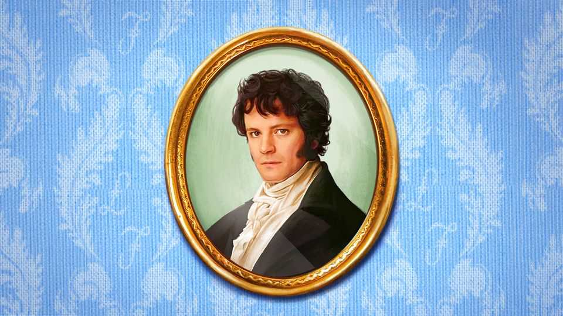

Christmas Specials | Single men in possession of good fortunes
Was Mr Darcy the richest of all Jane Austen’s characters?
It depends how you count their wealth
December 18th 2025

Mr Darcy is handsome, smouldering and rich. According to the 1995 television adaptation of “Pride and Prejudice”, he is also an excellent swimmer. But in Austen’s next novel, “Mansfield Park”, she introduces a man in possession of even more money: Mr Rushworth. He is a clod, a “king” who appears “best in the background”. But he is blessed with an estate spanning 700 acres (not counting the water meadows), one of the best houses on London’s Wimpole Street and £12,000 a year to Darcy’s mere £10,000. It is fun to compare characters’ fortunes across novels. Doing so reveals “fiscal twins”, as Marilyn Francus of West Virginia University calls them.

For example, Mr Bennet’s income in “Pride and Prejudice” (£2,000) is as large as Colonel Brandon’s in “Sense and Sensibility”. Strange, then, that Mr Bennet has done so little to secure his daughters’ futures. In “Northanger Abbey” James Morland can offer Isabella Thorpe only £400 a year. If she had settled for that, she would have become the fiscal twin of Mrs Price, the poorest sister in “Mansfield Park”, who lived a life of clatter and chaos on what is reckoned to be a similar amount.

The problem with these comparisons, however, is that the pound’s purchasing power was not steady in the years between Austen novels. Harvest failures and recurring wars with France contributed to rapid inflation. Conversely, the demobilisation of soldiers in brief interludes of peace caused unemployment and deflation.

Austen was aware of the problem. While revising “Sense and Sensibility” in 1811, she noted that “the Incomes remain as they were, but I will get them altered if I can.” It can make a big difference whether her numbers reflect the characters’ times or the year of publication. Some scholars, for example, argue that “Pride and Prejudice” is set around 1793-4 when militias were mobilised to protect Britain from possible invasion by France (“a whole campful of soldiers” thrills Lydia, the youngest and most feckless Bennet sister).

“Mansfield Park”, on the other hand, is believed to start in 1808 or 1812. Between 1793 and 1808, the cost of living rose by over half, according to Charles Feinstein, an economic historian. That means the £12,000 flowing to Mr Rushworth in “Mansfield Park” did not stretch as far as the pounds accruing to Mr Darcy roughly 15 years earlier. Indeed, Mr Rushworth’s fortune was worth less than £7,900 at the prices prevailing in 1793. By that logic, he is not in fact the richest of Austen’s characters. Mr Darcy is a better catch.■

This article was downloaded by zlibrary from https://www.economist.com//christmas-specials/2025/12/12/was-mr-darcy-the-richest- of-all-jane-austens-characters