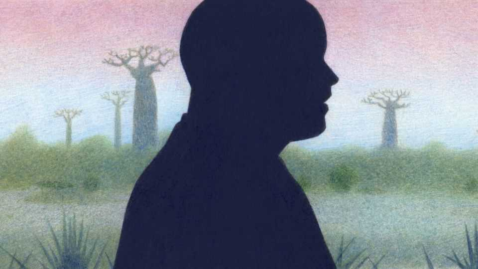
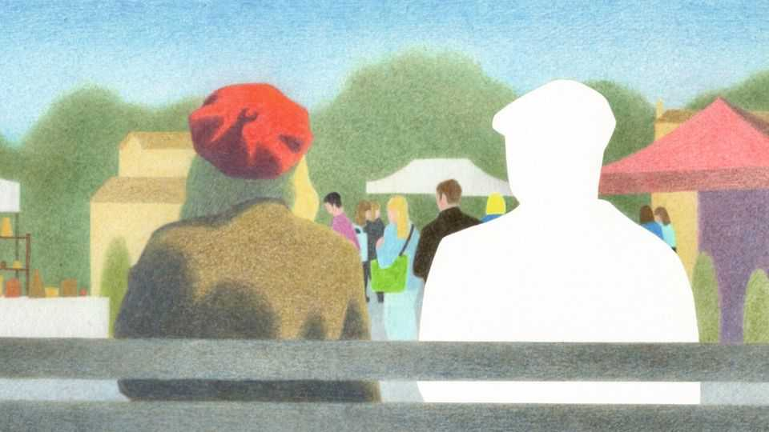

Christmas Specials | Unmoored in Madagascar
The most friendless place on earth
If you think rich, individualistic societies are the loneliest, think again
December 18th 2025

PRICKLY PEAR line the perimeters of brick-red fields. In a few there are crops, but in many the cactus is the only hint of green. Small children, who should be in school, herd Zebu cattle along dusty tracks. Women sell bags of charcoal outside flimsy wooden huts by the main road. It is the tail end of the dry season in southern Madagascar; locals are yearning for rain. They are short of cash and often hungry. They are also lonely. Many people think loneliness is a first-world problem: that rich societies become atomised as people chase wealth rather than social connections. But surveys suggest this is wrong. Western, individualistic societies, where more people live alone and religion is marginal, tend to be less lonely. People in poor countries are much likelier to be lonely. And the loneliest region of all,

surprisingly, is Africa, the home of ubuntu, the sociable notion that “people are people through other people.” In 2024 over a quarter of Africans surveyed said they had felt lonely the previous day.

For those who like definitions, loneliness is the painful mismatch between expectations of social connection and what happens in reality. Satisfying relationships generally include several ingredients, says Samia Akhter-Khan of Brandenburg Medical School. These include proximity, support, intimacy, fun, respect and a sense of contributing or being needed.

Loneliness is hazardous. Researchers have linked it to heart attacks and strokes. A study in 2010 estimated that social isolation shortened lives as much as smoking 15 cigarettes a day. More recent meta-analyses, examining data from millions of people, find that loneliness increases a person's risk of death at a given time by around 14%. Lonely people often have unhealthy habits, but the effect persists even when those are taken into account.

And being lonely is miserable. It raises the risk of anxiety and depression, and creates a vicious circle. “You have loneliness causing mental disorders, and you have mental disorders aggravating or causing isolation,” says Palmira Fortunato dos Santos, a clinical psychologist at Mozambique’s Ministry of Health.

The most rigorous studies of loneliness have largely been in Europe and America. Yet these regions are home only to a small fraction of the world’s lonely (see map). In June the World Health Organisation (WHO) published an analysis of 23 data sets, including the Gallup World Poll, which covers 150,000 people from roughly 150 countries. It found that the poorer a country is, the lonelier it tends to be. The Economist’s own analysis, using Gallup’s raw data, finds that this relationship holds within countries, too: the richest people in the richest places are the least lonely; the poorest in the poorest are the most (see chart).

And the loneliest place of all is Madagascar. The Economist flew there to find out why.

Most outsiders know very little about this giant island in the Indian Ocean. They probably assume, correctly, that the singing, dancing lemurs of the

popular cartoon franchise are fictional. They may have heard that millions of years of isolation have allowed an astonishing array of unique wildlife to evolve in Madagascar’s jungles, from the tomato frog to the fearsome cougar-like fossa. They may even have heard that Madagascar suffered a coup in 2025. But they know next to nothing about the people who live there.

There are only 33m of them, in a country more than twice the size of Britain. The largest ethnic group, the Malagasy, descend from settlers from East Africa, South-East Asia and Oceania. Most of the population live in the countryside and are very poor. Roughly 70% subsist on less than $3 a day.

In Ambovombe, a town in the arid, cyclone-ravaged south, the red-dirt streets do not look lonely. Wooden stalls lure shoppers; ox-drawn carts trundle by; labourers linger in groups, chatting as they wait for offers of work. Everyone seems to have some kind of social connection. Yet for many, it is not enough. An astonishing 60% of people in southern Madagascar told Gallup they felt lonely the previous day.

Robinette, a middle-aged seller of household goods, says she spends plenty of time with people. But most are customers, not friends. She lives in a rented room with her children, but no husband—polygamy is common in this region and many women are left to raise kids on their own. There are few people to help her, she complains. She often feels lonely.

Poverty does not cause loneliness, but money affects how and how often people socialise. In richer countries, people report spending far more time with friends, family and colleagues. In poorer places, residents see neighbours more often, but less of everyone else. Finding time to socialise is easier if you can pay for things that save time, from washing machines to grocery deliveries.

Money also seems to influence the quality of connections. Even when controlling for contact with friends and family, a higher income predicts less loneliness. This makes sense. It is easier to bond over dinner if you can pay the bill, easier to make friends with fellow football fans if you can afford tickets, and easier to relax with friends if you are not constantly fretting about money.

The truly poor lose countless hours to drudgery. In Ambovombe, for example, most people have no running water at home, so they have to fetch it from wells or buy it from sellers. Dieu Donné, a middle-aged man with scoliosis, is too disabled to carry water himself, so he relies on others to help him. When it doesn’t rain, wells dry up, water gets more expensive and Dieu Donné’s friends and family have to spend longer hustling for cash. So they have no time for him; and he feels isolated as well as thirsty. When his nearest and dearest are “looking for money”, “they don’t care about [me],” he says. He has contemplated suicide.

Poverty can strain relationships. Studies link it to mistrust and conflict. Stigma can compound the problem. Brigitta, a young woman in Ambovombe, says people avoid her because she doesn’t have a job.

To ease their poverty, many people migrate in search of work. This can aggravate their loneliness, says Lana Razafimanantsoa of the African Women’s Development Fund, an NGO. Since Madagascar is huge, rugged and has few paved roads, migrant labourers are often separated from their loved ones for long stretches. Brigitta’s mother left Ambovombe to look for a job. “I miss her every day,” she says.

Migration affects both movers and stayers, argues Chido Rwafa- Madzvamutse, who advises the WHO on mental health in Africa. Although good longitudinal studies are lacking, there is evidence that periods of mass migration are associated with a drop in social connection. Mentions of loneliness in English fiction rose in the 1800s and early 1900s, as many Britons left the countryside for cities. A review of 25 studies of older adults in China found that loneliness rose sharply between 1995 and 2011, as the young abandoned their villages and found factory jobs. Those left behind were often older, poorer, unhealthier—and lonely.

Culture plays a role. In more collectivist societies, strict expectations—for example, that children must care for ageing parents—can trap people in dutiful but unsatisfying relationships. When obligations are unmet, people can feel shame, says Dr Akhter-Khan. In individualistic cultures, people have more freedom to cut ties with people who make them unhappy.

Anything that reduces poverty would probably make the world less lonely. But attacking loneliness directly can work, too. Some 10,000km away from Madagascar, an experiment is under way to improve social connections. It is in Frome, an English market town, ordinary by rich-world standards but vastly more prosperous than Ambovombe. The surrounding countryside is lush and green. The high street is lined with independent cafés, bookshops and art galleries. Posters advertise jazz concerts and dance classes.

Yet plenty of locals are lonely. Helen Kingston, a doctor, noticed that isolation not only made her patients sicker; it also made them more likely to book an appointment with her, partly to have someone to talk to. In 2013 Dr Kingston and a colleague, Jenny Hartnoll, redesigned their practice. They set up a new service where they began prescribing social contact, and trained thousands of residents as “community connectors”—people who point neighbours towards sources of help and sociable activities.

The results were striking. Between 2013 and 2017 unplanned hospital admissions in Frome fell by 14%, even as they rose by nearly 30% in Somerset, the surrounding county. Researchers estimate that the scheme has saved the local health service more than £1m ($1.3m). Hundreds of other towns and cities have been in touch, hoping to replicate the model.

Similar ideas can work in poorer countries. In Zimbabwe, hundreds of “friendship benches” have been set up outside clinics. Older women, known as “grandmothers”, are trained to sit, listen, offer advice and encourage people to seek support. As well as helping others, the grandmothers themselves often find a new sense of purpose, says Dr Rwafa-Madzvamutse.

Back in Ambovombe, people with disabilities gather every Saturday in a space provided by a Christian charity. They socialise, and go out to visit others who are disabled and lonely. A cyclone this year blew off the roof, which had not yet been fixed when your correspondent visited. Exposure to the elements has curbed attendance a bit, but those who show up talk of the lift they get from bonding, and from helping others. “We connect well,” says one woman. “And we look forward to the future.” ■

This article was downloaded by zlibrary from https://www.economist.com//christmas-specials/2025/12/18/the-most-friendless-place- on-earth