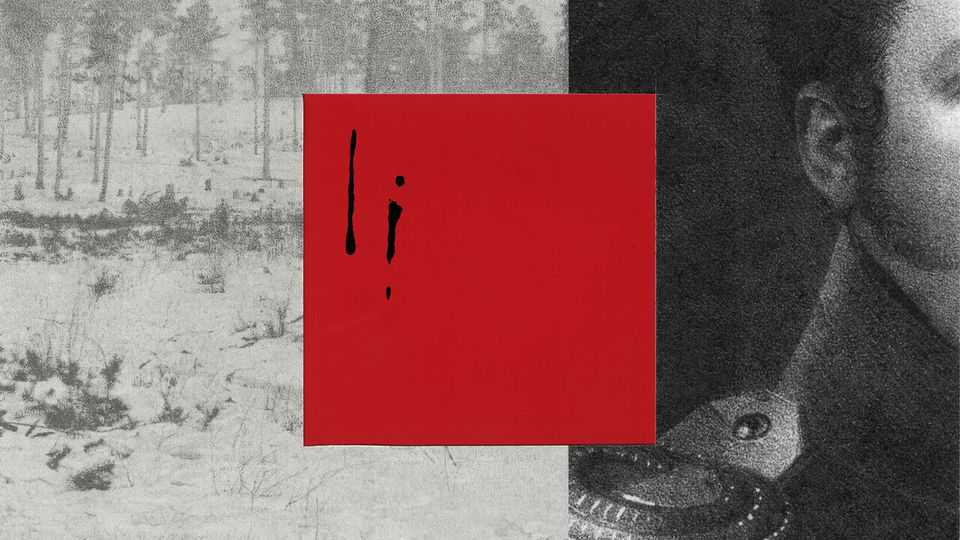
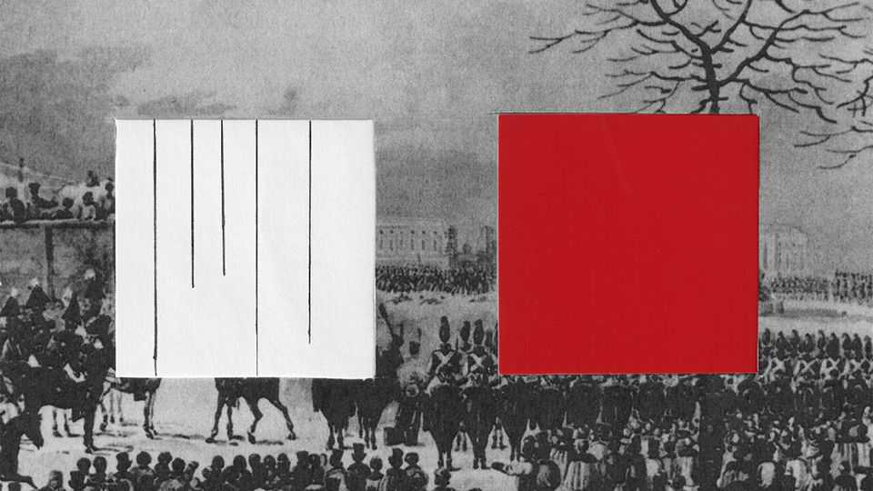

Christmas Specials | An uprising in St Petersburg
Two centuries ago, Russian revolutionaries tried to change the world
Bloodied and exiled, the Decembrists failed. But they made a start
December 18th 2025

IT WAS A wintry night in St Petersburg and revolution was in the air. A piercing wind whipped off the frozen Neva river as, before dawn, the conspirators hurried to Senate Square, close to the Winter Palace. They drew up their troops beneath the stern stare of Peter the Great’s bronze statue; the gilded spire of the Admiralty pierced the inky sky. Before long the imperial cavalry would arrive, and the cannons, and the tsar. “We are going to die, brothers!” exulted one of the rebels. “Oh, how gloriously we are going to die!” Though barely remembered in the West, that fateful day 200 years ago— December 26th 1825 in the modern calendar—was a hinge in time. Had the

conspirators prevailed, their country’s history, and the world’s, might have been drastically different. As it was these men, known as the Decembrists, were transmuted into myth. As with many myths, interpretations of theirs vary. To Russia’s authorities, then and now, they were traitors. To admirers, they are champions of the flickering hope that another Russia is possible.

Revolutions are typically fomented by the uppity middle classes. This plot went right to the top. The Decembrists were the flower of Russia’s aristocracy: young men inspired by the American and French revolutions, the Enlightenment and Romantic nationalism. They were immersed in literature, modelling themselves on Roman heroes. Kondraty Ryleyev, a ringleader, railed in verse against “despotism’s heavy yoke”. Alexander Pushkin, the era’s bard, was a sympathiser. “Here is Caesar,” wrote Pushkin. “Where is Brutus?”

Crucially, they were military officers, mostly in the imperial guards, who had fought in the Napoleonic wars. As Sergei Muravyov-Apostol, another leader, put it: “We were the children of 1812.” That was when Napoleon invaded Russia; two years later Russian forces entered Paris. They returned flushed with the pride of liberators—and with visions of bringing citizenship and rights to a vast land blighted by arbitrary rule, in which a third of the population were serfs. Their revolt was, in part, an example of the blowback of war.

As Yuri Lotman, a historian, observed, the Decembrists represented a new psychological type. They were the first generation of Russian aristocrats to distinguish between service to the monarch and to society and the nation. They had earned their honour and dignity, they believed, not been granted them from above. Still, at first they hoped the tsar, Alexander I, would oversee reform of his downtrodden empire. But though he espoused liberal plans, even enacting a few on the empire’s fringes, he backtracked.

The Decembrists formed secret societies, based in St Petersburg, the imperial capital, and what is now Ukraine. Initially neither subversive nor altogether secret, they hardened into a conspiracy for a coup d’état.

Russian history was littered with coups, but the Decembrists’ aims were unique—even if they did not entirely agree on them. The most radical

advocated a republic, others a constitutional monarchy. Still, they shared common goals. Having fought alongside conscripted serfs, all demanded their emancipation. They also wanted representative government, the rule of law and an end to caste-based privileges, including their own. Passionate patriots, they envisaged their country as a modern nation state. “All the nations of Europe are attaining laws and liberty,” declared a manifesto. “The Russian people deserve both.”

Autocracies are most vulnerable at moments of succession. Russia’s came sooner than the Decembrists expected—maybe too soon—when Alexander died suddenly. Since he was childless, his ostensible heir was his brother Constantine. But he had secretly renounced the throne, meaning another brother, Nicholas, would succeed. Because of the secrecy, however, imperial troops began swearing oaths to Constantine. So did Nicholas, lest he look like a usurper. Briefly, reported the Times of London, Russia had “two self- denying emperors, and no active ruler”.

This was an opening for the Decembrists, who set about agitating against Nicholas. Tipped off about the revolt, he instructed that a new oath of allegiance—to him—be sworn on December 26th. And so, on a frigid morning, the Decembrists led the troops who embraced their cause to Senate Square. Their plan was to seize the Winter Palace, arrest the tsar, install an interim government and convene an assembly. For a while they had the quiet, snow-covered square to themselves. Then forces loyal to Nicholas moved in.

In hindsight, the ensuing drama is doubly poignant. First, because many Decembrists didn’t expect to succeed. Rather they thought it was their duty to Russia—and each other—to make a stand. “There may be little prospect of success,” conceded Ryleyev, but “a beginning must be made.” They saw themselves as tragic actors on the stage of history, hoping for vindication by posterity rather than immediate victory.

Yet in a narrow sense, they might have won. The best chance for revolutionaries is often at the very start, when regimes are caught in confusion, and so it proved. Thousands of largely supportive civilians crowded around the square. The rebels could have seized the cannons that trundled across the cobbles. Above all, they might easily have killed

Nicholas, who rode around imperiously, shooing away onlookers. Alexander Bulatov, a hero of 1812, stood nearby with two pistols, but found he couldn’t pull the trigger.

What if the Decembrists had won the day? The rebellion might have been swiftly quashed. Russia could have devolved into civil war, then slid back into despotism. Or, just conceivably, reform would have eased the discontent that led to the Bolshevik revolution of 1917. Communism might not have overrun Russia—in which case Nazism might not have risen in Germany…

So much for hypotheticals. In reality, the Decembrists were undone by haste and disorganisation. Their leader, Sergei Trubetskoy, didn’t show up. His courage is unlikely to have failed (he was a hero of the battle of Borodino); perhaps he foresaw that the amateurish plot would lead to a bloodbath and crackdown. Without orders, the mutineers shivered in their ranks in ten degrees of frost. Overall they numbered around 3,000. Nicholas’s much larger force encircled them.

It was one of those bleak winter days in St Petersburg when it never truly gets light. Both sides were loth to kill their compatriots; soldiers crossed themselves in the icy air. At length Nicholas ordered cavalry charges in a bid to disperse the rebels. The horses were repulsed, partly by stones and

firewood hurled from the crowd. Several officials who interceded with the conspirators were shot. Bishops vainly beseeched them to retreat. “Our last minutes are close,” exhorted Ryleyev, “but these are the minutes of our freedom!”

“Give orders that this place should be swept by cannons,” Nicholas was advised, “or resign the throne!” Four artillery pieces were duly brought forward. No one moved. First came warning shots, at which the rebels shouted “hurrah!” Then grapeshot was loaded; it is said that the gunner refused to fire, so an officer did instead. As blood oozed across the snow, dazed insurgents tried to flee across the Neva. Some drowned when cannons smashed the ice. At least 1,271 people were killed, including many civilians.

By six o’clock it was over. The bullet-ridden Senate building was hastily replastered. Bloodstains were covered with fresh snow. Corpses were shoved into frozen canals. And the conspirators were rounded up.

Furious, Nicholas personally interviewed the leaders at the Winter Palace. He was surprised to see Bulatov among them; Bulatov said he was astonished to see Nicholas—because he had very recently meant to kill him. Offered a pardon, another Decembrist replied that it was precisely the tsar’s ability to override the law that provoked the revolt. The men were held in squalor, chained or isolated on Nicholas’s whim.

Interrogated at night, they were pressed to implicate themselves and each other in attempted regicide. In June 1826 scores were sentenced to decades of hard labour and exile in Siberia. Swords were broken over their heads in symbolic executions. Though capital punishment had been suspended in Russia for 50 years, five leaders were condemned to die.

It is never completely dark during the “white nights” of a St Petersburg summer. In the milky light of a July morning, the five were led to the gallows. Three of the ropes snapped. “Oh Lord, they can’t even hang people properly in Russia,” deadpanned Muravyov-Apostol after his tumble. New ropes were fetched.

The rest were clapped in irons and packed off to Siberia. The tsar instructed their wives to divorce them, but 11 women followed the men into exile,

leaving behind their titles, fortunes and children. Arduous journeys led to dismal prisons and labour in mines. Kept in chains for over two years, the men told a jailer they had but one request: “not to insult or humiliate them”.

The Decembrist families suffered and survived together. When their penal servitude ended, some settled in Irkutsk, near beautiful Lake Baikal. You can —or could—visit two of their houses, the blue timberwork decorated with ornate window frames in the 19th-century Siberian style. They painted, made music, studied, taught and farmed. By the time Nicholas’s successor pardoned them in 1856, many had died.

Their story, however, does not end with their demise on a malfunctioning gallows or in the Siberian taiga. The struggle over their memory has been as fierce as the carnage on the square.

After the uprising, newspapers obediently described it as a riot by a handful of “madmen”. An official report of 1826 portrayed the Decembrists as traitors, bent on anarchy and the empire’s collapse.

But for generations of Russian writers they have been emblems of honour and self-sacrifice; the gallows became a martyr’s cross. Alexander Herzen, a liberal thinker, first formulated this version of their myth, seeing them as Roman heroes willing to die “to awaken a new life”. Leo Tolstoy planned to write a novel called “The Decembrists” (his protagonist was to be “an enthusiast, a mystic, a Christian”). As he plunged into their back story, it became “War and Peace”.

After 1917 the Decembrist myth was appropriated by both Bolsheviks and dissidents. Lenin inducted them into the pantheon of Soviet heroes, presenting his own rise to power as the climax of a revolutionary saga that began in 1825. Statues and streets were dedicated to them. This veneration gave cover to those who instead saw them as epitomes of selflessness.

In 1967 a play about them by Leonid Zorin was staged in Moscow. At its heart was the moral dilemma of revolution: can it be right to shed blood for a higher goal? The Decembrists’ ideas resonated with the audience of Soviet intelligentsia (which included Alexander Solzhenitsyn). “We travelled half the world, liberating it from a tyrant,” the Trubetskoy character said,

evoking the mood of Russian soldiers after the second world war as much as 1825. “And what have we found when we came back? Tyranny at home!”

After Soviet tanks extinguished the Prague Spring in 1968—and with it hopes for reform in Moscow—Alexander Galich dedicated a poem to the Decembrists. Distributed through samizdat, it asked: “Do you dare to come to the square?” Soon, in a landmark of the dissident movement, eight protesters walked onto Red Square bearing signs with slogans such as “For your freedom and ours!” Just as the Decembrists looked to Rome for models, the dissidents looked to the Decembrists, whose Romantic brilliance contrasted with the grey, unheroic Soviet world.

On the uprising’s 150th anniversary, the fight over their legacy spilled back onto St Petersburg’s streets. Artists and poets gathered on Senate Square. “For a moment of freedom,” one of their placards read, “I’m ready to give my life!” They were detained, the placard tossed, like the rebels’ corpses, into the frozen Neva. A KGB officer later recalled that, when dissidents planned commemorations for the Decembrists, the kgb put on rival events in the same place. “We’d show up with a brass band. We would lay our wreaths.” Foreign observers would “yawn a couple of times and go home”. The officer’s name was Vladimir Putin.

Even in Mr Putin’s nightmarish presidency, the Decembrists remain an inspiration for some and a moral threat to others. Mikhail Khodorkovsky, a one-time oligarch who spent a decade in a Siberian camp, invoked them at his show trial in 2005. Alexei Navalny inherited their civic nationalism and sense of mission, and finally their martyrdom. Conversely, in May 2025 the Decembrists’ case was relitigated at a Kremlin-sponsored conference in St Petersburg. The justice minister decried their “lack of honour”, arguing that their punishment was too lenient. The main lesson was that “the Russian state cannot afford to be weak.”

Were the Decembrists anything more than glorious failures? In the short term the regime they loathed grew more draconian. As often in Russia’s past, reckons Andrei Zorin, a historian (and the playwright’s son), the actions of “the purest and most noble people” inadvertently set back reform. Anti-Putin protests have likewise led to crackdowns and war.

From one point of view the men of 1825 were hopeless dreamers, too aloof or naive to see that Russia’s size and history mean it is doomed to eternal misrule. Or perhaps it is still too early to say. The Decembrists’ rebellion lasted only a few hours, but 200 years on, they remain a beacon of individual dignity in undignified times. A beginning must be made, and it was. ■

This article was downloaded by zlibrary from https://www.economist.com//christmas-specials/2025/12/18/two-centuries-ago-russian- revolutionaries-tried-to-change-the-world