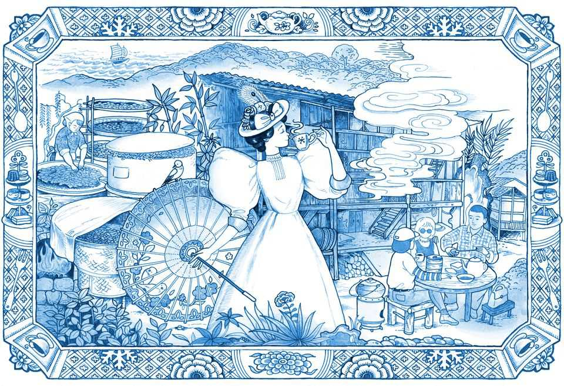
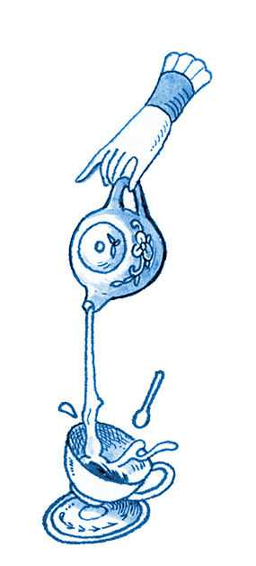

Christmas Specials | China’s tea industry
The rise and fall and rebirth of lapsang souchong
A smoky tea is fading in the West; in China, a better version survives
December 18th 2025

Visiting the birthplace of black tea can be a challenge. China no longer guards the secrets of its production, as it did in imperial days. But the pine- and bamboo-covered Wuyi hills of northern Fujian are a UNESCO “world heritage site”, requiring protection of its cultural relics and flora- and fauna- rich forests. Visitors must be on an authorised trip. Officials get twitchy when a foreigner in a car approaches villages famed for their tea. Anxious minutes pass as they check whether permission has been secured, before waving the vehicle on up the winding road. Deep in the hills is Tongmu, a village and collection of subordinate hamlets scattered across the steep slopes of a valley. It is here that a kind of black tea was born more than 400 years ago—the grand progenitor of all of them, lapsang souchong. Your correspondent’s journey, inspired by the smoky

aroma of this tea for grown-ups that permeated his childhood in Britain, was a quest for answers to a mystery in three parts. How did this particular tea, of all teas, become a sensation abroad? Why is its popularity now fading into irrelevance in the West? And what has become of lapsang souchong in the country that created it?

What becomes clear in these verdant hills is that lapsang souchong, as it is known in the West, does not exist in China. Even the words lapsang souchong may be a Western concoction. Souchong is based on the local dialect for “small type” (of leaf). The meaning of lapsang is unclear. Here at its birthplace the tea is usually known in (genuine) Chinese as zhengshan xiaozhong. But this too is misleading. Zhengshan xiaozhong can have a trace of the smokiness of lapsang souchong, but it is far superior in taste.

The Victorians knew no better. Long before chop suey and chow mein entered common usage, evoking cheap bland fare, British tea-drinkers were venerating lapsang souchong. In London’s 19th-century tea-rooms, it hinted at something posh. Victorian advertising called the tea an enhancer of cognitive ability for “men of brain power”, much in the way faddish supplements are hawked on podcasts today. In 1885, one ad quoted Queen Victoria as urging women to try it, too.

As it became fused with Western culture, tea—a Chinese invention—lost much of its original character. Milk and sugar were added, corrupting the subtleties and varieties of flavour that Chinese consumers relish. But lapsang souchong remained a favourite of more refined types, often without milk. Britain’s wartime leader, Winston Churchill, is said to have been a fan (though evidence is lacking). So, too, it is told, was JP Morgan, the American banker.

As with Marmite, a yeast-extract condiment that Britons love or hate, lapsang souchong has created sharp dividing lines. In a novel by Zoe Barnes, a pen-name of the late British novelist Susan Morgan, a protagonist likens the tea’s flavour to that of “roadmenders’ trousers”. A colleague of your correspondent compares it to “drinking a basketball”. But that, oddly, is part of the point. Legend has it that, in the 16th or 17th century, soldiers passed through Tongmu and bedded down on piles of freshly picked tea leaves, crushing them. Despondent farmers tried disguising the stench of their body

odour by curing the leaves in smoke. This novel production method (minus the sweat) took hold with the encouragement of Dutch traders, who found that tea treated this way would survive long sea journeys better than raw green types. The new tea gained pride of place in Western tea-drinkers’ hearts.

Imagine, then, the horror that rippled through polite society when Twinings, one of Britain’s most popular tea brands, announced in 2023 that it would no longer sell lapsang souchong. The product had once been integral to the brand: “An invalid feeble and pining,/Was ordered to drink tea from Twining:/He’s since grown so strong/On our Lapsang Souchong/That he’s taken to dancing and dining,” went an advertising ditty in the 1930s. Columnists wrung their hands. In London the Evening Standard called it “one of those terrible misjudgments that business schools may well be brooding over in decades to come”.

Twinings offered a substitute, called “Distinctively Smoky”. But it received scathing reviews. On Amazon, an online seller, one customer opined: “It doesn’t conjure up misty blue smoke wafting gently through Taoist mountains, nor the campfires of the trader transporting their tea along the Silk Road. Think more, the industrial Midlands; Smokestacks, collieries, creosote.” In 2025 Twinings gave up on its tea-equivalent of New Coke, declaring “It hasn’t been as popular with consumers as we had hoped.”

Lapsang souchong is still offered by specialist dealers. But Sainsbury’s and Morrisons, two British supermarkets, have discontinued selling their brands of it. “Fans should drink up, while they still can,” a newspaper in Shanghai intoned ominously in 2024. Lapsang souchong was fading into obsolescence.

The problem is not with the tea farmers in the Wuyi hills. They are still harvesting the leaves from small bushes on rugged slopes, as generations before them have been doing. It is not a job for machines: humans are needed to identify the right leaves to be picked (four or five down from the tip of the branch). Your correspondent’s clumsy attempts were no match for those of a dexterous group of caichanu, as female tea-pickers are known, who gamely let him try. They are in their 60s—younger folk prefer work in the cities.

The painstaking efforts of the caichanu are matched by those of the men who treat the leaves. Jiang Junfan, who is in his mid-60s, belongs to a family that has been doing this for 24 generations (he says he is training the 25th). He shows off the qinglou where he works: a traditional three-storey wooden building where the leaves are pressed and smoked. There are only two like it in Tongmu. Tea traders say that these days, the lapsang souchong that most foreigners drink is sourced from elsewhere in China, and perhaps from other countries. Instead of wood, some use chemical substitutes to produce the smoky flavour. Wuyi’s meticulously produced tea is far more expensive.

The expense of authenticity may be speeding the fall of lapsang souchong in the West. China has begun using its economic muscle to tighten control over the naming of food and drink sold abroad with Chinese names. In 2020 it

reached a “geographic indication” agreement with the European Union, like the kind that restricts where champagne can be made. Under this pact, no tea can be sold in the eu with the name lapsang souchong unless it comes from specified towns and villages (including Tongmu) in Wuyi; what is more, the smoking must involve pinewood.

And Western palates are changing. Henrietta Lovell of the Rare Tea Company in London sells lapsang of the subtle, zhengshan xiaozhong, type, sourced from Wuyi, at nearly £25 ($33) per 50g. Ms Lovell calls the cheaper types a tea “associated with your granny”. She says popular demand has slumped so much that were she to try to pitch lapsang souchong to a supermarket in Britain, they would “laugh me out of the store”.

In China, meanwhile, zhengshan xiaozhong thrives. China’s decades-long economic boom has created a sizeable market of wealthy customers who are willing to pay exorbitant prices for the genuine, pinewood-smoked article. And villagers in Tongmu have responded to market forces with zeal. In 2005 they invented a new form of black tea called Jin Jun Mei (Golden Eyebrow), which uses the tender unopened buds of leaves from the same bushes that produce standard zhengshan xiaozhong a little later in spring. They are not smoked. A pot of this exquisite-tasting tea can sell for about one-quarter of the price of gold.

There is a snag for zhengshan xiaozhong producers in Tongmu. To protect Wuyi’s forests, the authorities have imposed tight controls on the use of pinewood. But so tied up is the local economy in the production of zhengshan xiaozhong that local manufacturers say they expect the government to offer a workaround. The real lapsang souchong will live on as a status symbol for the upper classes. Ordinary Westerners will never know what they were missing. ■

This article was downloaded by zlibrary from https://www.economist.com//christmas-specials/2025/12/18/the-rise-and-fall-and- rebirth-of-lapsang-souchong