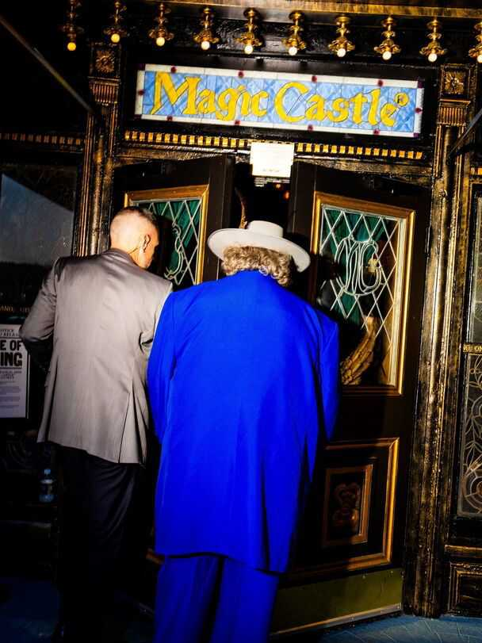

Christmas Specials | From Harry Houdini to Harry Potter
How magicians stay relevant in the age of AI
As TikTok dulls the world’s sense of wonder, conjurors are adapting
December 18th 2025
He was the most famous magician of the 20th century. Yet Harry Houdini’s peers were often scathing about him. His tricks were “awful stuff” and “a bunch of junk”, they sniffed. “Watching him play the part of an elegant conjurer was a bit like watching a wrestler play the violin,” writes Jim Steinmeyer in “Hiding the Elephant”, a history of magic. Despite this Houdini (whose real name was Ehrich Weiss, and who died in 1926) earned more than any magician of his time: as much as $200,000 a week in today’s money. It was not just that audiences loved his death- defying escapes. It was that he had a knack for selling the business of wonder. He used local-newspaper offices and police stations as stages for his escapes, ensuring press coverage. He invited audiences to share a sense of peril by trying to hold their breath while he struggled, handcuffed, to escape from a sealed milk can full of water. (Fortunately, he could hold it far longer than they could.) He ferociously defended his act against critics. In 1899 a newspaper claimed that his handcuff escape involved a hidden key. He invited detectives to watch him perform the same trick naked, thus debunking the debunker and generating buzz at the same time. He battled imitators, too, threatening to sue them for copying acts he claimed to have patented. (This was nonsense; you cannot patent an idea while also keeping it secret. But magicians are not lawyers.) One time he copyrighted a performance of one of his most popular tricks—being lowered upside-down into a “Chinese water torture” tank—as a play. This allowed him to sue a copycat in Germany and win. For good measure, while the case was pending, he taught the trick to a rival of the German conjuror, and even

lent her the apparatus, recounts Kenneth Silverman in “Houdini!!! The Career of Ehrich Weiss”, a biography.

A century after Houdini’s death, magicians face many of the same challenges—monetising mystery, guarding secrets—and a hatful of new ones. Attention spans are shrinking. Competition is proliferating: anyone can film an act and publish it on social media. More worryingly for those who depend on hocus-pocus for their groceries, TikTok makes it easy to show the whole world how a trick is done. And technology has jaded people to marvels, making them harder to wow. Conjurors today must attempt the trickiest trick of all—staying relevant in the age of AI. The Economist went to Las Vegas to ask them how they do it.

At “MAGIC Live!”, an annual convention, magicians gather in a smoky hotel near the strip to swap tips, snap up hardwood wands for $250 and listen to lectures on “crafting your stage persona through costuming”. In one corner, a fake elephant trunk swings next to the “Jaws of Death”, an $8,000 contraption used by escape artists. The inventor, Mike Michaels, says the weirdest prop he has made is a sex doll named Sindy Suckalnite (“long story short, the card comes out of her mouth”). He dreams up new ideas while drinking a beer, preferably in a casino, he says.

Dozens of wannabe wizards and polished prestidigitators cluster at the bar for “jam sessions”—like the musical kind, but with magic. Your correspondent was taught beginners’ card tricks and watched as one attendee claimed he would make a human appear between his hands (he managed a single shoe).

Mingling with the crowd is Justin Flom, a controversial Minnesotan who may represent the future of magic. He calls himself “one of the most visible humans on the planet”. His deftly publicised illusions are a huge hit on social media.

In Houdini’s day, when the trick of sawing a woman in half was new, magicians would whip up delicious fear by parking ambulances outside theatres and having assistants pour buckets of red liquid into nearby gutters. Today similar publicity can be generated with a shocking headline. In 2017 Mr Flom uploaded a video entitled, “SAWING A BABY IN HALF!!”. It

shows his four-month-old daughter gurgling peacefully at the camera while he appears to slot two Dr Seuss books into her stomach and slide her legs away. It has been watched nearly 200m times.

This year Mr Flom released a sequel even more shocking to his fellow magicians: “Sawing a Baby in Half and I Show the Secret”. “Magicians can make things disappear”, Mr Flom says in the video, “using smoke and mirrors.” The secret, he reveals alongside his now eight-year-old daughter, involves the careful arrangement of a doll’s legs that are equipped with springs to make them move, a “magic table” with a hole large enough to hide a small person inside it—and a strategically placed mirror which faces the audience and conceals what is going on underneath.

Showing how it’s done is the cardinal sin for conjurors. Mr Flom does it regularly, calling it “an artistic choice”. Often “the secret is more entertaining than the trick,” he says. “In those cases, give them the secret.” Some of his videos reveal it in the first few seconds. The “game”, Mr Flom explains, is to hook viewers with the opening shot “and then just make them watch as long as possible”. He says he pulls in millions of dollars a year from this sort of thing.

He is not the only one to have turned illusion-shattering into gold. A TikTok video showing a woman making her phone case vanish has 83m views. Her 17-second “tutorial” on how she did it—dropping the case at just the right second and angle for it to be obscured from the camera—has been watched 46m times.

Another video, filmed from the perspective of a magician, reveals some of the secrets of street magic. More than 39m people have watched it. In one frame a pen that presses through an unscathed dollar bill is revealed to be a magnetic contraption; in another a flute of champagne changes colour thanks to a cloth that conceals quick switches of cardboard triangles from inside the glass. “My world just became a little less magical,” laments a commenter.

Does exposing the mechanics make magic less thrilling? Some magicians fear so. But it is not exactly new. In the 1990s a television show called “Breaking the Magicians’ Code: Magic’s Biggest Secrets Finally Revealed” ran for three seasons. The host wore a mask, supposedly to avoid being

blackballed by other magicians, before dramatically revealing his identity at the end of the series. (His name was Val Valentino, and he insisted that he only divulged old tricks.)

The key to keeping modern audiences mystified is to stay one step ahead. Sometimes this means subverting the act of exposure itself. In an episode of “Fool Us”, a talent show hosted by Penn & Teller, two industry giants, Asi Wind asks a man in the audience to pick a card; he chooses the king of clubs. Mr Wind takes a deck of red cards from a wooden box on a circular table. Before the show, he says, he removed one card from the deck and reversed it. He reminds the man that they both could have picked anything— and then reveals the reversed king of clubs. Mr Wind was so sure of that choice, he adds, that he shows he took the card from a different deck of blue cards. Even more sure, he turns all of the red cards around, revealing them to have been blanks all along.

Mr Wind then asks his audience if they would like to know how the trick is done. As the camera pans to the crowd, most cheer. (One dismayed woman shakes her head and covers her ears.) He replaces the wooden box with a plastic box, explaining that it contains a hidden hole as well as magnets to activate a “trap door” in the table. Underneath the table, he shows from above, is a wheel of 52 decks of cards, each containing 51 blanks and a

different reversed card. Using a mug rigged with magnets, he demonstrates how he can spin the wheel and guide the correct deck towards the trap door. He jokes: “Do you see how this could help you with the trick?”

In a sudden finale he peels away the table skirt. Where the audience expect to see the contraption, they can see nothing at all. The “wheel” of cards is revealed to be a flat photo. The secret has been preserved. “Nothing is as it seems,” he says, ripping up the piece of paper to rapturous applause.

Despite his talent, Mr Wind frets about the future. “Sometimes I look at the kids and I can tell I’m losing them,” he says. Younger audience members want a “more immediate” pay-off, “more eye candy”. Criss Angel, whose television show “Mindfreak” lasted for six seasons from 2005-2010, says that nowadays “people won’t sit there for three and a half minutes watching one thing.” His live show in Las Vegas mimics the overstimulation of a TikTok scroll: within minutes he is suspended from the ceiling in a straitjacket, escaping while debris is blown towards the audience.

Technology may have cursed audiences’ brains, but it has also expanded the tools at magicians’ disposal. At the convention’s marketplace, one stall refuses to talk to a journalist, but a discreet browse through its catalogue reveals that it sells microchips that can be secretly embedded in cards to help a performer “guess” which one a spectator has chosen. Better tech allows magicians to put on shows more cheaply. Motion-sensitive tags can be used to cue sound. Cameras and screens let card-trick artists command big stages once reserved for grand illusions.

As veterans age and are replaced by digitally native youngsters, some fear there will be a shortage of magicians who can give long, immersive shows. YouTube conjurors “think performing on the internet is how you perform”, sighs one venue owner. Simone Marron of the International Brotherhood of Magicians, an industry group, says that half of them “are performing magic down at their crotch instead of up in their face”.

However, several magicians told The Economist that the complexities of the modern world have heightened the demand for live magic. At the Magic Castle, a club in Los Angeles, the use of phones is restricted. A young, glamorous crowd wanders through a maze to meet a variety of magicians. In

the basement, a bartender turns a deck of cards to glass. Entrance requires you to say “open sesame” to an owl on a bookshelf, which then slides away to reveal a secret passage. It is an experience impossible to replicate online.

David Blaine, a magician known for spectacular stunts, invites The Economist into his office in New York. He owns an original poster advertising a Houdini escape: burying himself alive. Inspired by the great man, in 1999 Mr Blaine buried himself alive, in a clear coffin in Manhattan, for a week. An estimated 75,000 people stopped by to look. Some, annoyingly, “thought...it was a hologram”.

Mr Blaine realises that the entertainment landscape has shifted. In 2023 Mr Beast, a popular YouTuber, copied his burial stunt and filmed it. The resulting video has been watched more than 285m times. “His magic is studying algorithms,” Mr Blaine shrugs.

The best live performances can be simple. “I’ve done a crate escape at 100 feet in the air, and I’ve got louder applause for doing, like, sponge balls in somebody’s hands,” says Gabriella Lester, a magician based in Los Angeles. Even the cliché of pulling a rabbit out of a hat can still amaze people in the right setting. An effective performance creates “a kind of hiccup in the texture of everyday life”, reckons Jason Leddington, a philosophy professor

at Bucknell University. People still crave that. As Houdini once put it, without wonder, “we should find life scarcely worth living.”

Phones will not kill magic. Good magicians incorporate them into their acts. Mr Blaine shuffles cards and fans them out in a pattern of one facing up, one facing down. He takes a photo of your correspondent holding this up, which he sends over to be inspected. It looks the same. Next, an instruction to pick one of the facing-up cards from the physical pile. “Would you be impressed if every single card turns face down, except for your card?” he asks. Indeed. “When I said every card is going to turn face down except for your card, I didn’t mean here.” He gestures to your correspondent’s phone, and the photo is pulled up once more.

This time—hey, presto!—only the queen of hearts faces the camera. ■

This article was downloaded by zlibrary from https://www.economist.com//interactive/christmas-specials/2025/12/18/how-magicians- stay-relevant-in-the-age-of-ai

International

Ditch textbooks and learn how to use a wrench to AI-proof your job? How to survive abandonment by America