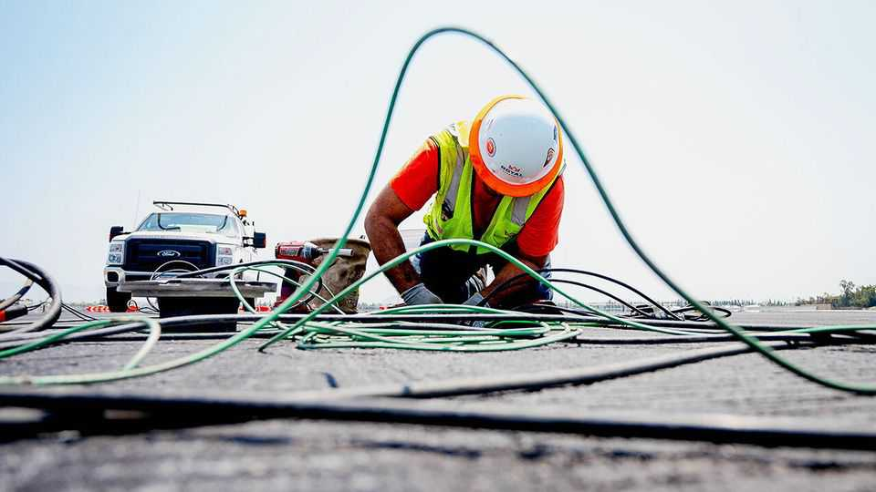
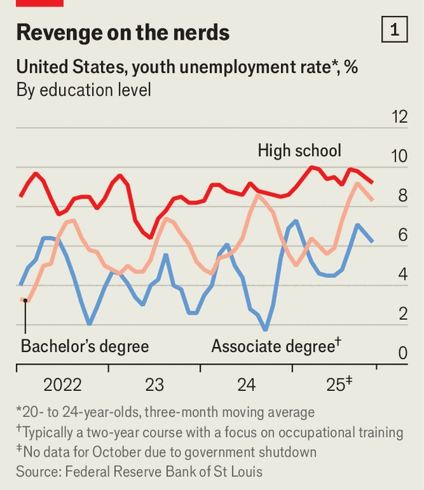
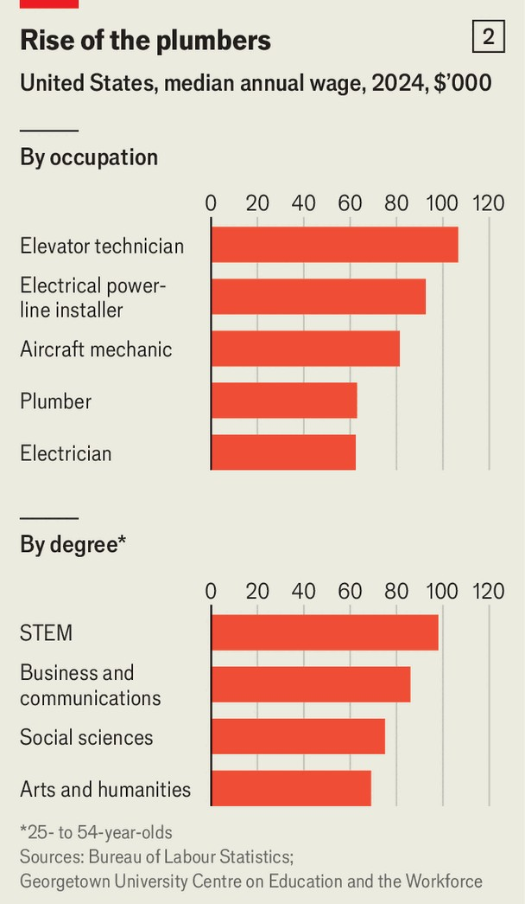

International | Toolbox versus textbook
Ditch textbooks and learn how to use a wrench to AI-proof your job?
Generation Z is becoming less invested in university and more interested in skilled trades
December 18th 2025

JACOB PALMER knew little about skilled manual jobs growing up, save that they were “dirty, sweaty” and “definitely seemed like lowbrow”. But it took only a year of remote learning during the covid pandemic for Mr Palmer, who grew up in North Carolina, to realise that university wasn’t for him. He dropped out after his freshman year, spent the next two years training as an apprentice electrician, and started his own business in 2024. Though just 23 years old he now has a warehouse, a pickup truck and a YouTube channel with more than 33,000 subscribers who watch him fix devices ranging from smoke detectors to Tesla chargers. He expects to generate $155,000 in revenue this year, of which 10% will come from

YouTube. Mr Palmer lists the advantages of becoming an electrician: “You get paid pretty well to do it. You get paid to learn to do it.” And it creates “massive job security” at a time when many young university graduates are anxious about artificial intelligence (AI) replacing entry-level white-collar workers. Mr Palmer doesn’t worry about that: “I’ll be wiring those data centres, right?”

Mr Palmer is not the only member of Generation Z (those born between 1997 and 2012) who is rethinking the merits of getting a university education. Only about one-third of American adults today think that university education is “very important”, according to recent polling by Gallup, a pollster, down from three-quarters in 2010. Around a quarter of Americans say they have “very little” or no confidence in higher education. Dig deeper and many of those with little confidence say that universities do not teach relevant skills and that they are too expensive. Indeed, the average tuition fees charged for a four-year degree at public universities in America have more than doubled in the past 30 years after adjusting for inflation.

Although AI is creating new sorts of jobs, such as software engineers who help deploy it in companies, it is also making life more difficult for some graduates to land their first jobs. Recent studies from Stanford, Harvard and King’s College London have found that firms that adopt generative AI in

America and Britain tend to hire fewer junior white-collar workers. In November 6.8% of 20- to 24-year-olds with a bachelor’s degree in America were unemployed, compared with 8.6% of those with only a high-school diploma (see chart 1). Of those university graduates who have found jobs, more than half are underemployed (working in jobs that did not require a four-year degree) a year after graduation, and 73% of those who start out underemployed remain so a decade later.

At the same time, interest in skilled manual jobs is growing. A recent advertisement on the London Tube shows a typed query: “Hey AI, bend this copper pipe” and an LLM’s response: “Sorry, I can’t do that.” The ad then invites viewers to “learn a trade and future-proof your career.” On social- media platforms such as Instagram and TikTok young plumbers and electricians post videos of their daily work that garner tens of thousands of views and admiring comments.

A survey published in June by the American Staffing Association found that a third of adults would advise youngsters graduating from secondary school to attend vocational or trade school, a slightly higher share than would encourage them to attend university. Some are taking that advice: enrolment in two-year vocational and trade programmes at American community colleges has grown by almost 20% since 2020. The number of active apprentices in America has more than doubled from 2014 to 2024, according to America’s labour department.

University graduates over the age of 25 still enjoy lower unemployment rates and almost double the median annual wage of high-school graduates. But look closer at individual degrees and the results become more varied. People with bachelor’s degrees in science, technology, engineering or mathematics earned a median annual salary of $98,000 in 2024, according to a study at Georgetown University (see chart 2). Arts and humanities graduates had a median income of $69,000. By contrast, a lift technician’s median annual salary in America is $106,580.

The spread within trades is wide, too. Median annual earnings of electricians in America are $62,000 a year, but the top 10% of them make more than $100,000 each. So do the top plumbers, boiler operators, aircraft mechanics and electrical power-line installers. None of these jobs requires a bachelor’s degree, though they do require specialised training.

Blue-collar workers are also sorely needed for industries like advanced manufacturing and defence. Almost 60% of new chip-manufacturing and design jobs that will be created in America between 2023 and 2030 are projected to remain unfilled because of a lack of skilled workers, according to a study by the Semiconductor Industry Association and Oxford Economics. Of those unfilled jobs, 40% are technician roles requiring only a two-year degree. Jensen Huang, the CEO of Nvidia, a chipmaker, has said that data centres for AI will require hundreds of thousands of electricians, plumbers and carpenters.

In Britain, industry reports estimate there is a shortage of 35,000 skilled welders, who are needed to build offshore wind farms, nuclear power plants and submarines, among others. Many with those skills are ageing: half of Britain’s welding workforce is expected to retire by 2027.

One solution to the skills shortage is to encourage more young people to learn vocational skills. But there is still a stigma attached to blue-collar jobs. Many parents see them as “dirty, dark and dangerous” and “a dead end”, says Sujai Shivakumar of the Centre for Strategic and International Studies, a think-tank in Washington. A lack of co-ordination between schools, industry and the government is also a problem, says Mr Shivakumar. Community colleges often offer courses that will increase enrolment but not ones that industries need, he says, which leaves vocational graduates with poor job choices even though there is a skills shortage.

A better solution would be to learn from countries like Switzerland, where about two-thirds of young people go into vocational training after 11 years of compulsory schooling. The system succeeds because it has “permeability”, meaning students can transfer easily back and forth between vocational and academic paths, says Ursula Renold, an expert in vocational education at ETH Zurich, a Swiss university. Many other countries promote apprenticeships where trainees get certified to work in a certain industry but cannot use that credential in the education system. “They are in silos,” says Ms Renold, which is “very dangerous”. An ideal system should avoid bifurcating students and trainees on different tracks, she says. It should also let companies take the lead in shaping curriculums and training students in the workplace.

Systems like Switzerland’s can take decades to build. In the meantime the best option may be degree apprenticeships, where students are paid by an employer to pursue a university degree and get on-the-job training at the same time. BAE Systems, a British arms manufacturer, has an apprentice programme that takes in more than 5,000 trainees a year, of which one-third are degree apprentices. Laché, a 20-year-old aerospace-engineering degree apprentice (whose last name is withheld for security reasons), spends four days a week working on cockpit technologies for the Tempest, a new fighter jet, and the fifth day attending classes. “It’s very, very, very, very cool,” she says. Demand for such apprenticeships is high: BAE got more than 31,000 applications for 1,100 spots in its most recent cycle, says Richard Hamer, the firm’s education director. It “definitely pays off” for both the trainees and the company, which had been struggling to find graduates with the right skills, he says.

Similar programmes are popping up in America as well. TSMC, a Taiwanese chipmaker, recently started an apprenticeship programme in Arizona, where it plans to build six semiconductor factories. Nolan Cunningham, a 23-year-old process-technician apprentice, was working at a fast-food chain before he joined the TSMC programme in April. He had decided to forgo university to avoid debt. “I don’t want to be spending the money that I’m making on paying student loans for the next 25 years,” he says. “It just cripples you.”

But he is now taking community-college courses in nanotechnology, paid for by TSMC, and is on his way to getting an associate’s degree. His factory job mostly involves data analysis and monitoring manufacturing systems from a computer. It was a “huge leap” to go from flipping burgers to making semiconductors, says Mr Cunningham, but an easy choice. ■

This article was downloaded by zlibrary from https://www.economist.com//international/2025/12/18/ditch-textbooks-and-learn-how- to-use-a-wrench-to-ai-proof-your-job