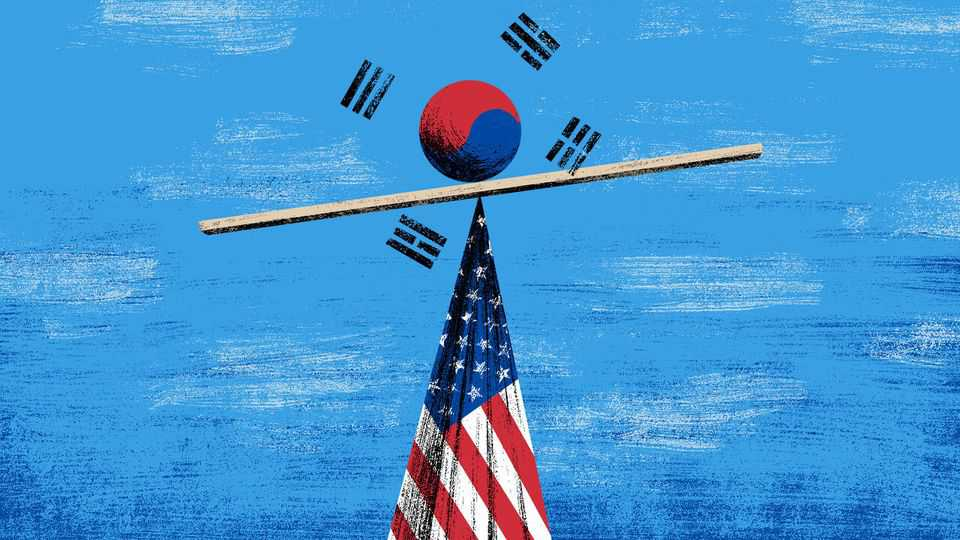

International | The Telegram
How to survive abandonment by America
Allies are planning for a lonelier, harsher world: a report from South Korea
December 18th 2025

SEEN FROM East Asia, America is a partner with a commitment problem, demanding ever more of Asian allies while promising ever less. That leaves governments in the region wondering how to hedge against their worst fear: Trumpian abandonment. Alas, today’s America is both fickle and jealous. The Telegram was recently in Seoul and heard about the one-sided demands being made by America of its decades-old ally, South Korea. President Donald Trump’s envoys have told Asian governments to take more responsibility for their own security, because American troops, warplanes and naval ships will not stay and guard them for ever. In the next breath, those envoys warn partners against forging deeper ties with America’s rival,

China. Some demands are commercial. To avoid Mr Trump’s wrath (and punitive tariffs), Asian allies must declare America their trade and technology partner of choice, and back that with investments designed to generate jobs and profits for Americans. Earlier this year Japan pledged to invest $550bn in America over several years. South Korea has agreed to invest $350bn in all, a sum equivalent to nearly 19% of the country’s entire gross domestic product in 2024. Other American demands involve blood as well as treasure. South Korean officials have been informed that, if American and Chinese forces ever clash over economically important places, from the island of Taiwan to shipping lanes in the South China Sea, they will not be allowed to sit out the fight.

South Korea is a horribly divided country. It is still recovering from a failed coup attempt a year ago by the country’s then president, Yoon Suk Yeol, a conservative now facing trial on insurrection charges. For all that, there are glimpses of an emerging consensus among moderates of the right and left, including about the relative riskiness of different hedging gambits.

When it comes to China there is agreement that South Korea cannot afford to alienate its giant neighbour. At the same time, greater closeness to China is seen as increasingly high-risk and low-reward. In polls, South Koreans have strongly negative views of China. That follows commercial boycotts imposed by leaders in Beijing to punish South Korea for hosting American missile-defence systems that China’s armed forces call a threat. Continuing Chinese bullying over disputed fishing grounds near the Koreas has stoked more anger. Public opinion helps to explain why the centre-left president, Lee Jae Myung, has toned down his pro-China rhetoric. Instead, Mr Lee has surprised observers with his pragmatism, striking trade deals with Mr Trump and agreeing to spend more on defence. The enthusiasm of South Korean big business for the China market has been tempered by fierce competition from cheaper, often highly advanced Chinese rivals. Whenever Mr Trump’s tariff wars have this year obliged South Korean carmakers and other giant firms to choose between Chinese and American markets, they chose America. For all that, a former diplomat and adviser to the conservative Yoon administration says that if the Trump administration declares South Korea to be outside America’s “defence perimeter” in Asia, then “we will have no choice but to get closer to China.” A prominent progressive scholar agrees, asking: “Why the hell would you antagonise China?”

A foreign diplomat frets about South Korean progressives who naively want to hug Russia, in hopes of loosening the ties between that country and North Korea that were forged when the north sent troops and arms to help Russia in its war with Ukraine. In reality, the diplomat argues, Russia is a wrecker with no intention of making the Korean peninsula safer. Meanwhile, North Korea is in its best strategic position for 35 years. Almost friendless a few years ago, today it plays China and Russia against one another.

South Korea’s centre-left and centre-right are remarkably united in enthusiasm for a project to build nuclear-powered attack submarines with America that was agreed upon by Mr Lee and Mr Trump at a summit in October (though important details remain fuzzy). A long-running debate about acquiring nuclear weapons has moved from the political fringes to the mainstream in South Korea. Officials and foreign diplomats in Seoul report that Trumpworld is surprisingly receptive to “friendly nuclear proliferation” by allies, if it would make those same partners less annoyingly needy. That marks a big break with America’s long-held stance of opposing the emergence of new nuclear powers.

The prominent progressive scholar believes that the Trump administration is miscalculating America’s interests. Why does America imagine that a nuclear-armed South Korea would meekly take orders from Washington, he asks? Worse, a South Korean bomb could trigger an unstoppable Asian arms race, with Japan and perhaps Taiwan feeling the need to follow suit. Meanwhile, China, North Korea and Russia would enlarge their own arsenals.

In Seoul, ghastly scenarios are described in which America withdraws its forces and removes its nuclear umbrella from South Korea; Mr Trump signs a “peace deal” that allows North Korea’s despot, Kim Jong Un, to keep and expand his nuclear arsenal; and an emboldened China tests South Korea’s sovereignty. Even if worst-case scenarios are avoided, South Korea has to reckon for the first time in its history with an America that is not there to pick up the phone when needed, says a former South Korean ambassador. He urges his country to seek closer ties with like-minded partners, starting with Japan. In his telling, if Japan and South Korea can overcome bitter memories of Japanese invasion and colonial rule, they share a long list of common problems, from ageing populations to brittle supply chains, fear of

China and disappointment at America. That is shrewd and constructive advice for bleak times. If South Korea must go alone, better to do it in good company. ■

Subscribers to The Economist can sign up to our Opinion newsletter, which brings together the best of our leaders, columns, guest essays and reader correspondence.

This article was downloaded by zlibrary from https://www.economist.com//international/2025/12/16/how-to-survive-abandonment-by- america

Business

The plan to rescue Novo Nordisk Retreating from EVs could be hazardous for Western carmakers Job apocalypse? Not yet. AI is creating brand new occupations Luxury handbags may be shoddier than you think How to conduct a job interview SpaceX, OpenAI, Anthropic and their giga-IPO dreams