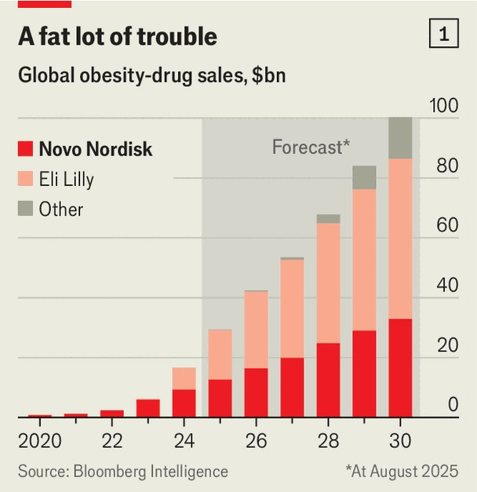
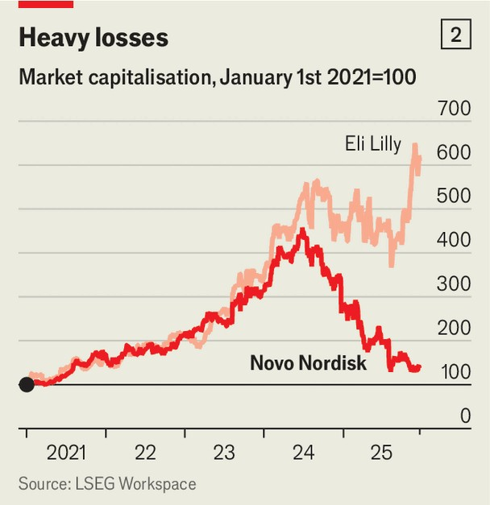

Business | Slim shaky
The plan to rescue Novo Nordisk
To recover its lead in obesity drugs, the Danish giant is transforming itself
December 18th 2025

When Novo Nordisk launched Wegovy, its pioneering weight-loss jab, in America in June 2021, it felt like it was “running into a dark tunnel”, recalls Maziar Mike Doustdar, who took over as the Danish drugmaker’s chief executive in August. Although it knew the opportunity was vast, the company had little way of telling how much demand there would be, or where it would come from. Novo, he says, suffered from the “curse of leadership”. For more than two years it had the market for weight-loss drugs to itself. By 2023 sales of Wegovy had reached $4.3bn in America. That year, however, Eli Lilly, a rival that had closely watched Novo’s mis-steps, launched its own weight-loss injection, called Zepbound. In 2024 it brought in sales of

$4.9bn, three-quarters as much as Wegovy. This year it will pull ahead. By 2030 Lilly will control more than half of the global market for obesity drugs, compared with just a third for Novo, according to forecasts from Bloomberg Intelligence, a research group (see chart 1).

Investors in the Danish drugmaker are rattled. Its market value, at around DKr 1.4trn ($220bn), is down by two-thirds from its peak in June 2024, when it was Europe’s most valuable company (see chart 2). Lilly’s is up by more than a quarter since then. Even so, in an interview with The Economist, Mr Doustdar sounded confident that Novo can recover. His prescription is to push a new generation of obesity treatments while making sweeping changes to how the company operates.

Novo was well placed to lead the weight-loss revolution. Founded more than a century ago to make insulin, a hormone that regulates blood sugar, it is a specialist in metabolic diseases. The company’s headquarters in Bagsvaerd, just outside Copenhagen, centre on a spiral staircase modelled on the insulin molecule. Around a decade ago Novo’s scientists noticed that semaglutide, a promising diabetes drug, also suppressed appetite, setting off the effort to create a new class of weight-loss treatments. (Semaglutide, which mimics the GLP-1 hormone, is the active ingredient in both Wegovy and Ozempic, a drug approved in America in 2017 for diabetes.)

Novo, however, vastly underestimated the appetite for its new weight-loss jab. Mr Doustdar says it planned for demand to be three times that of Saxenda, an older and less-effective obesity drug. But five weeks after its launch in America, Wegovy had notched up the equivalent of four years’ worth of Saxenda prescriptions. Production could not keep pace. As a result, Wegovy was placed on America’s official shortage list, exposing it to “compounding” pharmacies, which are allowed to make copies of brand- name drugs when supply is insufficient and sell them at steep discounts. Although Wegovy was removed from the shortage list in February, loopholes mean that compound copycats are still available. Novo estimates that approximately 1m Americans use them.

Just as Novo’s supply was coming up short, Lilly launched Zepbound. In its own head-to-head trial, patients on the drug lost 20% of their body weight, compared with 14% on Wegovy. What is more, Lilly, which had observed the growth of Wegovy, began ramping up production well before it had gained approval for Zepbound. As a result, the drug has been readily available since October last year.

Lilly also realised early on that selling weight-loss drugs is unlike peddling most other medicines. Demand has been propelled not by doctors and insurers, but by patients themselves, many of whom pay for the treatment

directly. From early 2024 Lilly began bypassing intermediaries and going straight to patients. It offered low-dose Zepbound vials online for $399, well below the wholesale list price of about $1,100 (and cheaper even after the discounts insurers receive). Lilly also teamed up with various telehealth providers to broaden its reach. Novo was late to adapt, launching its own direct offering a year after Lilly. In April it set up a partnership with Hims & Hers, a telehealth company, but this quickly collapsed, partly because the provider kept selling Wegovy copycats.

Novo was shaken out of its complacency in May, when the board booted out its chief executive since 2017, Lars Fruergaard Jorgensen. The changes to its leadership continued as the Novo Nordisk Foundation, which owns more than a quarter of the drugmaker’s shares, reasserted itself. Its chairman, Lars Rebien Sorensen, who ran Novo before Mr Jorgensen, rebuked the board for being “too slow” to grasp the shifts in the market for weight-loss drugs. After a purge in October in which seven board members resigned, Mr Sorensen took over as the drugmaker’s chairman.

A person close to both Mr Sorensen and Mr Doustdar says they will be “ruthless” in doing “what it takes” to recover. Change is already under way. In September Novo announced it would cut 9,000 jobs, more than a tenth of its workforce, including about 5,000 in Denmark, the biggest lay-off ever in the country. It has also halted the development of any drug not tied to diabetes or obesity.

That narrower focus is meant to clear the way for two new product launches next year. One is an oral version of Wegovy that, in trials, produced more weight loss than Lilly’s competing pill. Analysts worry that patients may balk at the requirement to take it on an empty stomach and wait half an hour before eating (Lilly’s pill carries no such strictures). But Martin Lange, Novo’s chief scientist, dismisses the concern, noting that diabetics are already taking oral semaglutide without fuss. The second launch is a higher- dose Wegovy injection that achieved weight loss comparable with Zepbound in trials. Novo hopes it will counter the perception that its treatment is less potent. This time around, it will have ample capacity in place for the drugs.

Novo is also making wider changes to how it does business. It wants to expand its direct channels, which currently account for a tenth of Wegovy

prescriptions in America. To that end, it has struck deals with retailers including Costco and Walmart to sell its drugs. Partnerships alone, however, will not be enough. Mr Doustdar says Novo must build a “consumer mindset”; he wants it to think “more like Amazon”, offering customers the speed and flexibility they now expect.

Novo is revising its pricing, too. It recently began offering Wegovy to customers directly for $199 for the first two months, rising to $349 thereafter. (Lilly retaliated by cutting prices for Zepbound sold directly.) In November both firms also struck deals with the Trump administration to provide Medicare, the public insurer for the elderly, with discounted access to their obesity drugs, at roughly a third less than the price charged to commercial insurers. In return, Medicare agreed to cover the treatments for the first time.

The final shift in Novo’s strategy relates to how it will build its pipeline. Novo has traditionally relied on its own labs rather than acquisitions, but that is changing. In November it entered a bidding war with Pfizer, an American drugmaker, for Metsera, a biotech firm with a promising obesity drug under development. Pfizer won, but Mr Doustdar is unbothered. Treating hundreds of millions of patients requires openness to outside ideas, he says. He wants Novo to build a broad portfolio of obesity drugs so that it can offer each patient the treatment best suited to their needs.

Novo may well need outside help. Lilly has a formidable pipeline of its own and has experience across a wider range of diseases, which may be an advantage as obesity drugs are increasingly used to treat adjacent conditions such as kidney and liver problems. Other competitors are also eyeing the weight-loss business. Over 160 new obesity drugs are currently in development. Moreover, semaglutide will lose patent protection in several big emerging markets in 2026—including Brazil, China and India— exposing Novo to competition from generic drugs in those places, which are home to a large share of the world’s obese people.

Still, Novo’s biggest battle may be internal, as it seeks to transform itself from a cautious drugmaker into a nimble consumer brand. Mr Doustdar is not out of that tunnel yet. ■

To track the trends shaping commerce, industry and technology, sign up to “The Bottom Line”, our weekly subscriber-only newsletter on global business.

This article was downloaded by zlibrary from [https://www.economist.com//business/2025/12/15/the-plan-to-rescue-novo-nordisk](https://www.economist.com//business/2025/12/15/the-plan-to-rescue-novo-nordisk)