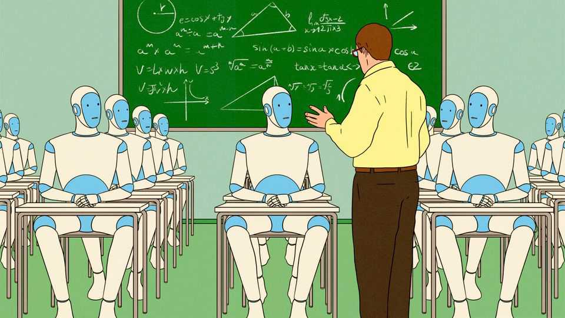

Business | The future of work
Job apocalypse? Not yet. AI is creating brand new occupations
Most needed: human skills
December 18th 2025

A mock job advertisement that has done the rounds recently calls for a “killswitch engineer” for OpenAI, maker of ChatGPT. The description requires the successful applicant to stand by servers all day and unplug them “if this thing turns on us”. Useful skills include the ability to “throw a bucket of water on the servers, too. Just in case.” Despite widespread fears of job losses owing to the rise of artificial- intelligence (AI) agents, it is not all gallows humour. The technology is already creating new roles—to train agents, embed them in organisations and ensure that they behave. Many of these new jobs, moreover, require uniquely human skills.

Start with data annotators. No longer are they merely low-paid gig workers tediously tagging images. As AI models have become more advanced, experts in subjects such as finance, law and medicine have increasingly been enlisted to help train them. Mercor, a startup that has built a platform to hire boffins to help build bots, was recently valued at $10bn. Brendan Foody, its chief executive, says they earn $90 an hour on average.

Once bots are trained, teams of so-called forward-deployed engineers (FDEs) are needed to embed them into organisations. Palantir, a software giant that pioneered the concept, imbues them with derring-do. “In the beginning, it was just us. Two engineers dropped into a military base near Kandahar, handed minimal-but-clear marching orders from Palo Alto: ‘Go there and win,’” starts a typical blogpost by a former Palantir FDE.

In practice, their jobs are a blend of developer, consultant and salesman. They work on-site to customise AI tools for a client and get them up and running. FDEs are proliferating, albeit from a low base. Garry Tan, the boss of YCombinator, a startup factory, said recently that its young companies had 63 job postings for FDEs, up from four last year. As AI agents spread, their makers need to understand the human-facing domains in which their tools operate. A programmer who builds a customer-service agent, for instance, needs to have a feel for why a frustrated customer dials zero just to yell at a human.

Himanshu Palsule, chief executive of Cornerstone OnDemand, a skills- development company, uses Waymo, a fast-growing robotaxi firm, as an example of how the job of a developer is evolving. Waymo’s cars drive themselves from start to finish. But what if they break down, locking their passengers inside? Then comes the need for what he calls “the guy—or gal —in the sky”, a remote human troubleshooter who needs to understand not just the technology, but also how to handle frazzled passengers. Software engineers, Mr Palsule says, used to be sought after for their coding abilities, not their bedside manner. No longer. Writing code can now be done by an algorithm. “Your personality is where your premium is.”

Then there is the task of setting rules to ensure that AI agents do not bring chaos. The AI Workforce Consortium, a research group led by Cisco, a maker of networking gear, recently examined 50 IT jobs across rich

countries. The fastest growing, even more so than AI programmers, was AI risk-and-governance specialists, who are typically involved in ensuring that bots do not leak data or cause a company’s operations to crash, among other things.

Responsible for bringing all these roles together is the chief AI officer, an increasingly popular addition to the c-suite as chief executives look to assure their boards that they are taking the technology very seriously indeed. Chief AI officers usually combine technical expertise with deep knowledge of a particular industry and a record of overhauling corporate processes. It is not a job for the faint-hearted. The typical large enterprise uses as many as 11 generative-AI models, according to IBM, an IT company, and is constantly being bombarded by vendors trying to sell agents for every conceivable function. Those in charge may already feel like reaching for that killswitch. ■

To track the trends shaping commerce, industry and technology, sign up to “The Bottom Line”, our weekly subscriber-only newsletter on global business.

This article was downloaded by zlibrary from https://www.economist.com//business/2025/12/14/job-apocalypse-not-yet-ai-is- creating-brand-new-occupations