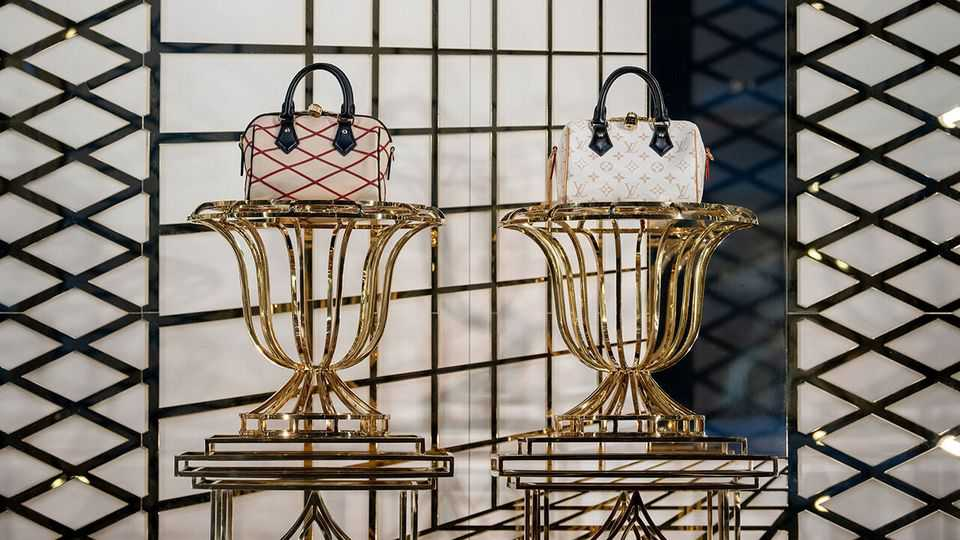

Business | Bags not it
Luxury handbags may be shoddier than you think
Complaints about quality are a growing worry for brands from Chanel to Prada
December 18th 2025

Those lucky enough to find designer wares under the Christmas tree this year will, for the most part, try hard to keep them in pristine condition. Yet an increasingly popular genre of online videos is dedicated to ripping them apart. Creators such as “Tanner Leatherstein” and “Fabricateurialist” show their audiences that even the priciest tier of clothes and accessories is rife with loose heel caps and shoddy stitching. The most popular critiques by far—and the ones that worry luxury brands the most—are of their extravagantly priced handbags. A video of dye melting off a $2,000 tote from Goyard, a maker of posh leather goods, was watched 3.2m times this year. In a widely viewed sub-genre on TikTok, a

short-video app, Chinese manufacturers claim (usually incorrectly) that various luxury bags are made in their country for pennies on the dollar.

Complaints about handbags are particularly concerning for luxury companies because they have been so central to their success. Often they are a brand’s best-known—and priciest—product. According to Bain, a consultancy, such leather goods accounted for 25-30% of the expansion in the global market for luxury items between 2019 and 2023, a period of roaring growth during which the industry’s total sales rose from €284bn to €369bn ($434bn).

Lately, however, the handbag business has taken a beating. Partly that is a consequence of the strain on middle-class wallets. It also reflects shifts in consumer preferences. Some well-heeled shoppers are prioritising splashy experiences over the designer wares that have become increasingly ubiquitous in recent years. LVMH, the industry’s colossus, now offers big- spending clients the chance to sleep in Christian Dior’s original studio.

Yet the slump in spending on luxury handbags has been especially pronounced, even as categories such as beauty and jewellery have continued to grow. Bain reckons that declining sales of leather goods accounted for three-fifths of the reduction in overall spending on luxury items since 2023, to an estimated €358bn this year.

Luxury brands, which ratcheted up prices for their handbags during the post- pandemic spending boom, have invited greater scrutiny of their quality. Shoppers eyeing Louis Vuitton’s Speedy 30 canvas tote will need to pay more than twice what they would have in 2019. The typical price of a luxury handbag has risen from between eight and 12 times the production cost to roughly 15 times, says Luca Solca of Bernstein, a broker. A series of investigations by the Italian government into sweatshop-like conditions in the country’s supply chain for luxury fashion have also not helped the industry’s reputation.

Meanwhile, those coveting a fancy handbag now have more alternatives. Online marketplaces for secondhand luxury goods are growing quickly. Vestiaire Collective, one such platform, says that handbags are its best- selling category, accounting for more than two-fifths of the value of

purchases. Decent quality knock-offs known as “superfakes” have also lured some one-time luxury clients.

The luxury industry will not readily abandon the cash cow that is the cowhide bag. Nearly every major European label appointed a new designer this year, and will be hoping that the handbags that appear in stores in 2026 will rekindle interest from jaded shoppers. Brands such as Chanel and Prada have been working to fix quality issues by taking stakes in leather manufacturers and tightening oversight of production. Hermès has avoided quality concerns by having a single artisan produce its priciest handbags, including the Birkin, from start to finish. Its sales of leather goods rose by 13% year on year in the quarter from July to September. Craftsmanship, it seems, still pays. ■

To track the trends shaping commerce, industry and technology, sign up to “The Bottom Line”, our weekly subscriber-only newsletter on global business.

This article was downloaded by zlibrary from https://www.economist.com//business/2025/12/18/luxury-handbags-may-be-shoddier- than-you-think