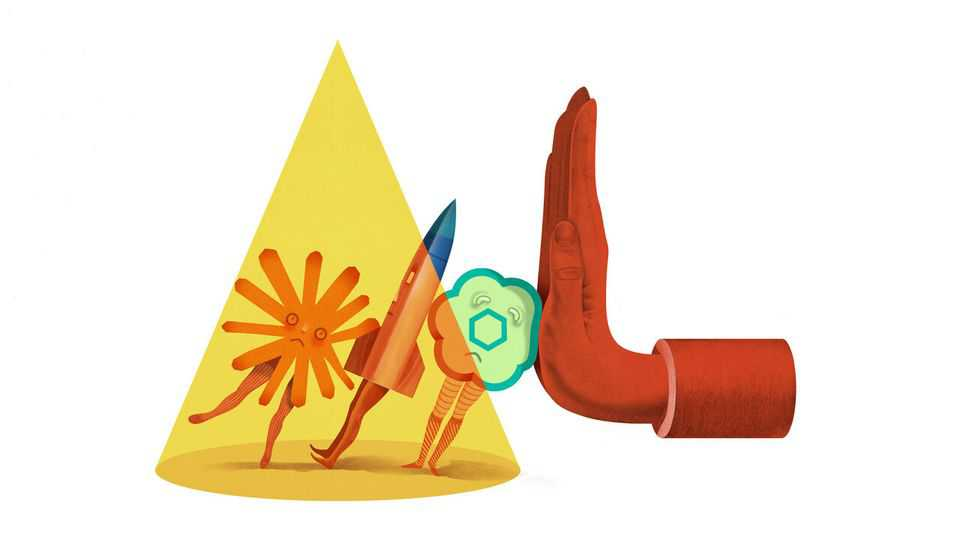

Business | Schumpeter
SpaceX, OpenAI, Anthropic and their giga-IPO dreams
Will more capital trump more scrutiny?
December 18th 2025

A DECADE OR so ago, before venture capitalists and buy-out barons began whipping out their chequebooks, going public was the obvious choice for ambitious businesses. A stockmarket listing offered startups both cash, courtesy of deep pools of capital, and cachet, conferred by a willingness to subject themselves to the scrutiny of millions of investors. It was possible to attain a $100bn-plus valuation while staying out of the stockmarket spotlight: Lidl may have pulled it off with cheap groceries, Mars with confectionery, Cargill peddling the sort of stuff that goes into Mars bars, Gulf and Chinese natural-resource firms extracting less digestible commodities, Vitol and Trafigura trading these. But if it was explosive

growth you were after, the real rocket fuel was to be found in public markets.

Maybe it still is. Reports have recently surfaced that SpaceX, a rocketry and satellite firm founded by Elon Musk, was sounding out investment bankers about an initial public offering (IPO) as soon as next year at a valuation as high as $1.5trn. In early December Anthropic, an artificial-intelligence darling valued at roughly $180bn in a recent funding round, was also said to be exploring a listing. It may want to pip OpenAI, the $500bn byword for the AI boom, which is likewise rumoured to be increasingly IPO-curious.

Any of these deals could be the biggest in America since Alibaba, a Chinese e-commerce titan, sold $25bn of shares on the New York Stock Exchange in 2014. It could be the largest anywhere since Saudi Aramco, the world’s oil colossus, raised nearly $30bn in 2019 at a valuation of nearly $2trn in Riyadh.

This sudden interest in public markets seems out of character for the trio. None has struggled to entice private backers. They have so far secured a total of nearly $120bn in funding. Anthropic, which turns five in January, and even ten-year-old OpenAI look youthful by contemporary IPO standards; the typical American company now goes public at 16, four years later than a decade ago. SpaceX, which has shunned the stockmarket for 23 years, looks ancient. In each case a listing also presents thorny dilemmas.

The obvious reason for all three to pursue an IPO is access to ever more capital. SpaceX is developing Starship, a reusable launch system with which it hopes to lift 150 tonnes to orbit on every flight, roughly double the payload of any rocket currently in operation. OpenAI has said it plans to invest perhaps $1.4trn in computing power over the coming years. If the younger and smaller Anthropic wants to keep up, it too must splurge on data centres.

Even as the trio’s capital needs grow, the private market may stop expanding. After swelling at a compound rate of 10% a year between 2012 and 2021, global private assets under management have since plateaued at just over $20trn. Limited partners are demanding that venture-capital and private-equity funds disburse some proceeds before asking for fresh cash.

Moreover, as the unlisted giants’ successive funding rounds balloon in size —OpenAI’s latest came in at $40bn, larger than any IPO ever—so do the typical contributions from what is by public-market standards a puny number of participants. At some point that may become an unacceptable concentration of risk for all but the most fearless, or reckless, financiers out there. The public- equity market, with a global market capitalisation of some $130trn, is far larger and its investor base far less concentrated.

In its aggregated wisdom, however, it is also far more discerning. This discernment is what SpaceX, OpenAI and Anthropic would be trading off for cash. In none of their cases is the trade-off comfortable.

For SpaceX the main headache would relate to corporate governance—or rather, if you treat Tesla as a listed proxy for Mr Musk’s assorted ventures, a troubling lack of it. At Tesla he has had run-ins with regulators (who fined him and Tesla $20m apiece in 2018 for his remark on Twitter that he had “funding secured” to take the carmaker private) and judges (last year one in Delaware voided a supersize pay deal after concluding that Tesla’s board was “beholden” to him). His growing fortune, which soared from $470bn to $638bn on December 15th after SpaceX was valued at $800bn in a secondary share sale, seems likely if anything to make him feel more emboldened.

At least SpaceX makes money. It is thought to be generating cash and turned a profit for the first time in 2023. For their part, OpenAI and Anthropic are burning enough to make a Starship launch pale by comparison. OpenAI is likely to make a net loss of around $12bn this year on revenue of a comparable size. It reportedly expects to torch another $115bn in cash before becoming profitable in 2030. Anthropic thinks it may break even a couple of years earlier, but will still bleed billions beforehand.

It will be a while before OpenAI, Anthropic and even SpaceX generate net profits comparable to those of Alibaba, which was $4bn in the black in the 12 months before its IPO, let alone Saudi Aramco, which booked $111bn, then the blackest ever for any company. The last time large profitless tech darlings went public, in the IPO wave of 2019, Uber needed four years and positive cashflow for its shares to rise reliably above their IPO price. You would be better off today having invested in the S&P 500 index.

The star trio may think they have no choice but to list before big profits arrive. SpaceX will look less exceptional once rival space companies like Blue Origin have narrowed the technological gap. OpenAI and Anthropic face fierce competition already. They could remain private and risk running out of the capital needed to stay ahead. Or they go public and risk markets’ impatience over profits. Either way, their lofty valuations will soon be put to the test. ■

Subscribers to The Economist can sign up to our Opinion newsletter, which brings together the best of our leaders, columns, guest essays and reader correspondence.

This article was downloaded by zlibrary from https://www.economist.com//business/2025/12/16/spacex-openai-anthropic-and-their- giga-ipo-dreams

Finance & economics

Where America’s most prominent short-sellers are placing their bets Meet the American investors rushing into Congo This Christmas, raise a glass to concentrated market returns Crypto’s real threat to banks Watch who you’re calling childless