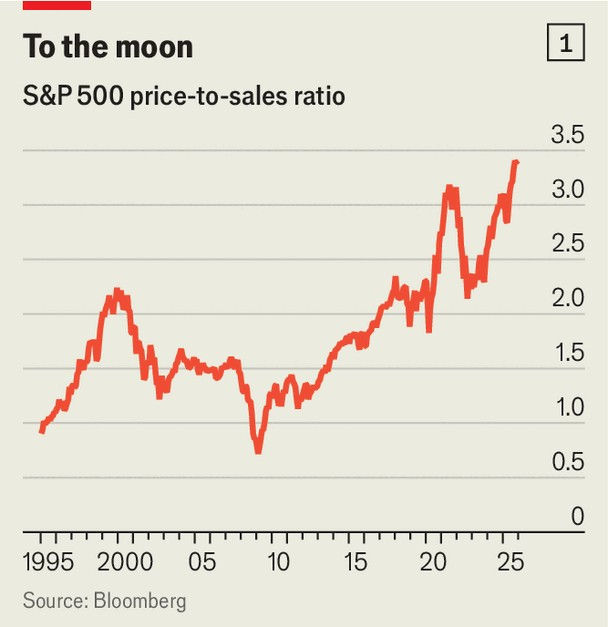
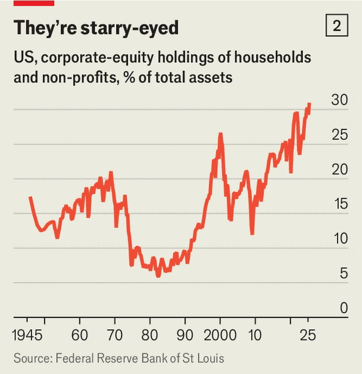

Finance & economics | The short view
Where America’s most prominent short-sellers are placing their bets
We interview three financial sleuths
December 18th 2025

“I have to giggle,” says Jim Chanos, asked if investors have become overly optimistic about artificial intelligence. “We’ve got to the ‘data-centres-in- space’ stage of the cycle.” Firms from SpaceX and Blue Origin to Alphabet plan to shrug off earthly constraints on the computing clusters that power AI, and launch them into orbit. To Mr Chanos, who is perhaps Wall Street’s most experienced short-seller, such pharaonic ambitions immediately ring alarm bells. Yet even he hesitates to say definitively that share prices are in a bubble: “That’s something we’ll only be able to tell with hindsight.” You might think that short-sellers like Mr Chanos, who bet on prices falling rather than rising, are looking forward to a bonanza. With plenty of

stockmarkets near all-time highs, there is surely no end of juicy targets. Conventional ways of valuing shares (which compare prices to fundamentals such as underlying earnings, sales or assets) show American stocks to be nearly as expensive as during the dotcom bubble, or even more so (see chart 1). And investors convinced of the profitmaking potential of AI are backing companies to fire data centres into space. With hopes so high, betting on disappointment has rarely seemed so tempting.

To test this idea, The Economist spoke to three of America’s most prominent shorts. Mr Chanos is best known for having predicted the downfall of Enron, a fraudulent energy-trading giant that collapsed in 2001. Carson Block rose to fame in 2011 after shorting Sino-Forest, a forestry firm that was felled amid a fraud scandal. One of Andrew Left’s biggest hits was Valeant, a drugmaker that in 2015 was Canada’s most valuable firm. Though their bets on fraud get the most attention, all three also hunt for shares that simply seem unjustifiably expensive.

Despite their bearish bias, our group’s views neatly spanned the range of those held by other professional money managers. Mr Chanos worries about “exuberance similar to 2021, or to 25 years ago”, noting that retail traders are even more exposed to the stockmarket than they were in the dotcom era. Mr Block is more sanguine. “I don’t think there’s this big bubble here,” he

says, since the firms with the highest valuations have shown solid earnings growth. Mr Left reckons “the market’s too thick and the technology’s too exciting” for there to be a crash. “But a deflation could happen,” he says, when “the cycle turns”.

All agree, however, that predicting this turn is impossible. “To go pick the point where Wall Street has its come-to-Jesus moment? I just don’t think you can do that,” says Mr Left. Mr Chanos draws a comparison with the boom in internet stocks that ended in March 2000. “The market just started going down—there was no narrative about why.” In fact, sales at telecoms firms kept increasing for several quarters. But when every marginal buyer at a certain price found a seller, and the price stopped rising, “that was when people started worrying about risks.”

Mr Chanos suspects the top of this market cycle will look similar. Share prices will peak, then “we’ll begin to see weakness in the AI story after the fact,” whether from cancelled orders or failure to convert technology into profits. Will short-sellers be able to spot the reversal in time to turn a profit? Yes, says Mr Left, “but only after missing the first 15-20%.” Then, the main sign that a prolonged bear market has begun would be firms cutting spending, or “saying they’ve experimented with AI and it’s not been transformational”.

For Mr Block, meanwhile, the key indicator that the cycle has turned would be a sharp rise in unemployment. He thinks a crucial driver of the bull market has been the monthly flow of retirement savings into passive index funds, which buy shares in the biggest firms regardless of their price. An abrupt rise in joblessness would reduce that flow, and with it support for share prices to keep rallying.

Whenever the next bear market begins, there are reasons to worry about its impact. Mr Left points to uncertainty over how AI will develop, and which companies will exploit it most profitably, as a source of potential losses for shareholders. Then there is the question of who will pay for firms’ vast AI- related capital expenditures. Big tech firms, for instance, are set to invest $5trn between now and 2030; JPMorgan Chase, a bank, estimates they will need additional revenues of some $600bn a year to make these worthwhile.

“It could [come from] businesses or consumers,” says Mr Left, “so which one is it? Do you really want to be the person trying to guess?”

The second reason to fear a bear market is that American households have more to lose from one than ever before. Stock ownership now accounts for over 30% of their total assets, the highest since the Federal Reserve started collecting such data in 1945 (see chart 2). At the peak of the dotcom bubble the equivalent figure was 27%.

Moreover, Mr Chanos believes that retail traders have concentrated their bets on the riskiest assets. He notes that the average account on Robinhood, a popular trading app, holds around $12,000. Mr Chanos estimates that account values dropped by 7% in October and November, when the the stockmarket wobbled, but ultimately recovered. That balances nevertheless fell suggests they were “way out there on the risk spectrum”, invested in stocks that dropped more and recovered less than the wider market.

The final big risk is that unscrupulous firms have used the boom to conceal wrongdoing. “The fraud cycle follows the financial cycle,” says Mr Chanos, “and the longer the financial cycle goes on, the more egregious the fraud.” It does not help that many short-sellers who once ferreted out such misdeeds have been defanged. Mr Chanos’s firm, once the world’s biggest short-

selling specialist, is now a family office, having closed to external investors in 2023 as a result of client withdrawals.

Elsewhere, law-enforcement agencies have taken aim at the shorts themselves, rather than the companies they suspect of fraud. America’s Department of Justice conducted a wide-ranging criminal investigation on short-selling in 2021. This included serving Mr Block’s firm with search warrants and subpoenas—a “really large, cold glass of water in the face” that forced him to consider other business lines. He still places short bets, but now also runs quantitative and long-only funds. Mr Left spoke to your correspondent between court hearings: the same probe left him facing charges including 17 counts of securities fraud.

When today’s optimism finally fades, in other words, markets will have fewer veteran sleuths working to uncover any corruption it has masked. That risks setting a dangerous precedent for the next boom. For all the obvious dangers of a stockmarket crash, the worst may remain hidden. ■

For more expert analysis of the biggest stories in economics, finance and markets, sign up to Money Talks, our weekly subscriber-only newsletter.

This article was downloaded by zlibrary from https://www.economist.com//finance-and-economics/2025/12/16/where-americas-most- prominent-short-sellers-are-placing-their-bets