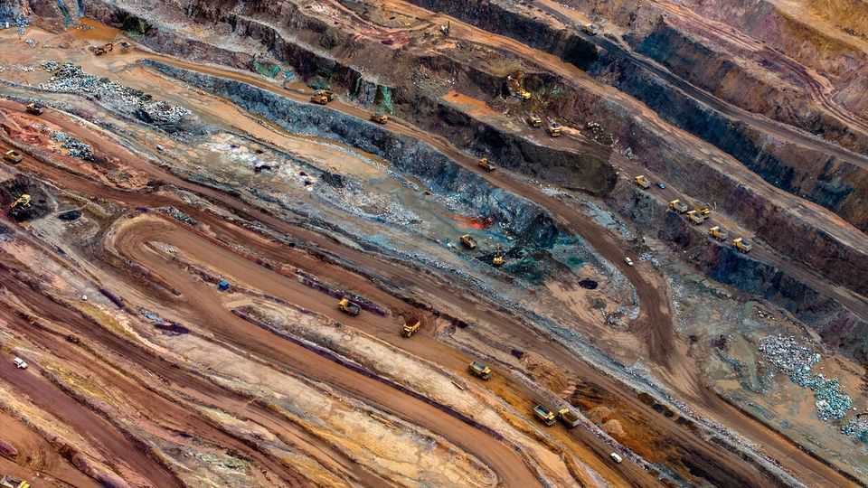
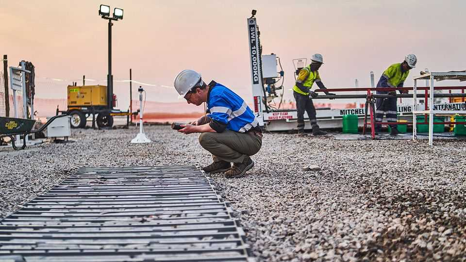

Finance & economics | Minefield
Meet the American investors rushing into Congo
They are taking on war, corruption and China
December 18th 2025

NEAR ZAMBIA’S border with the Democratic Republic of Congo, Josh Goldman, the boss of an American mining firm, is discussing his next venture. KoBold Metals is gearing up to do business in Congo, where one of the world’s biggest known lithium deposits is folded between layers of granite. The country is also home to myriad conflicts. But KoBold has been unable to resist. “It’s the most mineral-rich place on earth,” says Mr Goldman. American firms have generally avoided Congo on account of its conflicts, corruption and distance. Meanwhile, Chinese rivals appear to operate with ease. Donald Trump wants to change that. On December 4th, the president inked deals with Congo and Rwanda—which is backing the M23 rebel

group against the Congolese government. Under the so-called “Washington Accords” America will help oversee a peace deal in the region. In return, Congo will “facilitate investments” by American firms, such as KoBold, coveting access to some of the world’s most sought-after minerals, such as lithium, cobalt and copper.

The American government maintains a list of 60 such “critical minerals” used in cutting-edge tech including weapons, wind turbines and semiconductors. Uncomfortably for America, most of these materials are supplied by China. Mr Trump wants to diversify that supply, leading him to float annexing Greenland and sign a minerals deal with Ukraine in April. In that deal America agreed that any future military aid given to Ukraine would be paid for with a share of the country’s future resource revenues. The Congo deal has a similar rationale. And, as in Ukraine, the agreement has not stopped the fighting.

But, though American firms have made little progress in Ukraine, Congo is abuzz with Western activity. In August KoBold became the first American firm in a decade to hold a Congolese exploration licence. Earlier in December Mercuria, a Swiss firm, announced a $1bn partnership with Gecamines, a state-owned firm. Other enterprising types, often claiming close connections to Trumpworld, are trying to get in on the action, too. Manono, the deposit KoBold is preparing to drill, could on its own produce more lithium than America imports each year.

But these treasure hunters will have their work cut out in the east of the country, especially parts where M23, and thus Rwanda, is in de facto control. Mining in such a dangerous place is difficult. Whether American firms can muscle in will be a test of Mr Trump’s deal diplomacy.

One nationwide challenge is corruption. Between 2007 and 2018, Glencore, a Swiss-British miner and the biggest Western investor in Congo, admitted to paying bribes to open a copper mine in Kamoto, near the border with Zambia, costing it at least $1.1bn in fines. One previous owner of Manono has been accused of paying middlemen for permits, and another is facing corruption charges from the Australian government. Many investors believe it is impossible to get permits without bribes.

But KoBold insists that operating in the country need not require bungs. The firm, backed by Bill Gates, has the slick efficiency of a Silicon Valley startup. What accounts for its optimism? Mr Goldman says that getting things done in Congo has become easier since America showed interest. “Now we know the US government wants to see us succeed,” he says, “and tells the [Congolese] government that they want to see us succeed.”

On the Zambian border, every KoBold employee wears an American flag on their arm, “to show that we have the weight of America behind us”, one explains. According to other investors, Congolese officials want to please Mr Trump, in the hope that he will press Rwanda to stop supporting M23. Mr Trump’s backing, say several investors, has knocked down the sort of conditions that led firms to turn to bribery.

Even so, dealing lawfully with the Congolese government is a headache. Officials grant and withdraw permits with little notice. No single authority collects tax, so foreign mining firms have paid 45 different state organs. Firms struggle to distinguish a genuine revenue collector from pretenders. Royalties are negotiated on an ad hoc basis, exposing firms to dodgy dealings.

The Trump deal settles some of these issues, such as with an upfront agreement on tax. But much informality remains, exposing foreigners to the litigious excesses of Congolese officials. The country has been in court with over half the foreign firms in its mines since 2002. For explorers such as KoBold, which often take over a site after others have attempted to find minerals, disputes can create lingering problems. One Chinese firm that previously invested in Manono claims to still own 15% of a project in the area.

The hope is that a wave of American investment will break China’s grip on the country. In 2007 Congo handed a tax break to Chinese miners until 2040, in return for investments worth $9bn (only $6bn materialised). Back then Western governments showed scant interest in stopping their firms from selling to Chinese buyers. When Mr Trump returned to office in January 2025, China owned 80% of Congo’s mining output, including Tenke Fungurume, a mine once owned by an American firm, and now the second- biggest source of cobalt in the world.

Under the deal, Congo must keep its most promising mineral finds, a so- called “strategic asset reserve” (sar), for American investors. Firms from allied countries can also bid for rights, but America has the final say. The SAR reportedly includes the Rubaya mine, which supplies 15% of the world’s coltan, a metal used in smartphones. The goal is to block China from buying sites explored by Western firms and deplete its pipeline of projects.

Few would have expected Mr Trump’s deal to enjoy such early success. Congo has become more investible for American firms. But can this streak continue, and China’s mining dominance in the country be challenged? Officials will need to sustain their enthusiasm. Eventually exploration must give way to mining, which will test the risk appetites of more conservative resource majors. KoBold, for its part, is planning its own mine, but Mr Trump, or other investors, could well lose patience before then.

Peace will matter, too. Both Mr Trump and Congo’s government may be promising each other something that neither can deliver. Several assets eyed by America, including the Rubaya mine, are controlled by M23. Mr Trump’s half-hearted efforts at enforcing a truce mean that the prospect of tapping

such deposits remains remote. In Congo, as elsewhere, Mr Trump has prioritised profit-making above all else. That may not be enough. ■

For more expert analysis of the biggest stories in economics, finance and markets, sign up to Money Talks, our weekly subscriber-only newsletter.

This article was downloaded by zlibrary from https://www.economist.com//finance-and-economics/2025/12/18/meet-the-american- investors-rushing-into-congo