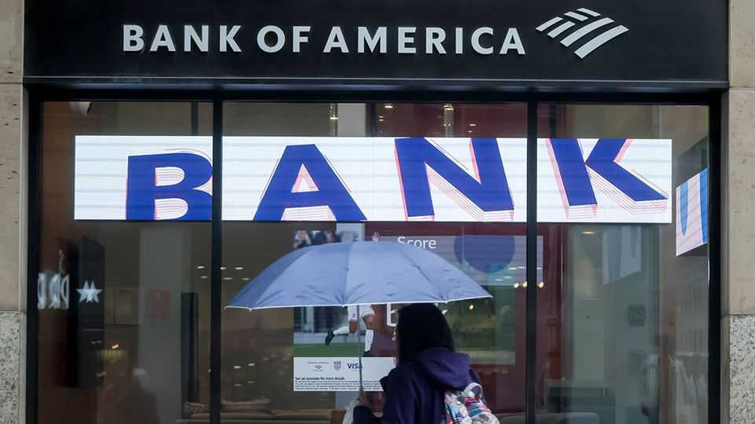

Finance & economics | Former glory
This Christmas, raise a glass to concentrated market returns
A surprisingly large share of companies lag far behind their former greatness
December 18th 2025

Nineteen years is a long time to wait for almost anything. When it comes to a share-price recovery, it can feel like an eternity. Bank of America’s stock touched a new record on December 12th (and again on December 15th). That has at long last taken the world’s second-largest bank by market capitalisation back above its share-price peak in 2006, before the ravages of the global financial crisis. Some companies have waited even longer before climbing back to old highs. On December 10th shares in Cisco, a networking tech firm, finally surpassed levels reached in 2000, during the dotcom boom. In Japan, a deep slump that

began in 1989 long burned through the stockmarket. The Topix index of stocks climbed to a new all-time high only last year.

Overall, indices around the world are far above their pre-financial-crisis highs: global share prices have risen by 135% since their peak in October 2007. But beneath the surface, the phenomenon of laggardly stocks is surprisingly common. Of the roughly 10,000 listed companies currently worth more than $100m and which existed before November 2007, around 36% remain below the share price they reached on the eve of the crisis. If anything, the measure is an underestimate, because it does not count companies that have collapsed entirely, or whose market value has fallen below the cut-off.

Even in America, one in four stocks is down after the best part of two decades. Some are heavyweights: Verizon, a telecoms giant worth $172bn, is still below its 2007 peak. Recovery will be longer in the making for another bank, Citigroup, which is still down about 80% from its high. Even in America’s technology sector, the jewel in the crown of a long and profitable bull market, 22% of firms trade for less than their pre-crisis levels.

The share of long-term losers is higher in other markets. About 42% of German stocks, 53% of British stocks and 70% of those of firms in Hong Kong sit below their 2007 levels in dollar terms today.

If the figures are shocking at first glance, raise a glass to the powerful force of concentrated returns this Christmas. For all the worry about the weight of a few large firms in equity markets, a small number of stocks usually account for the bulk of returns. The share prices of Apple, Nvidia and Netflix are respectively up by 4,043%, 19,920% and 24,807% since 2007.

The trend is not just a curiosity of today’s bull market, either. Hendrik Bessembinder of Arizona State University notes that among listed American firms from 1925 to 2023, most have negative returns. Less than 3% of stocks account for all the increase in shareholder wealth in that time.

Bank of America will cheer its return to old glory. But for most investors, the fact that a large share of firms live in the shadows of their former

greatness is not a problem. The many are not so important. It’s the few that count. ■

For more expert analysis of the biggest stories in economics, finance and markets, sign up to Money Talks, our weekly subscriber-only newsletter.

This article was downloaded by zlibrary from https://www.economist.com//finance-and-economics/2025/12/17/this-christmas-raise-a- glass-to-concentrated-market-returns