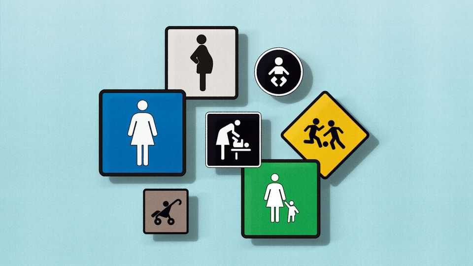
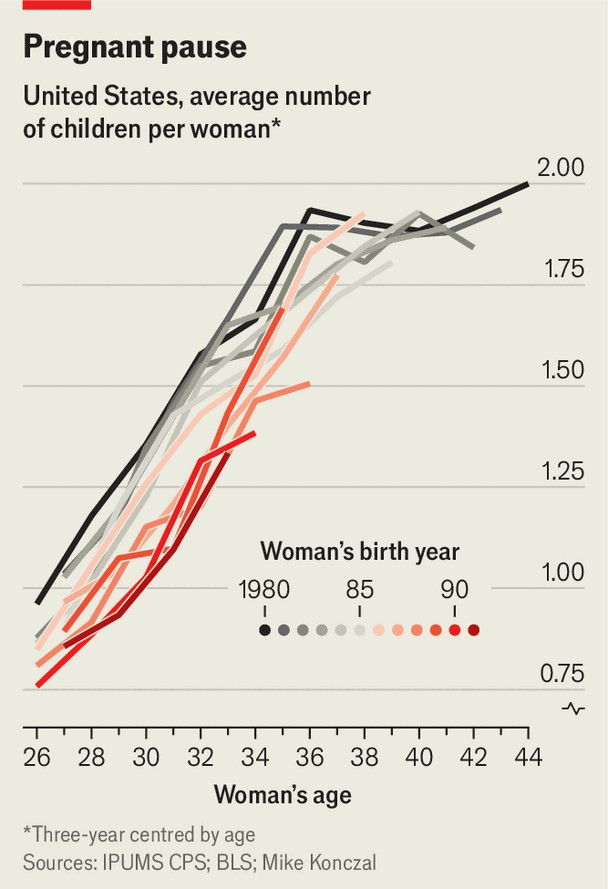

Finance & economics | Free exchange
Watch who you’re calling childless
Women in America are having as many babies over their lifetimes as they did two decades ago
December 18th 2025

IMAGINE a colony of sentient lizards, living on a distant planet. It comprises 100 females and 100 males. Each lives for 100 years. There is only one male and one female of any age (eg, one 15-year-old female, one 74-year-old male). The planet is safe and peaceful: no lizards die from disease or violence. But every year the two 100-year-olds pass away. And every year two babies are born, the fruits of an unusual reproductive cycle. At age 24 every female produces a male baby; at 26, a female. She will never have any more. The population of Planet Lizard is thus fixed at 200. Now imagine an asteroid hits Planet Lizard, altering its atmosphere and climate. At first little seems to have changed. All the lizards miraculously

survive, and they rejoice at their good fortune. But it soon becomes clear something is wrong: the two females, aged 24 and 26, who are due to produce baby lizards do not. The population shrinks to 198. The next year, the same thing happens. The colony dwindles to 196. Concern turns to panic. Prophecies of extinction are splashed across the front pages of lizard newspapers. Councils of senior lizards are convened to devise plans to revive fertility. Nothing works. Ten years after the asteroid struck, the remaining 180 lizards are resigned to their fate: ageing, death and extinction, two by two.

And then: a miracle. The two females who failed to have babies at 24 and 26 are suddenly fertile, at 34 and 36. Soon, two infants are born, to general ecstasy. The next year, the miracle is repeated. And so on. The population stabilises and (a century later) climbs back to 200. Ultimately, the asteroid changed the timing of lizard births but not their number.

This fable may seem silly, but it contains a lesson. For decades, across the West, the commonest measure of how many children women have, on average—the total fertility rate (tfr)—has been dropping. It has fallen well below the “replacement rate” (needed to keep a population constant) of 2.1. Between 2007 and 2022 America’s tfr dropped from 2.1 to just 1.6. Warnings of probable population decline, including from this newspaper, abound. Pronatalists are casting around frantically for solutions.

A shrinking (human) population could be cause for concern. It means fewer working-age people to support the old. Fiscal crisis could loom. Fewer minds would yield fewer innovative ideas. Less scope for division of labour would mean a less efficient economy.

But tfr has flaws. It measures the number of children a hypothetical woman might have in her life, based on current birth rates for women of different ages. To calculate it, you start by dividing the total number of births to a given group of women (aged, say 15-19 or 35-39) by the number of women in that group. Those group birth rates are then added up and multiplied by the number of years in each group (ie, five). The result is the number of children a woman will have if, aged 15-19, she has the same number of babies as the average woman of 15-19 is having today, then the same number at 20-24 as the average woman of 20-24 is having today, and so on.

It is almost sure to be wrong. That does not make TFR useless. It captures what demographers call “tempo”—the timing of an event, like a birth. But as a measure of “quantum”—the total number of births—it is likely to mislead. In effect it assumes that a young woman will have babies not only at the same rate as her contemporaries, but also at the same rate as women five or ten years older. That is not necessarily so.

A different measure, the completed fertility rate (CFR), captures the average number of births a woman has by the end of her child-bearing years (put at 44). America’s CFR has not fallen at all over the past two decades. In fact, according to an analysis of census data by Mike Konczal, a former Biden administration economist, it has risen slightly, from 1.91 in 2000 to 1.97 in 2024.

Back on Planet Lizard, the TFR dropped to zero overnight. After ten years, when females started having babies again, it jumped back to 2. The CFR never budged. The timing of births simply shifted, and eventually the tfr caught up with the cfr. In a doomsday scenario, in which the asteroid did render the lizards infertile, the cfr would have dropped to meet tfr.

Which scenario is playing out in the West? Many demographers, including Lyman Stone, of the Institute for Family Studies, a think-tank, point out that

tfr is typically a strong predictor of cfr. But there is evidence that women are deferring, not forgoing, childbirth. In 2000 by age 26 the average American woman had produced one child; the average 32-year-old, 1.6 children; the average 40-year-old, 1.9. In 2024 the average 26-year-old had 0.6 children and the average 32-year-old 1.2. But the average 40-year-old has still had 1.9, having delayed in her 20s and caught up in her 30s.

Does this mean, as with the lizards, that tfr will rise to meet cfr? Historical examples are suggestive. As women delayed childbearing in Sweden the tfr dropped sharply in the 1980s, before recovering in the 1990s (though it has fallen since). The cfr, at around 2, barely budged. In America the question is pertinent. The commonest ages are 33 and 34, because of a baby boom in 1990 and 1991. Women aged 34 have had, on average, 1.46 children each. As this group approaches their 40s, many more births may be on the way. As for younger women, those born in 2000 have had fewer children than those born in 1990 had had by 2015. Perhaps they will catch up—but that won’t be known for at least a decade.

To be sure, an average of just under two births per woman is still not “replacement level”. But if that truly is the long-term average, panic is scarcely justified. It would mean a gradual population decline: tricky, but much more manageable than implied by TFR. It is easy to fear the end times. But the problem may be one that humans, like our faraway lizards, never face. ■

Subscribers to The Economist can sign up to our Opinion newsletter, which brings together the best of our leaders, columns, guest essays and reader correspondence.

This article was downloaded by zlibrary from https://www.economist.com//finance-and-economics/2025/12/18/watch-who-youre- calling-childless

Science & technology

A debate is raging over the origins of an elusive cousin to modern humans Saudi Arabia wants to host the world’s cheapest data centres How dogs make teens feel less anxious Are some types of sugar healthier than others?