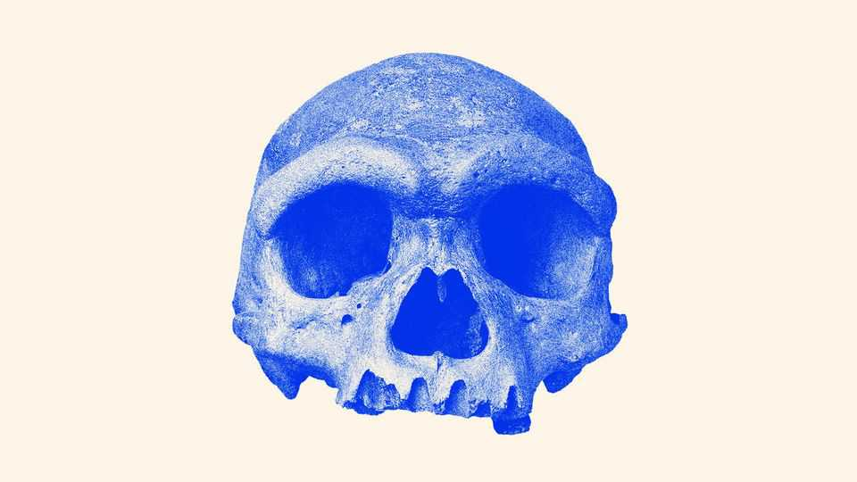

Science & technology | Palaeontology
A debate is raging over the origins of an elusive cousin to modern humans
Who were the Denisovans?
December 18th 2025

During the Japanese invasion of northern China in 1933, a man was hired to build a bridge across the Songhua river near the city of Harbin. As he was digging, he found a large, ancient cranium embedded in the muddy riverbank, which he hid in a well. It was not until his deathbed that he told his grandchildren about the fossil. Whether apocryphal or not, that was the story the skull came with when it was donated to the Geoscience Museum of Hebei in China a few years ago. Today the skull’s provenance is still the subject of debate, though on a much grander scale. Recent DNA evidence has linked the fossil to a mysterious group of hominins known as the Denisovans, about which scientists know

precious little. The skull should have helped clarify who the group was and what role they played in human evolution. Instead it has done the opposite: its appearance suggests an evolutionary history at odds with genetic data. That could place the ancestors of Homo sapiens—modern humans—outside Africa, an idea which flips everything palaeontologists think they knew about human origins on its head.

Over the course of its history H. sapiens is known to have shared Earth with another human species: the Neanderthals, a stocky type of human that made sophisticated tools, buried its dead and even made art. In 2008 another species burst onto the scene when a fingertip from a child, between 30,000 and 60,000 years old, was discovered in Denisova cave in Siberia. A team led by Svante Paabo from the Max Planck Institute in Germany extracted DNA from the finger and found it was neither Neanderthal nor sapiens.

The team declared the presence of a new group of humans: the Denisovans. Soon genetic studies found traces of Denisovan DNA in modern people, particularly across Asia, just as Neanderthal DNA shows up in present-day populations around the world.

But who were the Denisovans? Only 12 small fragments of these humans have been found—hardly enough to put a face to the name. Then in 2021 a team led by Ni Xijun, a palaeoanthropologist at the Chinese Academy of Sciences (CAS), presented the Harbin skull to the world. More than 146,000 years old, its large brain case is reminiscent of sapiens, yet other features such as its prominent eyebrow ridges do not fit the look of modern humans. The team proposed a new species: Homo longi, “Dragon Man”.

This year brought confirmation that the skull belonged to a Denisovan. In two papers published in June and July, respectively, Fu Qiaomei, a molecular geneticist also at CAS, detailed finding ancient proteins and mitochondrial DNA in the plaque on the Harbin skull’s teeth that matched a Denisovan profile. Scientists around the world were elated: here, at last, was a face.

The result was also a vindication for the Chinese fossil record, a collection of hominin fossils found in China over the past century. Long considered of little evolutionary importance by many in the West, fossils in China were

thought to consist mainly of Homo erectus, a hominin that evolved some two million years ago in Africa, before leaving the continent and dying out in south-east Asia some 110,000 years ago. In contrast, many Chinese researchers believed that these erectus fossils found in China were the ancestors of modern Chinese, despite ample evidence that modern humans stem mostly from Africa.

Christopher Bae, a palaeoanthropologist at the University of Hawai’i at Manoa, says it is only in the past two decades that the world has begun to look at the fossils with new eyes. Longi is just one of several new species recently proposed based on Chinese skulls. (In fact Dr Bae and Wu Xiujie from CAS suggested that some of these skulls belonged to a new species they called Homo juluensis (“Big-Headed People”) in 2024; they also assigned the Denisovans to that new species.)

At the same time, ancient DNA and protein research within China has advanced. Dr Fu’s dogged pursuit of DNA samples from the Harbin skull’s dental plaque, for example, showed it was possible to obtain usable samples from even the most minuscule original material. That kind of work could bring even more Chinese fossils, otherwise considered too old or poorly preserved because of the heat and humidity in some parts of the country, within reach of molecular science.

In the months since Dr Fu’s work was published, however, a conundrum has cropped up. Nuclear genomes extracted from Denisovans show that they and Neanderthals formed a single lineage which split from modern humans before splitting from each other (see first diagram)—a finding that was reinforced when Dr Paabo’s team, led by his colleague Janet Kelso, posted a preprint with a new high-quality genome from a Denisovan tooth on October 20th.

The lineage looks different when scientists study the appearance of the Harbin skull, and others that have since been designated longi, however. Dr Ni and his collaborator, Chris Stringer from the Natural History Museum in Britain, reckon that longi split from the ancestors of sapiens only after Neanderthals went their own way (see second diagram).

The discrepancy creates a mystery. Follow the DNA and the sapiens lineage seems to diverge from an ancestral group of Neanderthals and Denisovans, sometimes called the Neandersovans, between 500,000 and 800,000 years ago. This group would have spread out of Africa to Eurasia, from where the ancestors of the Neanderthals eventually moved westward into Europe and the ancestors of the Denisovans went east to Asia.

According to Dr Kelso’s new genome, at least three separate Denisovan groups then interbred with sapiens coming from Africa some 60,000 years ago. Comparing the genetics of the three Denisovan populations with that of modern populations, it suggests that groups of sapiens walked through Asia at different times and along different routes, thus differentially encountering the three Denisovan populations. The ancestors of modern Oceanians, including indigenous Australians, came first, with the ancestors of modern- day east and south Asians coming later.

Follow the morphology instead—meaning the shape of physical features such as teeth, brain cases, foreheads and eyebrows—and an entirely different story emerges. It suggests that the ancestors of sapiens and longi (including, in Dr Ni’s and Dr Stringer’s telling, the people who would become the Denisovans) remained one group and probably lived in Europe or west Asia more than a million years ago.

They base this on the Harbin skull and on a reconstruction of a one-million- year-old crushed Chinese skull called Yunxian 2, an analysis which they published in September in Science. Dr Stringer says that it is possible that the early Denisovans stayed in Asia while sapiens’s ancestors migrated back into Africa to continue most of their evolution before some of them left again 60,000 years ago. In other words, the origin of the sapiens lineage could have arisen outside Africa—an astonishing twist in the history of modern humans.

Both divergence stories cannot be true. Geneticists such as Dr Paabo maintain that genomics is the only way to determine when branches split off from one another. John Hawks, a palaeoanthropologist at the University of Wisconsin-Madison, agrees that DNA has a certain credibility that morphology does not. But, at the same time, the current DNA evidence comes from only a small set of samples, which do not reflect all populations

that lived at the time. “So it can be good to keep an open mind even when the evidence seems very convincing,” he says.

Dr Hawks has a fix for the paradox. China is littered with fossils of old erectus-like people. It is possible, Dr Hawks argues, that those erectus-like humans were still around when the Denisovans arrived. If the Denisovans interbred with the Asian erectus, that could have made the resulting Denisovans look older than they actually were.

The genetics also allows for another possibility: a paper from 2020 found evidence that Denisovans interbred with a very old “superarchaic” lineage that had split from their own ancestors more than 1.2m years earlier. Alternatively, Denisovans might have retained erectus-like features while sapiens evolved differently.

The evidence is complex but scientists are optimistic that they will eventually understand the Denisovans and their history. Dr Stringer says more fossils must be out there, either of longi or their ancestors. Geneticists also feel confident that they will become better and better at extracting DNA and proteins from the fossils they already have. Both may prove crucial. After all, a single portrait is not enough to represent a whole species. A photo album will be needed, if not several of them. ■

Curious about the world? To enjoy our mind-expanding science coverage, sign up to Simply Science, our weekly subscriber-only newsletter.

This article was downloaded by zlibrary from https://www.economist.com//science-and-technology/2025/12/17/a-debate-is-raging- over-the-origins-of-an-elusive-cousin-to-modern-humans