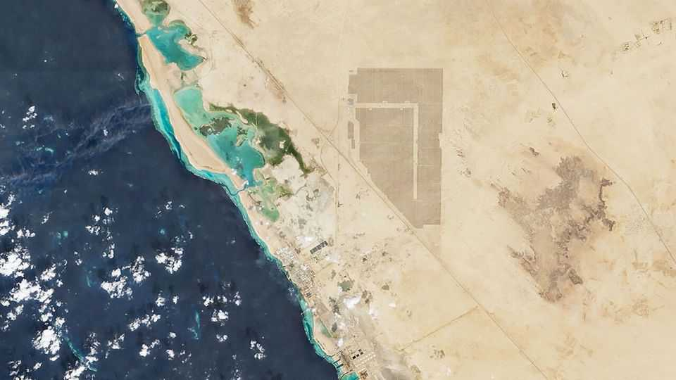

Science & technology | Chips in the desert
Saudi Arabia wants to host the world’s cheapest data centres
With plentiful land and electricity on hand, the kingdom thinks it has found an edge
December 18th 2025

Two hours south of Jeddah, on Saudi Arabia’s Red Sea coast, the Al Shuaiba solar farm blankets 50 square kilometres of desert. The first phase of the project, started in 2024, produces 600 megawatts of electricity at just 3.9 Saudi halalas (just over a cent) per kilowatt-hour, nearly a twentieth of the cost of generation at Britain’s planned Hinkley Point C nuclear power plant. Saudi Arabia’s plan for all this cheap electricity is to power enormous data centres for artificial intelligence (AI). The cost of inference, the process of querying and getting answers from an AI system, is made up of two things—the fixed cost of computer hardware,

and the ongoing cost of the electricity to run it. Cutting corners on hardware is a false economy, since the newest and most expensive chips are usually more efficient at running the best algorithms. Offering cheaper AI systems, therefore, comes down to using cheaper electricity. On that, Saudi Arabia reckons it has the edge.

This strategy became a national priority in May and is backed by the state’s defacto ruler, Muhammad bin Salman, known as MBS. A new company, Humain, has centralised the efforts under the leadership of Tareq Amin, boss of Aramco Digital, the tech arm of the state-owned energy company. “We hit the ground sprinting, not just walking,” Mr Amin says.

Humain’s mission is wrapped up in Saudi Arabia’s wider “Vision 2030” strategy, a goal for pivoting the country away from its dependence on extracting fossil fuels. Executing the overall vision within the constraint available is “the number one risk”, says Mr Amin. “We have no choice. We have to do this, there is no plan B.” Born in Jordan, Mr Amin has taken on big challenges before, having worked on infrastructure projects for Reliance Jio, an Indian telecoms company, and Rakuten, a Japanese conglomerate.

The conditions seem favourable. Data centres need power to run on, land to sit on and chips to fill them. The first is Saudi Arabia’s strength. The second, too, is easy to obtain. The country is large and sparsely populated, and with government backing, the permits to build are easy to obtain. In its first two weeks, Mr Amin says, Humain found more than 200 potential sites with access to a combined 15.6 gigawatts of energy supply, including four large plots situated next to sufficient solar power.

Chips have been trickier. The state’s AI data-centre journey began with a deal between Aramco Digital and Groq, an AI chip company (not the xAI model with a similar name), obtaining $1.5bn of the company’s semiconductors in February. Those chips are specifically designed for inference workloads, which has made them unappealing for many large AI labs, which value flexibility between training and running models. But these chips are well suited to reducing the cost of using models by making it cheaper to export tokens, the fundamental unit of AI use.

A token is just a fragment of a word. Most commercial AI products charge a fee for every token used in a query ($1.25 per million for OpenAI’s GPT-5, for instance), and a separate fee for every token produced in the output ($10 per million). Humain’s offer to AI companies is simple: run those AI models on Saudi electricity, and produce the output tokens for much less than customers are billed. With cheap power and efficient chips, Humain was able to sell output tokens for around half market price, Mr Amin says.

In November Humain secured the most cutting-edge chips. A visit to America by MBS—also the chair of Humain, and whose face sits at the top of its website—included a chummy meeting with Donald Trump, which unlocked a licence to import 35,000 top-flight chips from Nvidia, costing around $1bn. That is not enough to fill more than a single  data centre for the types of big AI companies Humain wants to provide services to, but it represents a stark reversal on earlier American attempts to keep the most valuable AI computing hardware available only to the country’s closest allies. Shortly before, AirTrunk, a data-centre builder, had signed a $3bn deal with Humain to build a data-centre campus in the country.

Saudi Arabia is not only making data centres, it is also using them. ALLAM, an Arabic-language AI model built with the Saudi Data & AI Authority (SDAIA), another wing of the state, has been provided to civil servants. Humain has also signed deals with firms like Adobe to have this model incorporated in their applications.

Such partnerships suggest Saudi Arabia is on the right track to seeding a viable AI sector, says Derar Saifan, a partner at PwC, a consultancy. He expects to see the country break into the top five of global AI hubs in the next five to seven years.

The early successes have raised Humain’s ambition further. Mr Amin now talks not only of exporting tokens or training models, but of building a “world-first AI operating system for the enterprise”, a direct competitor to Microsoft Windows where human resources, finance and legal departments are replaced by AI agents and the interface is built around prompting chatbots rather than clicking on icons. It’s a bold, potentially quixotic, vision. “I cannot slip my timelines, and that’s what keeps me awake,” says Mr Amin. “I’m not underestimating the task.” ■

Curious about the world? To enjoy our mind-expanding science coverage, sign up to Simply Science, our weekly subscriber-only newsletter.

This article was downloaded by zlibrary from https://www.economist.com//science-and-technology/2025/12/17/saudi-arabia-wants-to- host-the-worlds-cheapest-data-centres