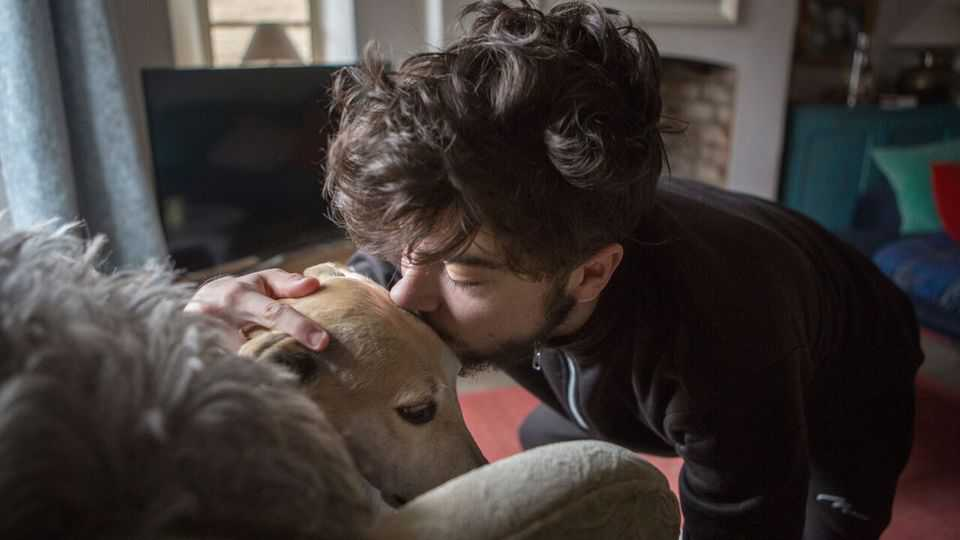

Science & technology | Paws and effect
How dogs make teens feel less anxious
The beneficial relationship is much more than skin deep
December 18th 2025

Dogs have been a part of human society for over 20,000 years. Whereas they first served people by supporting hunters, it did not take long before they became part of the home. Companion dogs may not help secure food, but for years evidence has mounted that they help diminish anxiety and improve sociality. Research led by Kikusui Takefumi at Azabu University in Japan, published recently in iScience, explains what might be going on. It reveals that the microbes found in the guts of dog owners are notably different from those who do not own dogs and that this is, at least partially, responsible for the behavioural differences.

The brain does not exist in isolation. The microbes found elsewhere, particularly in the gut, produce chemical compounds that influence how the brain works. Those microbes are heavily affected by diet, but are also shaped by factors like stress, pollutants and exercise. Dr Kikusui knew from his own research that having a dog influenced the microbiota of the human gut, too. With this in mind, he wondered if microbe transfer from dogs might be helping confer psychological benefits on owners. Keen to find out, he set up an experiment with 343 participants in Tokyo.

Dr Kikusui specifically worked with teenagers. His reason for this was because adolescence is a crucial period of brain development, when social interactions often have lasting mental effects; if microbes from dogs were reducing teen anxiety and increasing teen sociality, then this would yield long-term benefits. He and his colleagues therefore psychologically analysed 96 teens who were dog owners and 247 teens who were not. As expected, dog owners suffered from fewer social problems. More specifically, they showed reduced aggression, diminished delinquent behaviour and less social withdrawal.

Dr Kikusui and his colleagues then collected saliva samples from the participants and noted that several variants of Streptococcus and Prevotella 7 bacteria were significantly more abundant in samples from dog owners. They further found that participants within whom these key microbe variants were rare also tended to have more delinquent behaviours. This finding suggested that microbes, added to the human gut by dogs, may be influencing the brains of their owners in healthy ways.

The ideal next step for Dr Kikusui would have been to infuse dog microbes into the bodies of non-dog-owning teens. Since that is an ethically grey area he worked instead with mice. He cultured microbe samples from both groups of teens in the lab and fed them to 24 mice. After six weeks, he monitored them as they were put through a series of murine sociality tests, which included examinations of how long they spent sniffing unfamiliar mice and how close they would get to a distressed mouse that had previously been their cage-mate.

Remarkably, mice carrying the microbes of teen dog owners spent up to 14 seconds sniffing unfamiliar mice whereas mice carrying the microbes of

teens without dogs spent a paltry six seconds doing so. A similar result played out with the distressed mouse test—mice with the microbes of teen dog owners often spent more than 21 seconds checking on the distressed mouse while the other mice never spent more than three seconds doing so. Dr Kikusui admits that making direct comparisons between murine and human behaviour is not ideal, but his findings nonetheless indicate that the microbiotic changes brought about by dog ownership influence the brain. If the conclusions hold, it seems that the path to a healthier mind may begin not with introspection, but with a nuzzle and a few licks. ■

Curious about the world? To enjoy our mind-expanding science coverage, sign up to Simply Science, our weekly subscriber-only newsletter.

This article was downloaded by zlibrary from https://www.economist.com//science-and-technology/2025/12/17/how-dogs-make-teens- feel-less-anxious