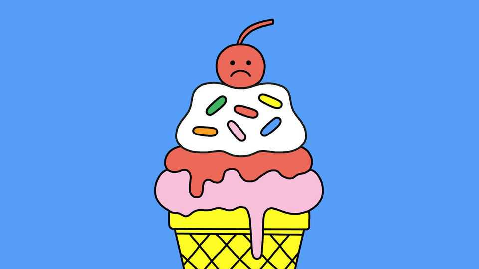

Science & technology | Well informed
Are some types of sugar healthier than others?
We weigh up the options
December 18th 2025

This is the time of year for mulled wine, sweet brandy and puddings drenched in syrup. Some people may tell you that you can limit the damage by being picky about which type of sugar you eat. Avoid refined white sugar, they will say, and search out the healthier “natural” stuff instead, such as raw sugar or honey. Alas, the advice is misplaced—the type of sugar you eat won’t make any difference to your health. What could, though, is how you eat it. More than 250 different types of sugar can appear on food labels. But whether you see sugar (eg, brown, coconut, cane or crystal), nectar or syrup (eg, corn, maple, agave or grape), their sweetness usually comes from the

same two main molecules: fructose and glucose. When they are bound together in equal proportions, they form sucrose—familiar plain white sugar.

Glucose is the body’s main source of fuel, used for metabolism within cells. Consuming lots at once will cause a spike of it in your blood, which is then followed by a sharp dip that will make you hungry (cue snacking). Over time, frequent spikes can also impair blood-glucose control and lead to diabetes.

Fructose, found mainly in fruits and honey, is much sweeter and does not cause spikes because it first has to be processed into glucose, and other compounds, inside the intestine and the liver. Excess fructose, though, is turned into fat by the liver and, in some people who cannot deal with this sugar well, lots of unabsorbed fructose may linger in the gut, feeding harmful bacteria and causing bloating and other problems. So a useful strategy, when consuming sugar in any form, is to eat it slowly.

Another tip is to avoid drinking your sugar. Having a sugary drink is worse than eating the same amount of sugar as part of food, simply because drinking allows more sugar to be gulped down faster. Fruit juice is best avoided—mincing and separating the fruit sugar from the pulp leaves behind a cocktail of glucose and fructose that is almost identical to plain white sugar. A glass of orange juice typically has nearly as much sugar as a glass of Coca-Cola of the same size.

By contrast, you would struggle to eat three oranges in one sitting (the number you would need for a glass of orange juice), due to the fibre of the pulp. It helps that both fructose and glucose are absorbed more slowly when they are consumed with fibre, or alongside protein or fat (cake with nuts, say). All these macronutrients interfere with the sugar’s access to the intestinal wall and also make you feel fuller for longer. Chewing also slows down the speed at which sugars reach the stomach.

Other ingredients in “natural” sugars are unlikely to make them any healthier. Date sugar, which is just ground dried dates, has some fibre; in some brands, it makes up around 10% of the weight, though this is too little to affect the speed of sugar absorption by the gut. Honey has some minerals

and antioxidants but you would need to eat several jars of it to get the same amounts you would get from a cup of blueberries.

Unless your Christmas hamper is a fruit basket, the notion that any of its goodies is healthier than others, sugarwise, is sadly untrue. But there are ways to be smart about your sugar intake—eat slowly, in the form of cakes, ideally with lots of nuts. Happy holidays. ■

After a free, evidence-based guide to health and wellness? Sign up to our weekly Well Informed newsletter.

This article was downloaded by zlibrary from https://www.economist.com//science-and-technology/2025/12/12/are-some-types-of- sugar-healthier-than-others

Culture

What goes into raising the turkey on your holiday table And 2025’s winners are…Timothée Chalamet and Sydney Sweeney The best podcasts of 2025