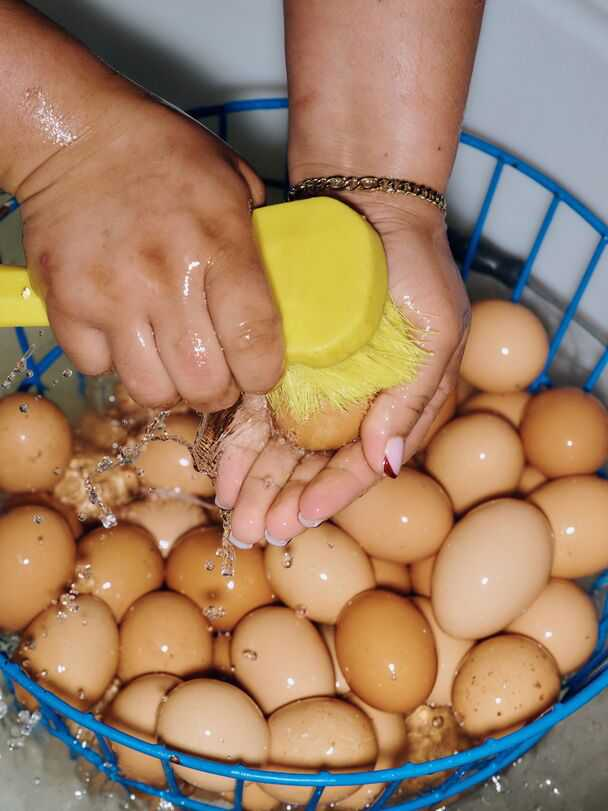
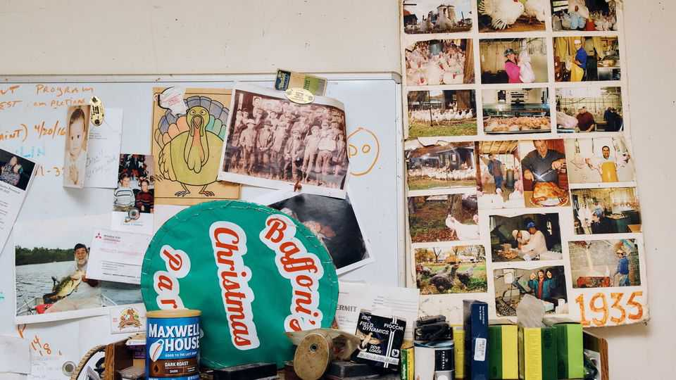
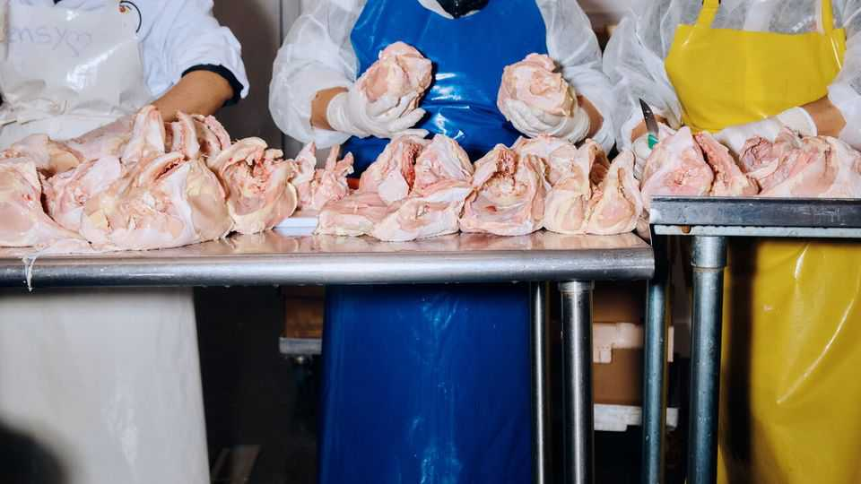
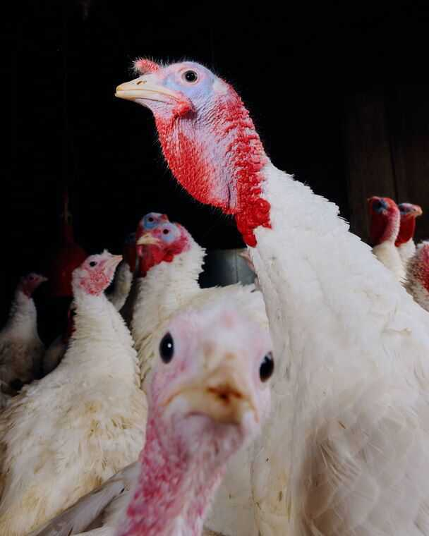
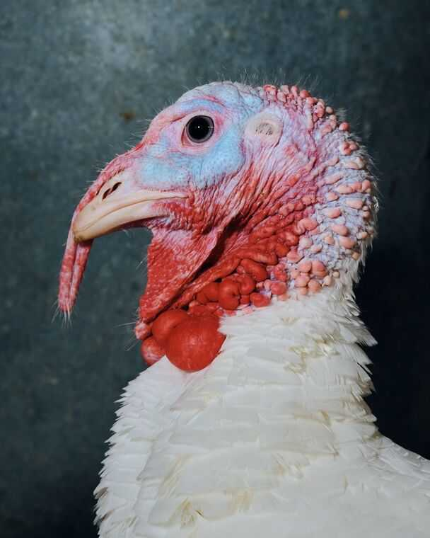
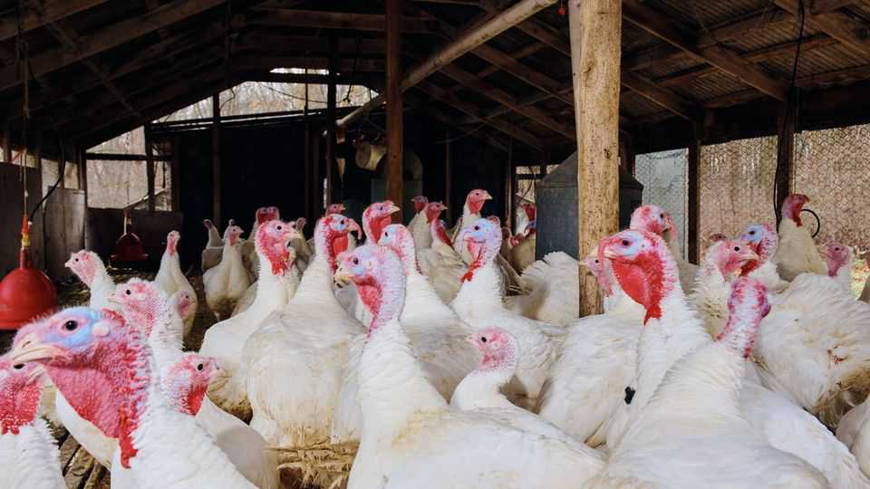
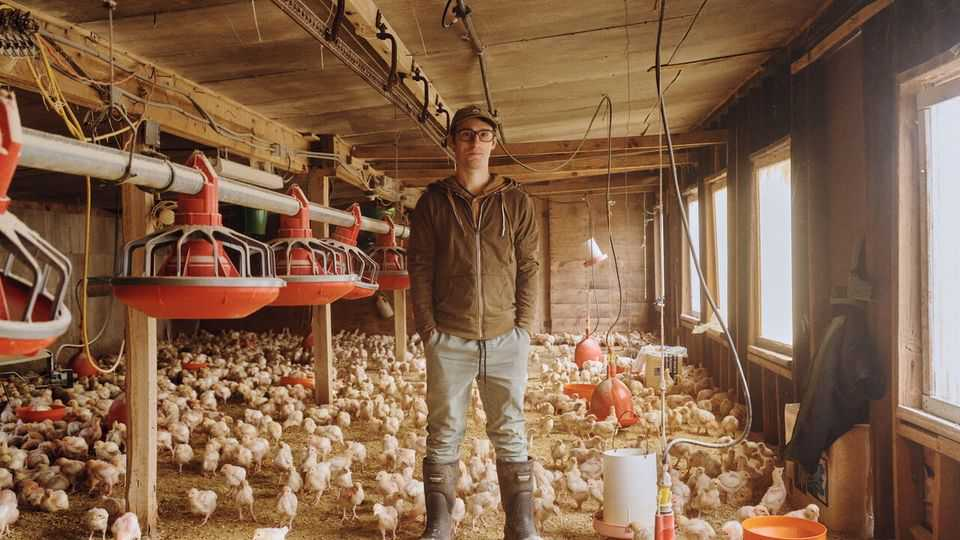
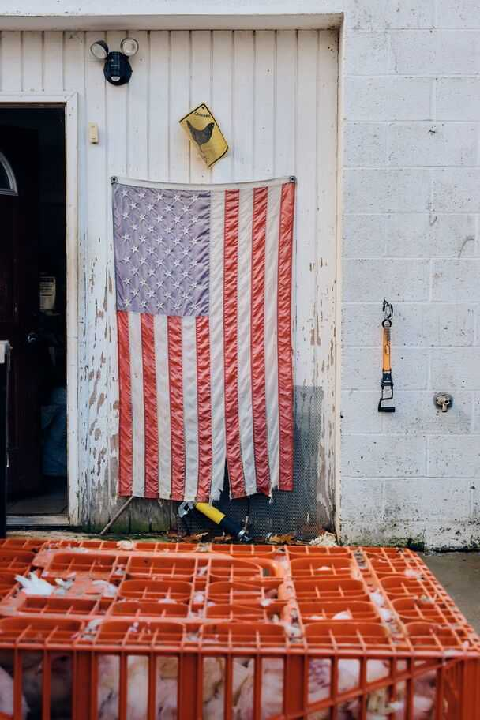

Culture | Christmas food
What goes into raising the turkey on your holiday table
Producing a delicious bird gobbles up time and effort. You cannot just wing it
December 18th 2025
THE FIRST thing to know about domesticated turkeys is that they do not really go “gobble, gobble”. Children’s books lie. Instead, turkeys emit either sharp seal-like barks or a strange trilling coo that sounds a bit like a basso pigeon. The second thing to know is that they have no survival instinct. Wild turkeys have a shrewd skittishness, as any hunter knows. Farmed turkeys, however, will walk right up to you and peck at your shoes and hands. That is because the person entering their enclosure is usually bringing food. Yet that is true for chickens, too, and they have the good sense to run away first. After all, there will come a time when their keeper does not bring food, but takes them to the slaughterhouse to become it. That time is now: millions of the birds will be devoured in the coming days. Families in France, Belgium and Switzerland will serve dinde de Noël as their centrepiece. Americans, having just eaten 46m turkeys for Thanksgiving, will consume around 22m at Christmas. Britons will polish off 10m. Turkeys became a Christmas staple among Britain’s upper class not long after the birds’ introduction from the new world in the 16th century; the turkey overtook the goose to become the most popular bird about a century ago.

Reams of advice and recipes emerge every year to help nervous cooks get their turkeys from fridge to table in a delicious manner. (The scourge of the cook is dryness.) Far less attention is paid to the long journey from farm to fridge. What, exactly, does the process of raising turkeys involve?

It may end badly for the bird but it keeps hundreds of small farmers in business. Baffoni’s Poultry Farm has been at it for almost a century. Giuseppe Baffoni, who came to America from the Abruzzo region of Italy, started with chickens in what was then rural Rhode Island. Today Adam, Giuseppe’s great-grandson, oversees the farm’s operations, along with his cousin, Zach, who runs the farm’s shop. Other family members help out with administrative work, wholesale operations and accounting. The next generation waits in the wings: Adam has a three-year-old daughter who loves feeding the turkeys.

Giuseppe and his son built the coops that house 1,600 turkeys and 25,000 chickens. The indoor coops are long and low: the birds have plenty of room to run but tall folk have to stoop once inside. In early December most of the turkeys strut around watchfully in two fenced-in, outdoor porches. “They like the cold,” explains Adam, “and they’re prone to diseases if the air is stagnant.”

Like most turkey farms, Baffoni’s raises broad-breasted whites, the most common domesticated breed. They grow relatively quickly, convert feed to meat efficiently, and look lovely and full on the table, though white meat is the least tasty part of the bird. Heritage breeds are leaner and fuller- flavoured—unlike whites, they can fly and reproduce on their own—but far more expensive and trickier to cook. (For purely gustatory reasons your correspondent would like someone to breed a turkey that is just one long spine and digestive tract with a dozen wings on either side—head, feet and feathers optional.)

In May and June, two local hatcheries send the farm a batch of 300 day-old poults every fortnight. The staggered arrivals mean they can offer various sizes for Thanksgiving and Christmas, from eight-pound (3.6kg) birds for a small celebration, up to 30-pounders (13.6kg). They can reach up to 54 pounds (24.5kg), though at that size they are probably destined to become ground or sliced meat.

When a bird’s number is up, its throat is cut. It is put into a cone to bleed, before being plunged into scalding water. The turkey goes into an agitator that removes most of the now-loosened feathers, then the bird is hung above a steel trough. An assembly line of workers sets about eviscerating it: removing the heads and feet, pulling out the pinfeathers and, if needed, cutting it into parts. The workers use slim, sharp knives which can slice through bone.

On an average day in the run-up to Thanksgiving, Baffoni’s slaughters and processes around 300 turkeys and 2,000 chickens. (Slightly fewer are required for Christmas.) That may sound like a lot, but a big farm can do around 4,700 turkeys and 8,400 chickens per hour.

Baffoni’s has the only federally inspected slaughterhouse for miles, which means every morning, crates holding live chickens from smaller nearby farms are stacked outside, cooing and clacking their nails nervously on the plastic. This provides an extra revenue stream, which the farm needs. For generations, Adam explains, chickens and eggs kept the farm going but the farm did not go into the black until the year’s end. Turkeys put them there. “Everyone came to the farm for their turkey,” Adam recalls. “The week before Thanksgiving sometimes we’d come help out because my dad, his cousins, my grandfather: they’d be here until nine or ten pm, getting turkeys killed, prepped, bagged, chilled, and ready for orders.”

Yet for years “it wasn’t cool to be a local farm”, Adam says. “When my dad was young, grocery stores were the cool thing: so clean and convenient.” Now the pendulum has swung back: urbanites love the idea of knowing the farmer who produced their turkeys.

But surviving at Baffoni’s size is tough. They sell turkeys for $5.19 per pound, but you have to come to the farm to pick them up. Butterball, a large American brand, sells its frozen in every supermarket for as little as $0.97 per pound. The work is back-breaking, unglamorous and relentless. Adam left to go to college and work in restaurants in Providence, the state capital, but found his way back after the pandemic.

Today the farm occupies around 30 hectares, but most of that is woods. Johnston, just a few miles outside Providence, is no longer rural; the farm is now tucked among streets of single-storey suburban homes. Adam explains that when land adjacent to the farm comes up for sale, the family tends to buy it to extend their buffer, the better to prevent the unwitting from accidentally buying a home too close to the sounds and smells (sweet mother of God, the smells) of an active poultry farm.

“What we have here,” says Adam, with no small amount of pride, “has been built up over a long time by generations of people who’ve shared the same vision for what this place should be.” He says his parents never pressed him to join the family business and he found it easy to return. Asked if he wants to work with his daughter one day, he is philosophical. “It’s important to me that I keep it going long enough so that’s an option. [But] I want to introduce her to everything in the world.”

Turkey farms may be unromantic, but they play a vital role in cherished traditions. To many the bird embodies the shared merriment of the holidays. “The Christmas Song”—sung most famously by Nat King Cole—observes that “Everybody knows a turkey and some mistletoe/Help to make the season bright.” In “A Christmas Carol” Ebenezer Scrooge’s redemption is

complete when he gives an enormous turkey to Bob Cratchit, his long- suffering clerk. Talk about clucking festive. ■

This article was downloaded by zlibrary from https://www.economist.com//interactive/culture/2025/12/18/what-goes-into-raising- the-turkey-on-your-holiday-table