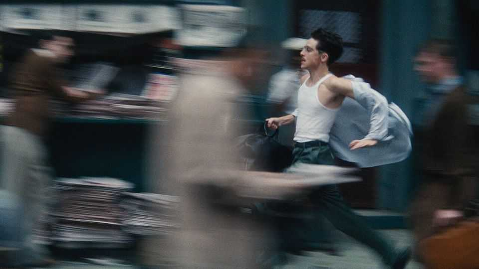

Culture | Back Story
And 2025’s winners are…Timothée Chalamet and Sydney Sweeney
“Marty Supreme” and “The Housemaid” boast the star power that cinema needs
December 18th 2025

Who won 2025? In world affairs, this is a tricky question. But in Hollywood, the answer is simpler. The year’s champions are Timothée Chalamet and Sydney Sweeney. Their victory matters, not just for them and their agents but for the idea of stardom, cinema’s prospects and even, in a small way, the future of the human race. Both appear in glitzy films coming out over Christmas. In “Marty Supreme”, set in the 1950s, Mr Chalamet is a table-tennis ace and hustler with big dreams and a bigger mouth. His character is in frenzied pursuit of his ambitions—and in flight from his responsibilities. In a screwball caper

featuring assorted heists and animals, he is on the run from so many foes that you sometimes lose track of who is chasing him.

Skating between charming and obnoxious, Mr Chalamet’s manic turn lays bare the essence of the sports flick: what matters is not which game the hero plays, the film shows, but his grit and yearning and how much you care. It ranks with his enigmatic performance as Bob Dylan in “A Complete Unknown”, which was in cinemas at the start of the year. He may get an Oscar for this one.

Meanwhile Ms Sweeney caused a stir with an advert for a clothing firm. She and the punning strapline—“Sydney Sweeney has great jeans”—ignited rows about eugenics, the objectification of women, whether cleavage is inherently reactionary and whether Ms Sweeney had bazookaed wokeness. With his comic talent and svelte masculinity, Mr Chalamet is a latter-day heir to Cary Grant; for her part Ms Sweeney excites comparisons to Marilyn Monroe.

She made some movies, too. The set-up of “The Housemaid”, a twisty new thriller (pictured), is that the jealous wife of a hunky man does the obvious thing and hires Ms Sweeney as a live-in maid. The luxurious home turns out —surprise!—to be a nest of mysteries. (Such as: after an impromptu hotel stay, what do the amorous characters do about toothpaste?) “Christy”, her other recent release, disappointed at the box office, but she earned acclaim as a female boxer who battles prejudice and an abusive husband.

Mr Chalamet is the better actor; Ms Sweeney’s default expression is a vaguely peeved disdain. But her screen charisma means that, like him, she has become a bona fide movie star. Real stars lend their popularity to films, rather than the other way round. Fans watch their titles in two ways at once: they follow the story and at the same time fit the star’s role into the longer arc of their persona and career.

As well as talent and ambition, maintaining this status involves a delicate tango of intimacy and distance that is ever tougher to pull off. The star is the subject of fascination which, to retain their mystique, they must frustrate, shaping a public legend but guarding their private self. The trick, as Mr Chalamet and Ms Sweeney have both clocked, is to feed the publicity beast but never sate it.

In 2025 Mr Chalamet has kept up a nice line in sly stunts. He rocked up to a premiere on an e-bike; in a funny video of a spoof marketing brainstorm, he suggests painting the Taj Mahal orange, the hero’s colour in “Marty Supreme”. An interviewer asked Ms Sweeney about the advert furore. Her aloof response was a withering stare that became a meme. (“People had a habit of looking at me”, Monroe said, “as if I were some kind of a mirror instead of a person.” Ms Sweeney is discovering what she meant.)

It is rare to achieve this standing in today’s fractured attention economy. Compared with the silver screen, streaming a film on your sofa, as more and more viewers do, dims the stars’ aura. In any case action franchises are now crowding out character-driven star vehicles. Contemporary actors in the old- school-star category—Tom Cruise, Tom Hanks, Leonardo DiCaprio— mostly ascended to it in the pre-streaming age.

If it is hard for stardom to flourish without cinema, however, the reverse is doubly true. Big-screen storytelling is struggling; without the draw of fresh stars, it may be doomed. Moreover showbiz, and in particular the actors who work in it, face a new threat from artificial intelligence. There are worries that holograms and clones may oust humans in some entertainment.

But AI actors, no matter how plausible, will never be true stars. No one will ever be curious about their love lives or views, as they are of Mr Chalamet’s and Ms Sweeney’s. This is the ultimate prize of their winning year. Stars like them are the best hope for keeping people in cinema seats—and on cinema screens.■

For more on the latest books, films, TV shows, albums and controversies, sign up to Plot Twist, our weekly subscriber-only newsletter

This article was downloaded by zlibrary from https://www.economist.com//culture/2025/12/16/and-2025s-winners-aretimothee- chalamet-and-sydney-sweeney