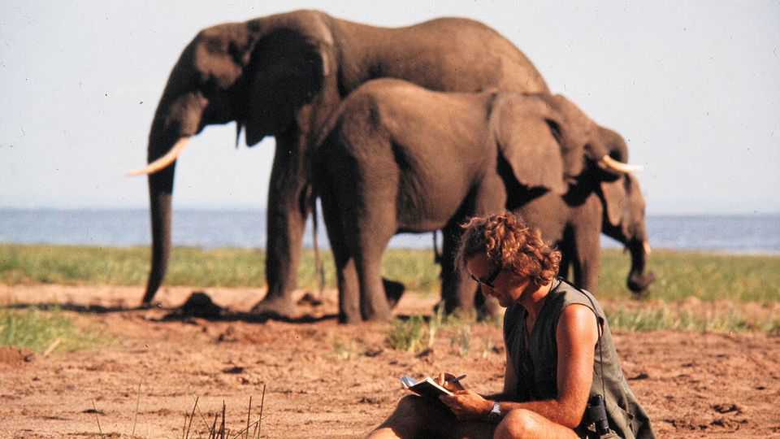
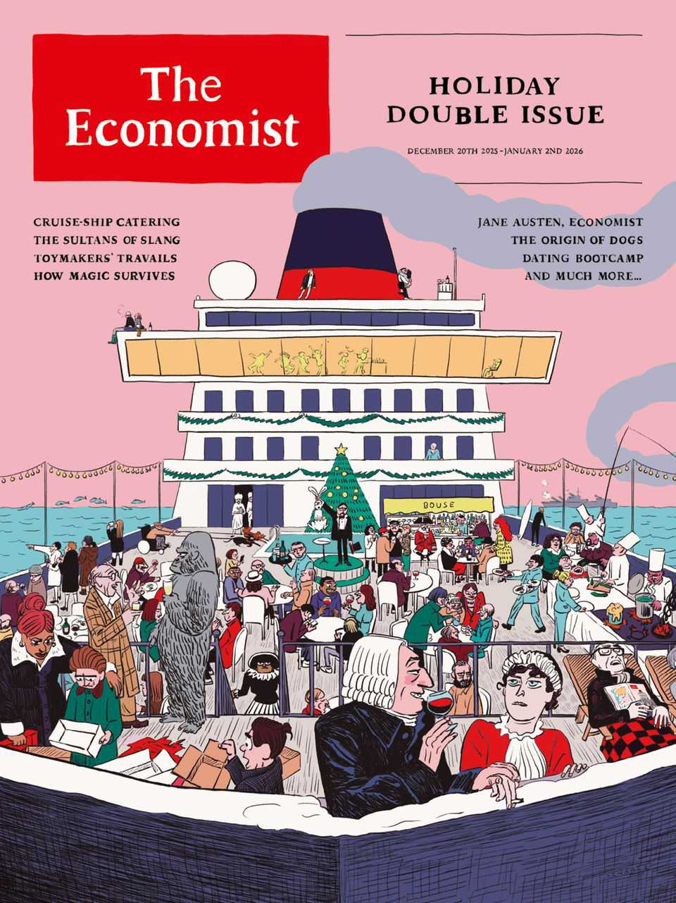

Obituary | Flying with elephants
Iain Douglas-Hamilton fought to save the beasts he loved
The campaigning zoologist died on December 8th, aged 83
December 18th 2025

FEW ANIMALS scare full-grown African elephants. But bees are among them. So it was to bees that Iain Douglas-Hamilton looked when he sought to draw a line between the pachyderms’ domain and humanity’s. The farmers of Samburu, the Kenyan county where his research was based, bore elephants no ill will as long as the beasts kept out of their smallholdings. But the elephants did not know that. Bee fences—hives established at regular intervals on a farm’s perimeter—not only deterred the interlopers, they also yielded a mellifluous profit. Irony of ironies, then, that it was bees which did for him. He was attacked by a swarm of them in February 2023. They almost killed him there and then,

not least because he threw himself over his wife, Oria, to shield her from the hymenopteran assault. As tough as the animals he studied, he survived. But he never truly recovered from the long shadow of anaphylaxis.

It is said that the English conquered the British empire but the Scots ran it. So it was no surprise that Dr Douglas-Hamilton, grandson of a Scottish duke and son of a second-world-war Spitfire pilot, should pitch up in Tanzania in 1965. He came, however, not to rule (Tanzania was now independent) but to help. At the time he was reading zoology at Oxford under the watchful eye of Niko Tinbergen, one of the founders of ethology. The ethological approach was based on one big radical idea: to look at what creatures actually got up to in their own natural worlds, rather than examining their actions in forensic detail in the controlled conditions of a box that dished out rewards and punishments. He was happy to leave that to the so-called behaviourists across the pond, at Harvard under B.F. Skinner.

Those were days of zoological opportunity, when the future alpha males and females of the field were starting their careers: Jane Goodall (chimpanzees); Dian Fossey (gorillas); George Schaller (lions); Hans Kruuk (hyenas). In that scramble for species, though, elephants were as yet unclaimed. He made them his own, hunting them not as his forebears would have done, with rifles, but with field-glasses and a notebook.

Gradually he got to know his quarry as individuals, each with their own particular quirks, in a way that Skinner and his acolytes could not have conceived of doing with their lab rats and pigeons. Anwar, a young male obsessed with cars. Frank, a bull who loved mountaineering. Monsoon, another mountaineer, who liked to take her calves along for the ride. Alpine, a female who often adopted orphans. And fearsome Boadicea, who forced him to shin up trees and tried to kill him.

But it was when he added a plane (a Cessna, rather than a Spitfire) to his inventory that things really took off. Flying low and slow—a risky combination that allowed him to see and log every individual, from the smallest calf to the biggest bull—and following the transect approach pioneered by earlier ecologists to quarter the ground, he was able to count an area’s population with precision. Applied across Africa, this method showed

just how much damage ivory poachers were doing. And thus his true life’s work began. Saving the beasts became as crucial as studying them.

The numbers were horrifying. The censuses showed Africa’s elephant population crashing from 1.3m in 1979 to 600,000 in 1989. He became their advocate. Several times in the 1970s and 1980s he testified to America’s Congress, doing much to assist the passing, in 1988, of the African Elephant Conservation Act. In testimony in 2012 he described vividly how a band of poachers linked to rebels in Darfur had travelled over 1,000 miles on horseback and mass-acred more than 400 elephants in Cameroon.

Meanwhile, back in Africa, the fall of Idi Amin gave him the chance to do more than just lobby. Uganda’s tyrant had not only made made his people suffer, but the country’s wildlife too. In 1980, after Amin’s flight, Dr Douglas-Hamilton was invited to become honorary chief warden for the country’s three national parks. There he masterminded the creation of air and ground patrols to fight poaching gangs, many of which were operating from neighbouring Sudan. The poachers, who toted semi-automatic weapons, sometimes responded by trying to shoot down his plane. But he nonetheless laid the ground for a rise in the country’s elephant population from a few hundred to several thousand.

In 1993, to institutionalise his efforts, he and Oria founded Save the Elephants, an organisation intended to do just that. And in many places, not just in Uganda, it worked. In Botswana, Namibia and South Africa, and later in Kenya and Tanzania, populations rose. Even Angola and Zimbabwe showed signs of things picking up. Success, then; but qualified, for the poachers moved on to fresh pastures—or, rather, forests. Africa’s forest elephants, recognised as a distinct species since 2021, became the animals most in the cross-hairs. In the 31 years before recognition their population was reckoned to have fallen by 86%, and it is still declining. By comparison, savannah elephants were down 60% in 50 years: horrible, but not quite as bad.

Between the two species, about 400,000 African elephants remain. The research side of Save the Elephants, operating from its base in Samburu National Reserve, keeps tabs on 1,000 of them, often courtesy of satellite-

monitored radio collars, but sometimes still using Dr Douglas-Hamilton’s simpler gear of field-glasses, notebooks and the trusty Cessna.

As a battered Toyota Hilux, attacked by an enraged bull and now on display at the base, attests, the elephants did not always appreciate these efforts. His own Land Rover was three times punctured by tusks. But the gratitude of his charges was never his motive. And the bees? As of last year, more than 14,000 hives had been deployed by farmers in Africa and Asia eager to make themselves elephant-free. ■

This article was downloaded by zlibrary from https://www.economist.com//obituary/2025/12/18/iain-douglas-hamilton-fought-to- save-the-beasts-he-loved

Table of Contents

The world this week The world this year 2025 The weekly cartoon Leaders China proved its strengths in 2025—and Donald Trump helped Two months in, the Gaza ceasefire is floundering The Economist’s country of the year for 2025 What Novo Nordisk, OpenAI and Pop Mart have in common Your Well Informed guide to surviving Christmas Letters Europeans should be worried by America’s new national security strategy United States Will California try to block Hollywood’s next megadeal? Toll roads are spreading in America More schools in America are adopting a four-day week The race for an AI Jesus is on A vote against gerrymandering shows why political courage is rare The Americas An oil boom where the Amazon meets the Atlantic Javier Milei loosens his grip on the peso Asia Can Australia defend itself against jihadist murderers? Why has the border between the Koreas fallen silent? The botched response to a devastating storm infuriates Indonesians China Jimmy Lai’s judgment day The Christmas-industrial complex centres on Yiwu Middle East & Africa Donald Trump’s peace plan is faltering in the chaos of Gaza Just 74 intensive-care beds remain in Gaza Ethiopia wants to build Africa’s biggest airport Europe Ukraine scrabbles for handholds against Russia’s massive assault

Italy is using the Winter Olympics to appeal to the ultra-wealthy Why German cities feel like war zones on New Year’s Eve European nationalism is dead. Long live European gastronationalism Britain How to heal the trauma from Northern Ireland’s killings Britons are becoming obsessed with pet photography A portrait of Britain’s aristocrats All sides have learned a lot from Extinction Rebellion’s co-founder Christmas Specials A journey into the world’s most mysterious rainforest What The Economist discovered at dating bootcamp How humankind’s 10m-year love affair with booze might end The tariffs that nearly stole Christmas From honeycomb curry to blood fry: India’s “untouchable” cooking The battle to stop clever people betting Adam Smith is misinterpreted and his influence overstated What street talk reveals about Anglophone civilisation America’s fight back against China starts in Los Angeles—in flip-flops The long, strange journey of a temple from profane to sacred What if the best way to learn about history is by playing with it? How two explorers, a mother and a baby made America The titanic task of catering on the world’s biggest cruise ship How wolves became dogs A journey along East Asia’s hidden artery How Jane Austen revealed the economic basis of society Was Mr Darcy the richest of all Jane Austen’s characters? The most friendless place on earth Two centuries ago, Russian revolutionaries tried to change the world The rise and fall and rebirth of lapsang souchong How magicians stay relevant in the age of AI International Ditch textbooks and learn how to use a wrench to AI-proof your job? How to survive abandonment by America Business The plan to rescue Novo Nordisk Retreating from EVs could be hazardous for Western carmakers Job apocalypse? Not yet. AI is creating brand new occupations

Luxury handbags may be shoddier than you think How to conduct a job interview SpaceX, OpenAI, Anthropic and their giga-IPO dreams Finance & economics Where America’s most prominent short-sellers are placing their bets Meet the American investors rushing into Congo This Christmas, raise a glass to concentrated market returns Crypto’s real threat to banks Watch who you’re calling childless Science & technology A debate is raging over the origins of an elusive cousin to modern humans Saudi Arabia wants to host the world’s cheapest data centres How dogs make teens feel less anxious Are some types of sugar healthier than others? Culture What goes into raising the turkey on your holiday table And 2025’s winners are…Timothée Chalamet and Sydney Sweeney The best podcasts of 2025 Economic & financial indicators Economic data, commodities and markets Obituary Iain Douglas-Hamilton fought to save the beasts he loved